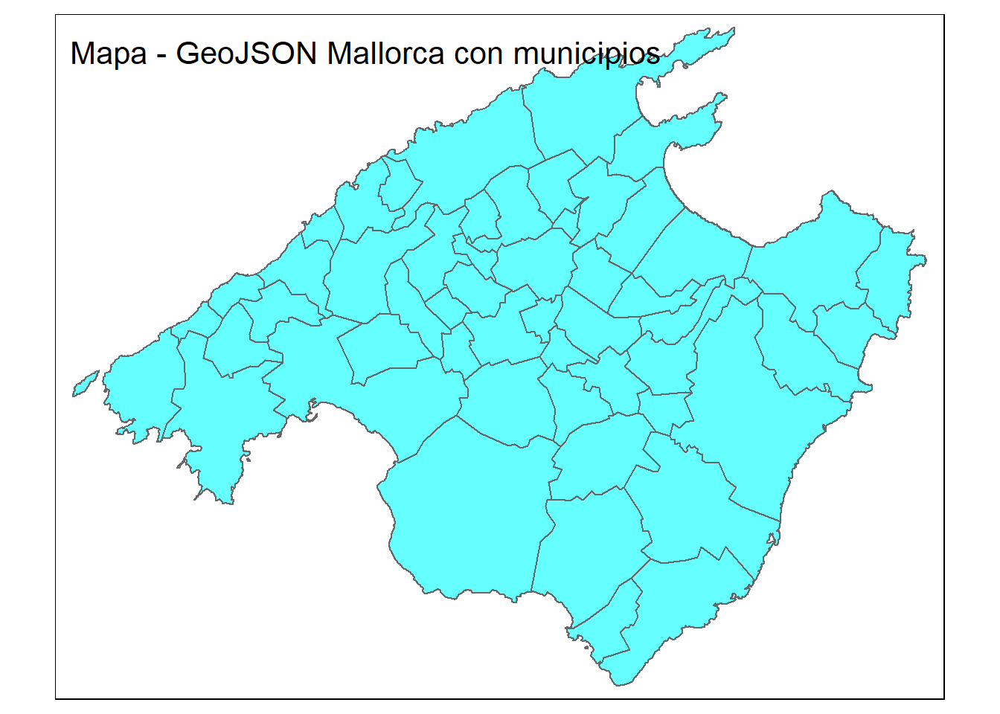
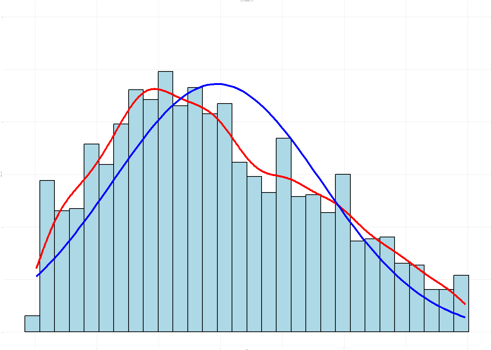
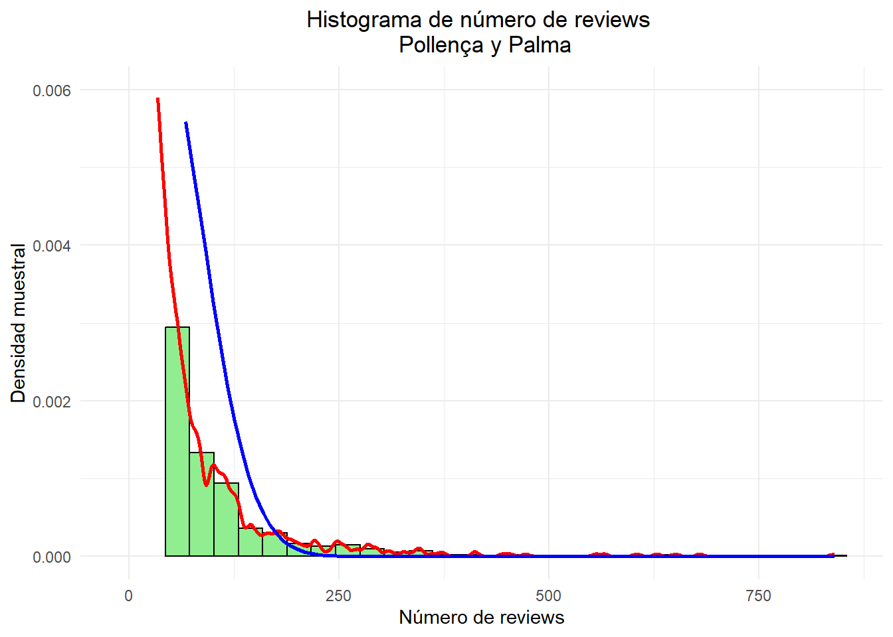
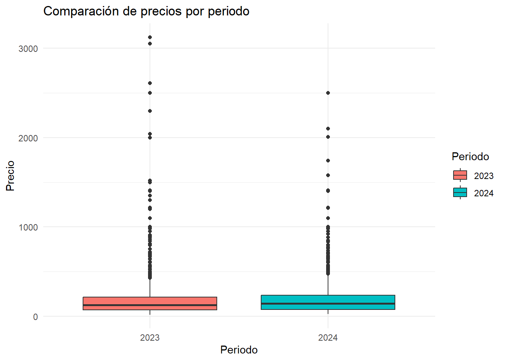
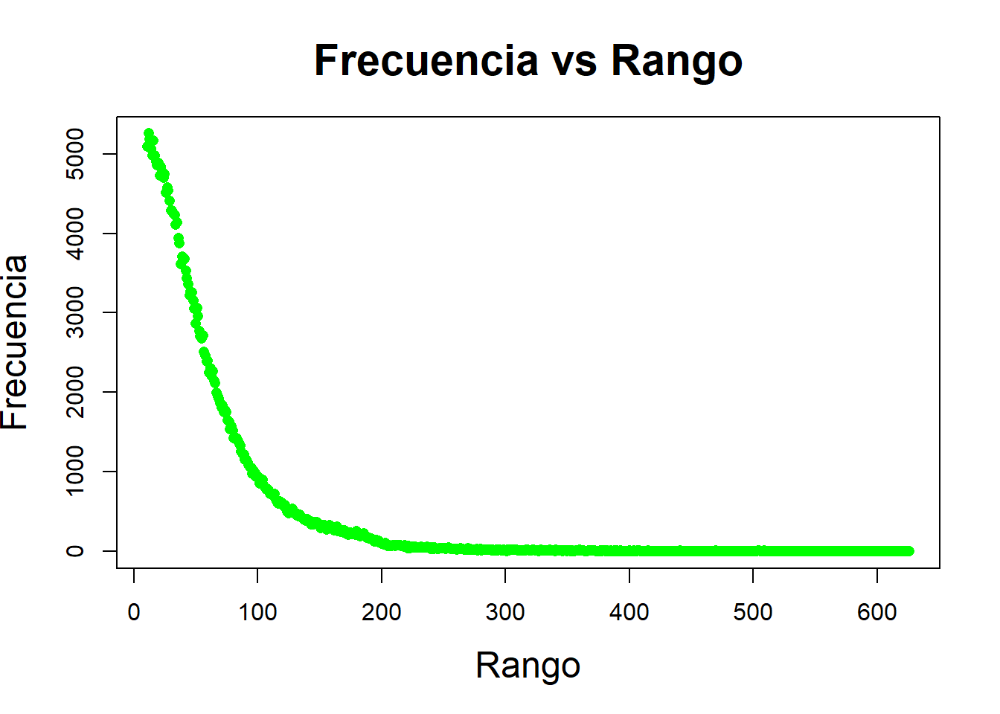
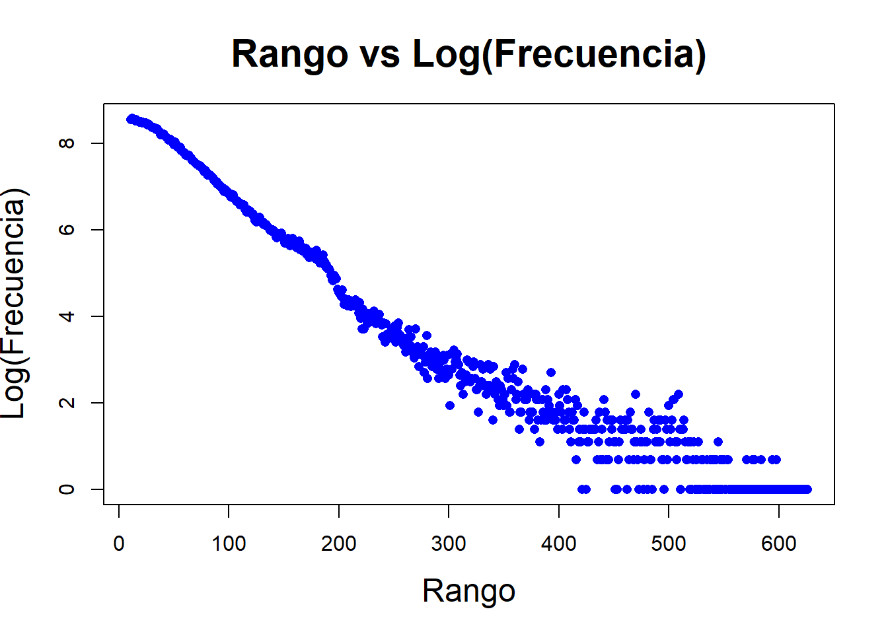
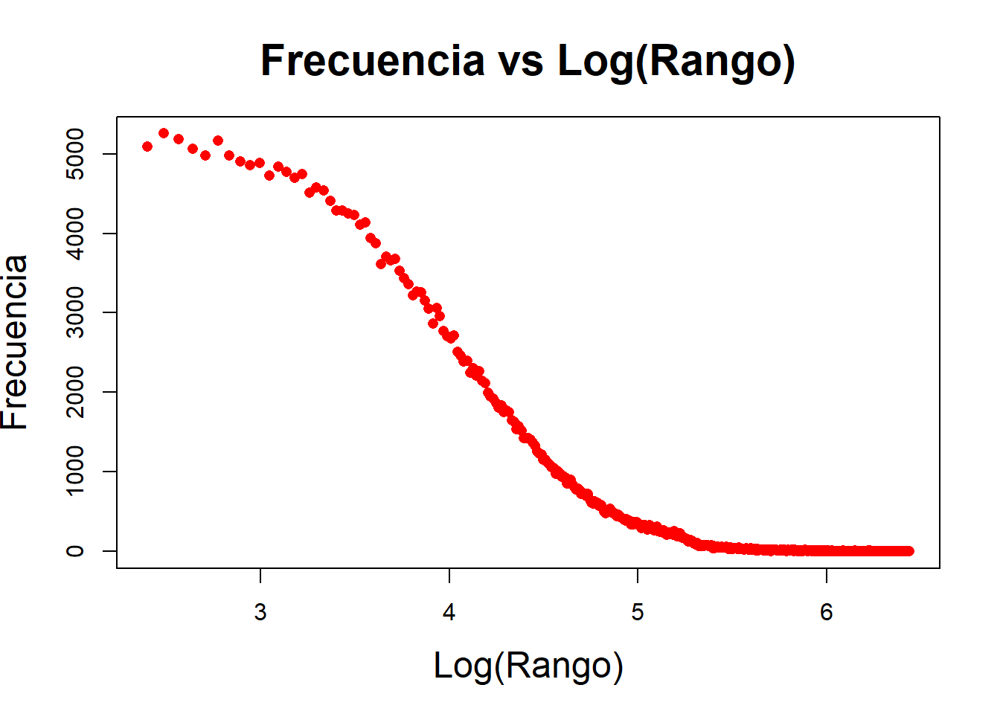
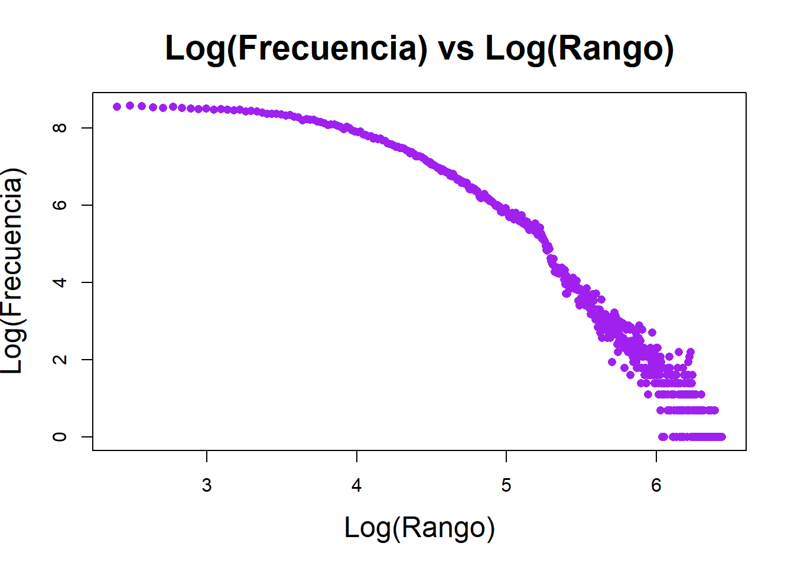

# Instrucciones para el taller

Se entrega en grupos que deben de estar constituidos en la actividad de grupos. Los grupos son de 2 o 3 ESTUDIANTES, loa caso especiales consultadlos con el profesor para que los autorice.

**Enlaces y Bibliografía**

-   [R for data science, Hadley Wickham, Garret Grolemund.](https://r4ds.had.co.nz/)
-   [Fundamentos de ciencia de datos con R.](https://cdr-book.github.io/)
-   [Tablas avanzadas: kable, KableExtra.](https://haozhu233.github.io/kableExtra/awesome_table_in_html.html)
-   [Geocomputation with R, Robin Lovelace, Jakub Nowosad, Jannes Muenchow](https://r.geocompx.org/)
-   Apuntes de R-basico y tidyverse moodel MAT3.

## Objetivo MALLORCA

Leeremos los siguientes datos de la zona de etiqueta `mallorca` con el código siguiente:


::: {.cell}

```{.r .cell-code}
# Carga de datos del objeto 'listings_common0_select'.
load("clean_data/mallorca/listing_common0_select.RData")
ls()  # Lista los objetos cargados en el entorno
```

::: {.cell-output .cell-output-stdout}

```
[1] "listings_common0_select"
```


:::

```{.r .cell-code}
str(listings_common0_select) # Muestra la estructura del objeto
```

::: {.cell-output .cell-output-stdout}

```
tibble [52,088 × 16] (S3: tbl_df/tbl/data.frame)
 $ date                  : Date[1:52088], format: "2023-12-17" "2023-12-17" ...
 $ id                    : chr [1:52088] "49752748" "935239498971961146" "24932587" "782518268756227225" ...
 $ price                 : num [1:52088] 2636 107 50 683 62 ...
 $ longitude             : num [1:52088] 2.71 3.12 2.62 3.21 3.24 ...
 $ latitude              : num [1:52088] 39.8 39.3 39.6 39.5 39.4 ...
 $ property_type         : chr [1:52088] "Entire home" "Entire home" "Entire rental unit" "Entire villa" ...
 $ room_type             : chr [1:52088] "Entire home/apt" "Entire home/apt" "Entire home/apt" "Entire home/apt" ...
 $ accommodates          : num [1:52088] 14 5 2 10 4 8 5 2 6 10 ...
 $ bedrooms              : num [1:52088] NA NA NA NA NA NA NA NA NA NA ...
 $ beds                  : num [1:52088] 9 4 1 7 3 5 3 3 5 5 ...
 $ number_of_reviews     : num [1:52088] 0 0 124 0 18 0 0 73 0 0 ...
 $ review_scores_rating  : num [1:52088] NA NA 4.88 NA 4.89 NA NA 4.73 NA NA ...
 $ review_scores_value   : num [1:52088] NA NA 4.64 NA 4.83 NA NA 4.64 NA NA ...
 $ host_is_superhost     : logi [1:52088] FALSE FALSE TRUE FALSE FALSE FALSE ...
 $ host_name             : chr [1:52088] "Novasol" "Mallorca Villa Selection" "Juana" "Homerti" ...
 $ neighbourhood_cleansed: chr [1:52088] "Sóller" "Santanyí" "Palma de Mallorca" "Felanitx" ...
```


:::
:::


**listings**

Hemos cargado el objeto `listings_common0_select` que contiene los datos de los 4 periodos de apartamentos de inside Airbnb de Mallorca con unas 15 ó 16 variables.

Notemos que cada apartamento:

-   queda identificado por id y por date que nos da el periodo en la que apareció el dato.
-   así que cada apartamento aparece 4 veces ya que hemos elegido solo los apartamentos que aparecen en las 4 muestras.
-   Las muestras son 2023-12-17, 2024-03-23, 2024-06-19, 2024-09-13,


::: {.cell}

```{.r .cell-code}
unique(listings_common0_select$date)
```

::: {.cell-output .cell-output-stdout}

```
[1] "2023-12-17" "2024-03-23" "2024-06-19" "2024-09-13"
```


:::
:::


**reviews**

Estos datos necesitan leerse de forma adecuada, las columnas 1, 2 y 4 deben ser de tipo `character` las otras son correctas


::: {.cell}

```{.r .cell-code}
# Carga de datos de reseñas desde un archivo CSV comprimido
reviews=read_csv("data/mallorca/2023-12-17/reviews.csv.gz")
str(reviews)
```

::: {.cell-output .cell-output-stdout}

```
spc_tbl_ [344,651 × 6] (S3: spec_tbl_df/tbl_df/tbl/data.frame)
 $ listing_id   : num [1:344651] 69998 69998 69998 69998 69998 ...
 $ id           : num [1:344651] 881474 4007103 4170371 4408459 4485779 ...
 $ date         : Date[1:344651], format: "2012-01-24" "2013-04-02" ...
 $ reviewer_id  : num [1:344651] 1595616 3868130 5730759 5921885 810469 ...
 $ reviewer_name: chr [1:344651] "Jean-Pierre" "Jo And Mike" "Elizabeth" "Jone" ...
 $ comments     : chr [1:344651] "This place was charming! Lorenzo himself is a very warm and engaging host and made us feel very welcome. \r<br/"| __truncated__ "We had a four night stay at this gorgeous apartment and it was absolutely perfect. It's really pretty, beautifu"| __truncated__ "Lor's apartment looks exactly like the pictures! It is perfectly located for historic Palma - close to the Cath"| __truncated__ "Wonderful place! 10/10. Charming, spacious and comfortable. Looks even more splendid than in the pictures. The "| __truncated__ ...
 - attr(*, "spec")=
  .. cols(
  ..   listing_id = col_double(),
  ..   id = col_double(),
  ..   date = col_date(format = ""),
  ..   reviewer_id = col_double(),
  ..   reviewer_name = col_character(),
  ..   comments = col_character()
  .. )
 - attr(*, "problems")=<externalptr> 
```


:::

```{.r .cell-code}
head(reviews)
```

::: {.cell-output .cell-output-stdout}

```
# A tibble: 6 × 6
  listing_id      id date       reviewer_id reviewer_name comments              
       <dbl>   <dbl> <date>           <dbl> <chr>         <chr>                 
1      69998  881474 2012-01-24     1595616 Jean-Pierre   "This place was charm…
2      69998 4007103 2013-04-02     3868130 Jo And Mike   "We had a four night …
3      69998 4170371 2013-04-15     5730759 Elizabeth     "Lor's apartment look…
4      69998 4408459 2013-05-03     5921885 Jone          "Wonderful place! 10/…
5      69998 4485779 2013-05-07      810469 Andrea        "My boyfriend and I, …
6      69998 4619699 2013-05-15     3318059 Devii         "We had a very last m…
```


:::
:::


**neighbourhoods.csv**

Son dos columnas y la primera es una agrupación de municipios (están NA) y la segunda es el nombre del municipio


::: {.cell}

```{.r .cell-code}
# Carga de datos de municipios desde un archivo CSV.
municipios=read_csv("data/mallorca/2023-12-17/neighbourhoods.csv")
str(municipios)
```

::: {.cell-output .cell-output-stdout}

```
spc_tbl_ [53 × 2] (S3: spec_tbl_df/tbl_df/tbl/data.frame)
 $ neighbourhood_group: logi [1:53] NA NA NA NA NA NA ...
 $ neighbourhood      : chr [1:53] "Alaró" "Alcúdia" "Algaida" "Andratx" ...
 - attr(*, "spec")=
  .. cols(
  ..   neighbourhood_group = col_logical(),
  ..   neighbourhood = col_character()
  .. )
 - attr(*, "problems")=<externalptr> 
```


:::

```{.r .cell-code}
head(municipios)
```

::: {.cell-output .cell-output-stdout}

```
# A tibble: 6 × 2
  neighbourhood_group neighbourhood
  <lgl>               <chr>        
1 NA                  Alaró        
2 NA                  Alcúdia      
3 NA                  Algaida      
4 NA                  Andratx      
5 NA                  Ariany       
6 NA                  Artà         
```


:::
:::


**neighbourhoods.geojson**

Es el mapa de Mallorca, o podemos leer así:


::: {.cell}

```{.r .cell-code}
library(sf)
library(tmap)

# Leer el archivo GeoJSON
geojson_sf <- sf::st_read("data/mallorca/2024-09-13/neighbourhoods.geojson")
```

::: {.cell-output .cell-output-stdout}

```
Reading layer `neighbourhoods' from data source 
  `C:\Users\JaumeJH\Documents\GitHub\PracticaAirBnb\data\mallorca\2024-09-13\neighbourhoods.geojson' 
  using driver `GeoJSON'
Simple feature collection with 53 features and 2 fields
Geometry type: MULTIPOLYGON
Dimension:     XY
Bounding box:  xmin: 2.303195 ymin: 39.26403 xmax: 3.479028 ymax: 39.96236
Geodetic CRS:  WGS 84
```


:::

```{.r .cell-code}
# Crear un mapa

# interactivo
tmap_mode("plot") # Cambiar a modo  view/plot   que es interactivo/estático
tm_shape(geojson_sf) +
  tm_polygons(col = "cyan", alpha = 0.6) +
  tm_layout(title = "Mapa - GeoJSON Mallorca con municipios")
```

::: {.cell-output-display}
{width=672}
:::
:::


Tenéis que consultar en la documentación de inside Airbnb para saber que significa cada variable. Os puede ser útil leer los ficheros [DATA_ABB_modelo_de_datos.html](DATA_ABB_modelo_de_datos.html) y [DATA_ABB_modelo_de_datos.pdf](DATA_ABB_modelo_de_datos.html) en los que se explica el modelo de datos de inside Airbnb y como se cargan en el espacio de trabajo.

Responder las siguientes preguntas con formato Rmarkdown (.Rmd) o quarto (.qmd) y entregad la fuente un fichero en formato html como salida del informe. Se puntúa la claridad de la respuesta, la calidad de la redacción y la corrección de la respuesta.

## Pregunta 1 (**1punto**)

Del fichero con los datos de listings `listing_common0_select.RData` calcula los estadísticos descriptivos de las variable `price` y de la variable `number_of_reviews` agrupados por municipio y por periodo.

Presenta los resultados con una tabla de kableExtra.

### Solución


::: {.cell}

```{.r .cell-code}
# Analizamos los precios
aux_price = listings_common0_select %>% select(id,
                                              date, 
                                              price, 
                                              neighbourhood_cleansed)
                                              
table_price = aux_price %>% group_by(neighbourhood_cleansed, date) %>%
   summarise(mean_price = mean(price, na.rm = TRUE) ,
            sd_price = sd(price, na.rm = TRUE) ,
            median_price = median(price, na.rm = TRUE),
            min_price = min(price, na.rm = TRUE),
            max_price = max(price, na.rm = TRUE),
            n_price = n()) %>% arrange(neighbourhood_cleansed, date)

# Presentación de resultados en tabla HTML
knitr::kable(table_price,"html") %>%
  kableExtra::kable_styling(bootstrap_options = "striped", full_width = F)
```

::: {.cell-output-display}

`````{=html}
<table class="table table-striped" style="width: auto !important; margin-left: auto; margin-right: auto;">
 <thead>
  <tr>
   <th style="text-align:left;"> neighbourhood_cleansed </th>
   <th style="text-align:left;"> date </th>
   <th style="text-align:right;"> mean_price </th>
   <th style="text-align:right;"> sd_price </th>
   <th style="text-align:right;"> median_price </th>
   <th style="text-align:right;"> min_price </th>
   <th style="text-align:right;"> max_price </th>
   <th style="text-align:right;"> n_price </th>
  </tr>
 </thead>
<tbody>
  <tr>
   <td style="text-align:left;"> Alaró </td>
   <td style="text-align:left;"> 2023-12-17 </td>
   <td style="text-align:right;"> 405.1667 </td>
   <td style="text-align:right;"> 797.20322 </td>
   <td style="text-align:right;"> 199.0 </td>
   <td style="text-align:right;"> 60 </td>
   <td style="text-align:right;"> 5000 </td>
   <td style="text-align:right;"> 78 </td>
  </tr>
  <tr>
   <td style="text-align:left;"> Alaró </td>
   <td style="text-align:left;"> 2024-03-23 </td>
   <td style="text-align:right;"> 385.0641 </td>
   <td style="text-align:right;"> 697.72153 </td>
   <td style="text-align:right;"> 190.0 </td>
   <td style="text-align:right;"> 67 </td>
   <td style="text-align:right;"> 5000 </td>
   <td style="text-align:right;"> 78 </td>
  </tr>
  <tr>
   <td style="text-align:left;"> Alaró </td>
   <td style="text-align:left;"> 2024-06-19 </td>
   <td style="text-align:right;"> 427.4872 </td>
   <td style="text-align:right;"> 763.57545 </td>
   <td style="text-align:right;"> 220.0 </td>
   <td style="text-align:right;"> 70 </td>
   <td style="text-align:right;"> 5000 </td>
   <td style="text-align:right;"> 79 </td>
  </tr>
  <tr>
   <td style="text-align:left;"> Alaró </td>
   <td style="text-align:left;"> 2024-09-13 </td>
   <td style="text-align:right;"> 550.4595 </td>
   <td style="text-align:right;"> 1346.14100 </td>
   <td style="text-align:right;"> 215.5 </td>
   <td style="text-align:right;"> 66 </td>
   <td style="text-align:right;"> 9999 </td>
   <td style="text-align:right;"> 78 </td>
  </tr>
  <tr>
   <td style="text-align:left;"> Alcúdia </td>
   <td style="text-align:left;"> 2023-12-17 </td>
   <td style="text-align:right;"> 216.6308 </td>
   <td style="text-align:right;"> 343.01203 </td>
   <td style="text-align:right;"> 166.0 </td>
   <td style="text-align:right;"> 34 </td>
   <td style="text-align:right;"> 10752 </td>
   <td style="text-align:right;"> 1298 </td>
  </tr>
  <tr>
   <td style="text-align:left;"> Alcúdia </td>
   <td style="text-align:left;"> 2024-03-23 </td>
   <td style="text-align:right;"> 216.1858 </td>
   <td style="text-align:right;"> 341.61765 </td>
   <td style="text-align:right;"> 165.0 </td>
   <td style="text-align:right;"> 34 </td>
   <td style="text-align:right;"> 10752 </td>
   <td style="text-align:right;"> 1297 </td>
  </tr>
  <tr>
   <td style="text-align:left;"> Alcúdia </td>
   <td style="text-align:left;"> 2024-06-19 </td>
   <td style="text-align:right;"> 280.4335 </td>
   <td style="text-align:right;"> 410.02465 </td>
   <td style="text-align:right;"> 212.0 </td>
   <td style="text-align:right;"> 35 </td>
   <td style="text-align:right;"> 10752 </td>
   <td style="text-align:right;"> 1297 </td>
  </tr>
  <tr>
   <td style="text-align:left;"> Alcúdia </td>
   <td style="text-align:left;"> 2024-09-13 </td>
   <td style="text-align:right;"> 272.7096 </td>
   <td style="text-align:right;"> 433.71675 </td>
   <td style="text-align:right;"> 208.0 </td>
   <td style="text-align:right;"> 35 </td>
   <td style="text-align:right;"> 9999 </td>
   <td style="text-align:right;"> 1297 </td>
  </tr>
  <tr>
   <td style="text-align:left;"> Algaida </td>
   <td style="text-align:left;"> 2023-12-17 </td>
   <td style="text-align:right;"> 259.8481 </td>
   <td style="text-align:right;"> 352.82814 </td>
   <td style="text-align:right;"> 187.0 </td>
   <td style="text-align:right;"> 65 </td>
   <td style="text-align:right;"> 3125 </td>
   <td style="text-align:right;"> 83 </td>
  </tr>
  <tr>
   <td style="text-align:left;"> Algaida </td>
   <td style="text-align:left;"> 2024-03-23 </td>
   <td style="text-align:right;"> 245.2530 </td>
   <td style="text-align:right;"> 234.81788 </td>
   <td style="text-align:right;"> 187.0 </td>
   <td style="text-align:right;"> 60 </td>
   <td style="text-align:right;"> 1994 </td>
   <td style="text-align:right;"> 83 </td>
  </tr>
  <tr>
   <td style="text-align:left;"> Algaida </td>
   <td style="text-align:left;"> 2024-06-19 </td>
   <td style="text-align:right;"> 296.0375 </td>
   <td style="text-align:right;"> 352.65024 </td>
   <td style="text-align:right;"> 232.0 </td>
   <td style="text-align:right;"> 74 </td>
   <td style="text-align:right;"> 3085 </td>
   <td style="text-align:right;"> 83 </td>
  </tr>
  <tr>
   <td style="text-align:left;"> Algaida </td>
   <td style="text-align:left;"> 2024-09-13 </td>
   <td style="text-align:right;"> 293.7342 </td>
   <td style="text-align:right;"> 357.07891 </td>
   <td style="text-align:right;"> 214.0 </td>
   <td style="text-align:right;"> 74 </td>
   <td style="text-align:right;"> 3125 </td>
   <td style="text-align:right;"> 83 </td>
  </tr>
  <tr>
   <td style="text-align:left;"> Andratx </td>
   <td style="text-align:left;"> 2023-12-17 </td>
   <td style="text-align:right;"> 568.6497 </td>
   <td style="text-align:right;"> 964.08258 </td>
   <td style="text-align:right;"> 221.0 </td>
   <td style="text-align:right;"> 32 </td>
   <td style="text-align:right;"> 6711 </td>
   <td style="text-align:right;"> 178 </td>
  </tr>
  <tr>
   <td style="text-align:left;"> Andratx </td>
   <td style="text-align:left;"> 2024-03-23 </td>
   <td style="text-align:right;"> 569.0169 </td>
   <td style="text-align:right;"> 862.56015 </td>
   <td style="text-align:right;"> 223.5 </td>
   <td style="text-align:right;"> 37 </td>
   <td style="text-align:right;"> 4756 </td>
   <td style="text-align:right;"> 178 </td>
  </tr>
  <tr>
   <td style="text-align:left;"> Andratx </td>
   <td style="text-align:left;"> 2024-06-19 </td>
   <td style="text-align:right;"> 715.9944 </td>
   <td style="text-align:right;"> 1147.07395 </td>
   <td style="text-align:right;"> 300.0 </td>
   <td style="text-align:right;"> 60 </td>
   <td style="text-align:right;"> 8403 </td>
   <td style="text-align:right;"> 178 </td>
  </tr>
  <tr>
   <td style="text-align:left;"> Andratx </td>
   <td style="text-align:left;"> 2024-09-13 </td>
   <td style="text-align:right;"> 745.9209 </td>
   <td style="text-align:right;"> 1281.85507 </td>
   <td style="text-align:right;"> 317.0 </td>
   <td style="text-align:right;"> 56 </td>
   <td style="text-align:right;"> 9999 </td>
   <td style="text-align:right;"> 178 </td>
  </tr>
  <tr>
   <td style="text-align:left;"> Ariany </td>
   <td style="text-align:left;"> 2023-12-17 </td>
   <td style="text-align:right;"> 224.7468 </td>
   <td style="text-align:right;"> 164.37898 </td>
   <td style="text-align:right;"> 157.0 </td>
   <td style="text-align:right;"> 50 </td>
   <td style="text-align:right;"> 1024 </td>
   <td style="text-align:right;"> 80 </td>
  </tr>
  <tr>
   <td style="text-align:left;"> Ariany </td>
   <td style="text-align:left;"> 2024-03-23 </td>
   <td style="text-align:right;"> 216.1750 </td>
   <td style="text-align:right;"> 146.22306 </td>
   <td style="text-align:right;"> 156.5 </td>
   <td style="text-align:right;"> 50 </td>
   <td style="text-align:right;"> 726 </td>
   <td style="text-align:right;"> 80 </td>
  </tr>
  <tr>
   <td style="text-align:left;"> Ariany </td>
   <td style="text-align:left;"> 2024-06-19 </td>
   <td style="text-align:right;"> 254.2000 </td>
   <td style="text-align:right;"> 179.58358 </td>
   <td style="text-align:right;"> 190.0 </td>
   <td style="text-align:right;"> 60 </td>
   <td style="text-align:right;"> 987 </td>
   <td style="text-align:right;"> 80 </td>
  </tr>
  <tr>
   <td style="text-align:left;"> Ariany </td>
   <td style="text-align:left;"> 2024-09-13 </td>
   <td style="text-align:right;"> 243.5974 </td>
   <td style="text-align:right;"> 174.47042 </td>
   <td style="text-align:right;"> 183.0 </td>
   <td style="text-align:right;"> 75 </td>
   <td style="text-align:right;"> 987 </td>
   <td style="text-align:right;"> 80 </td>
  </tr>
  <tr>
   <td style="text-align:left;"> Artà </td>
   <td style="text-align:left;"> 2023-12-17 </td>
   <td style="text-align:right;"> 258.2846 </td>
   <td style="text-align:right;"> 235.38432 </td>
   <td style="text-align:right;"> 204.5 </td>
   <td style="text-align:right;"> 35 </td>
   <td style="text-align:right;"> 1590 </td>
   <td style="text-align:right;"> 249 </td>
  </tr>
  <tr>
   <td style="text-align:left;"> Artà </td>
   <td style="text-align:left;"> 2024-03-23 </td>
   <td style="text-align:right;"> 265.3333 </td>
   <td style="text-align:right;"> 240.86472 </td>
   <td style="text-align:right;"> 204.0 </td>
   <td style="text-align:right;"> 35 </td>
   <td style="text-align:right;"> 1610 </td>
   <td style="text-align:right;"> 249 </td>
  </tr>
  <tr>
   <td style="text-align:left;"> Artà </td>
   <td style="text-align:left;"> 2024-06-19 </td>
   <td style="text-align:right;"> 262.4449 </td>
   <td style="text-align:right;"> 153.97645 </td>
   <td style="text-align:right;"> 235.0 </td>
   <td style="text-align:right;"> 55 </td>
   <td style="text-align:right;"> 1036 </td>
   <td style="text-align:right;"> 249 </td>
  </tr>
  <tr>
   <td style="text-align:left;"> Artà </td>
   <td style="text-align:left;"> 2024-09-13 </td>
   <td style="text-align:right;"> 296.3902 </td>
   <td style="text-align:right;"> 636.74414 </td>
   <td style="text-align:right;"> 234.5 </td>
   <td style="text-align:right;"> 55 </td>
   <td style="text-align:right;"> 9999 </td>
   <td style="text-align:right;"> 249 </td>
  </tr>
  <tr>
   <td style="text-align:left;"> Banyalbufar </td>
   <td style="text-align:left;"> 2023-12-17 </td>
   <td style="text-align:right;"> 230.4906 </td>
   <td style="text-align:right;"> 206.43314 </td>
   <td style="text-align:right;"> 169.0 </td>
   <td style="text-align:right;"> 70 </td>
   <td style="text-align:right;"> 1200 </td>
   <td style="text-align:right;"> 53 </td>
  </tr>
  <tr>
   <td style="text-align:left;"> Banyalbufar </td>
   <td style="text-align:left;"> 2024-03-23 </td>
   <td style="text-align:right;"> 226.0943 </td>
   <td style="text-align:right;"> 195.52299 </td>
   <td style="text-align:right;"> 159.0 </td>
   <td style="text-align:right;"> 65 </td>
   <td style="text-align:right;"> 1050 </td>
   <td style="text-align:right;"> 53 </td>
  </tr>
  <tr>
   <td style="text-align:left;"> Banyalbufar </td>
   <td style="text-align:left;"> 2024-06-19 </td>
   <td style="text-align:right;"> 272.1509 </td>
   <td style="text-align:right;"> 256.02024 </td>
   <td style="text-align:right;"> 195.0 </td>
   <td style="text-align:right;"> 74 </td>
   <td style="text-align:right;"> 1500 </td>
   <td style="text-align:right;"> 53 </td>
  </tr>
  <tr>
   <td style="text-align:left;"> Banyalbufar </td>
   <td style="text-align:left;"> 2024-09-13 </td>
   <td style="text-align:right;"> 269.7736 </td>
   <td style="text-align:right;"> 189.49464 </td>
   <td style="text-align:right;"> 211.0 </td>
   <td style="text-align:right;"> 80 </td>
   <td style="text-align:right;"> 950 </td>
   <td style="text-align:right;"> 53 </td>
  </tr>
  <tr>
   <td style="text-align:left;"> Binissalem </td>
   <td style="text-align:left;"> 2023-12-17 </td>
   <td style="text-align:right;"> 256.0120 </td>
   <td style="text-align:right;"> 178.57003 </td>
   <td style="text-align:right;"> 227.0 </td>
   <td style="text-align:right;"> 60 </td>
   <td style="text-align:right;"> 977 </td>
   <td style="text-align:right;"> 83 </td>
  </tr>
  <tr>
   <td style="text-align:left;"> Binissalem </td>
   <td style="text-align:left;"> 2024-03-23 </td>
   <td style="text-align:right;"> 268.8675 </td>
   <td style="text-align:right;"> 182.01385 </td>
   <td style="text-align:right;"> 214.0 </td>
   <td style="text-align:right;"> 60 </td>
   <td style="text-align:right;"> 963 </td>
   <td style="text-align:right;"> 83 </td>
  </tr>
  <tr>
   <td style="text-align:left;"> Binissalem </td>
   <td style="text-align:left;"> 2024-06-19 </td>
   <td style="text-align:right;"> 280.4444 </td>
   <td style="text-align:right;"> 184.83763 </td>
   <td style="text-align:right;"> 235.0 </td>
   <td style="text-align:right;"> 59 </td>
   <td style="text-align:right;"> 963 </td>
   <td style="text-align:right;"> 83 </td>
  </tr>
  <tr>
   <td style="text-align:left;"> Binissalem </td>
   <td style="text-align:left;"> 2024-09-13 </td>
   <td style="text-align:right;"> 289.7215 </td>
   <td style="text-align:right;"> 205.59002 </td>
   <td style="text-align:right;"> 235.0 </td>
   <td style="text-align:right;"> 60 </td>
   <td style="text-align:right;"> 1277 </td>
   <td style="text-align:right;"> 83 </td>
  </tr>
  <tr>
   <td style="text-align:left;"> Bunyola </td>
   <td style="text-align:left;"> 2023-12-17 </td>
   <td style="text-align:right;"> 294.6441 </td>
   <td style="text-align:right;"> 215.21503 </td>
   <td style="text-align:right;"> 236.0 </td>
   <td style="text-align:right;"> 52 </td>
   <td style="text-align:right;"> 1257 </td>
   <td style="text-align:right;"> 59 </td>
  </tr>
  <tr>
   <td style="text-align:left;"> Bunyola </td>
   <td style="text-align:left;"> 2024-03-23 </td>
   <td style="text-align:right;"> 302.4068 </td>
   <td style="text-align:right;"> 210.98555 </td>
   <td style="text-align:right;"> 250.0 </td>
   <td style="text-align:right;"> 52 </td>
   <td style="text-align:right;"> 1300 </td>
   <td style="text-align:right;"> 59 </td>
  </tr>
  <tr>
   <td style="text-align:left;"> Bunyola </td>
   <td style="text-align:left;"> 2024-06-19 </td>
   <td style="text-align:right;"> 352.8039 </td>
   <td style="text-align:right;"> 258.52103 </td>
   <td style="text-align:right;"> 260.0 </td>
   <td style="text-align:right;"> 52 </td>
   <td style="text-align:right;"> 1400 </td>
   <td style="text-align:right;"> 59 </td>
  </tr>
  <tr>
   <td style="text-align:left;"> Bunyola </td>
   <td style="text-align:left;"> 2024-09-13 </td>
   <td style="text-align:right;"> 364.3333 </td>
   <td style="text-align:right;"> 266.15592 </td>
   <td style="text-align:right;"> 300.0 </td>
   <td style="text-align:right;"> 52 </td>
   <td style="text-align:right;"> 1400 </td>
   <td style="text-align:right;"> 59 </td>
  </tr>
  <tr>
   <td style="text-align:left;"> Búger </td>
   <td style="text-align:left;"> 2023-12-17 </td>
   <td style="text-align:right;"> 266.9435 </td>
   <td style="text-align:right;"> 201.81849 </td>
   <td style="text-align:right;"> 197.0 </td>
   <td style="text-align:right;"> 27 </td>
   <td style="text-align:right;"> 1770 </td>
   <td style="text-align:right;"> 124 </td>
  </tr>
  <tr>
   <td style="text-align:left;"> Búger </td>
   <td style="text-align:left;"> 2024-03-23 </td>
   <td style="text-align:right;"> 258.6694 </td>
   <td style="text-align:right;"> 153.42574 </td>
   <td style="text-align:right;"> 205.5 </td>
   <td style="text-align:right;"> 27 </td>
   <td style="text-align:right;"> 792 </td>
   <td style="text-align:right;"> 124 </td>
  </tr>
  <tr>
   <td style="text-align:left;"> Búger </td>
   <td style="text-align:left;"> 2024-06-19 </td>
   <td style="text-align:right;"> 288.5600 </td>
   <td style="text-align:right;"> 167.06607 </td>
   <td style="text-align:right;"> 242.0 </td>
   <td style="text-align:right;"> 27 </td>
   <td style="text-align:right;"> 861 </td>
   <td style="text-align:right;"> 125 </td>
  </tr>
  <tr>
   <td style="text-align:left;"> Búger </td>
   <td style="text-align:left;"> 2024-09-13 </td>
   <td style="text-align:right;"> 294.1760 </td>
   <td style="text-align:right;"> 176.54726 </td>
   <td style="text-align:right;"> 238.0 </td>
   <td style="text-align:right;"> 27 </td>
   <td style="text-align:right;"> 861 </td>
   <td style="text-align:right;"> 125 </td>
  </tr>
  <tr>
   <td style="text-align:left;"> Calvià </td>
   <td style="text-align:left;"> 2023-12-17 </td>
   <td style="text-align:right;"> 462.6070 </td>
   <td style="text-align:right;"> 941.34603 </td>
   <td style="text-align:right;"> 199.0 </td>
   <td style="text-align:right;"> 31 </td>
   <td style="text-align:right;"> 9999 </td>
   <td style="text-align:right;"> 345 </td>
  </tr>
  <tr>
   <td style="text-align:left;"> Calvià </td>
   <td style="text-align:left;"> 2024-03-23 </td>
   <td style="text-align:right;"> 455.6087 </td>
   <td style="text-align:right;"> 917.45264 </td>
   <td style="text-align:right;"> 190.0 </td>
   <td style="text-align:right;"> 33 </td>
   <td style="text-align:right;"> 9999 </td>
   <td style="text-align:right;"> 345 </td>
  </tr>
  <tr>
   <td style="text-align:left;"> Calvià </td>
   <td style="text-align:left;"> 2024-06-19 </td>
   <td style="text-align:right;"> 525.7009 </td>
   <td style="text-align:right;"> 913.04750 </td>
   <td style="text-align:right;"> 274.0 </td>
   <td style="text-align:right;"> 37 </td>
   <td style="text-align:right;"> 9999 </td>
   <td style="text-align:right;"> 345 </td>
  </tr>
  <tr>
   <td style="text-align:left;"> Calvià </td>
   <td style="text-align:left;"> 2024-09-13 </td>
   <td style="text-align:right;"> 525.3720 </td>
   <td style="text-align:right;"> 930.00414 </td>
   <td style="text-align:right;"> 254.0 </td>
   <td style="text-align:right;"> 37 </td>
   <td style="text-align:right;"> 9999 </td>
   <td style="text-align:right;"> 345 </td>
  </tr>
  <tr>
   <td style="text-align:left;"> Campanet </td>
   <td style="text-align:left;"> 2023-12-17 </td>
   <td style="text-align:right;"> 199.4754 </td>
   <td style="text-align:right;"> 121.50681 </td>
   <td style="text-align:right;"> 168.5 </td>
   <td style="text-align:right;"> 40 </td>
   <td style="text-align:right;"> 1032 </td>
   <td style="text-align:right;"> 132 </td>
  </tr>
  <tr>
   <td style="text-align:left;"> Campanet </td>
   <td style="text-align:left;"> 2024-03-23 </td>
   <td style="text-align:right;"> 206.4242 </td>
   <td style="text-align:right;"> 148.41540 </td>
   <td style="text-align:right;"> 170.0 </td>
   <td style="text-align:right;"> 40 </td>
   <td style="text-align:right;"> 1483 </td>
   <td style="text-align:right;"> 132 </td>
  </tr>
  <tr>
   <td style="text-align:left;"> Campanet </td>
   <td style="text-align:left;"> 2024-06-19 </td>
   <td style="text-align:right;"> 241.5039 </td>
   <td style="text-align:right;"> 191.89166 </td>
   <td style="text-align:right;"> 215.0 </td>
   <td style="text-align:right;"> 50 </td>
   <td style="text-align:right;"> 2088 </td>
   <td style="text-align:right;"> 132 </td>
  </tr>
  <tr>
   <td style="text-align:left;"> Campanet </td>
   <td style="text-align:left;"> 2024-09-13 </td>
   <td style="text-align:right;"> 314.8413 </td>
   <td style="text-align:right;"> 890.24567 </td>
   <td style="text-align:right;"> 208.0 </td>
   <td style="text-align:right;"> 54 </td>
   <td style="text-align:right;"> 9999 </td>
   <td style="text-align:right;"> 132 </td>
  </tr>
  <tr>
   <td style="text-align:left;"> Campos </td>
   <td style="text-align:left;"> 2023-12-17 </td>
   <td style="text-align:right;"> 261.7614 </td>
   <td style="text-align:right;"> 230.47734 </td>
   <td style="text-align:right;"> 195.0 </td>
   <td style="text-align:right;"> 39 </td>
   <td style="text-align:right;"> 2171 </td>
   <td style="text-align:right;"> 419 </td>
  </tr>
  <tr>
   <td style="text-align:left;"> Campos </td>
   <td style="text-align:left;"> 2024-03-23 </td>
   <td style="text-align:right;"> 260.3628 </td>
   <td style="text-align:right;"> 207.31629 </td>
   <td style="text-align:right;"> 200.0 </td>
   <td style="text-align:right;"> 39 </td>
   <td style="text-align:right;"> 1650 </td>
   <td style="text-align:right;"> 419 </td>
  </tr>
  <tr>
   <td style="text-align:left;"> Campos </td>
   <td style="text-align:left;"> 2024-06-19 </td>
   <td style="text-align:right;"> 292.1646 </td>
   <td style="text-align:right;"> 225.50618 </td>
   <td style="text-align:right;"> 234.0 </td>
   <td style="text-align:right;"> 39 </td>
   <td style="text-align:right;"> 2150 </td>
   <td style="text-align:right;"> 419 </td>
  </tr>
  <tr>
   <td style="text-align:left;"> Campos </td>
   <td style="text-align:left;"> 2024-09-13 </td>
   <td style="text-align:right;"> 310.7414 </td>
   <td style="text-align:right;"> 530.44275 </td>
   <td style="text-align:right;"> 236.0 </td>
   <td style="text-align:right;"> 39 </td>
   <td style="text-align:right;"> 9999 </td>
   <td style="text-align:right;"> 419 </td>
  </tr>
  <tr>
   <td style="text-align:left;"> Capdepera </td>
   <td style="text-align:left;"> 2023-12-17 </td>
   <td style="text-align:right;"> 235.0736 </td>
   <td style="text-align:right;"> 287.06719 </td>
   <td style="text-align:right;"> 148.0 </td>
   <td style="text-align:right;"> 40 </td>
   <td style="text-align:right;"> 3000 </td>
   <td style="text-align:right;"> 401 </td>
  </tr>
  <tr>
   <td style="text-align:left;"> Capdepera </td>
   <td style="text-align:left;"> 2024-03-23 </td>
   <td style="text-align:right;"> 244.2836 </td>
   <td style="text-align:right;"> 316.96744 </td>
   <td style="text-align:right;"> 149.5 </td>
   <td style="text-align:right;"> 43 </td>
   <td style="text-align:right;"> 3000 </td>
   <td style="text-align:right;"> 402 </td>
  </tr>
  <tr>
   <td style="text-align:left;"> Capdepera </td>
   <td style="text-align:left;"> 2024-06-19 </td>
   <td style="text-align:right;"> 288.9724 </td>
   <td style="text-align:right;"> 376.24032 </td>
   <td style="text-align:right;"> 174.5 </td>
   <td style="text-align:right;"> 46 </td>
   <td style="text-align:right;"> 3164 </td>
   <td style="text-align:right;"> 402 </td>
  </tr>
  <tr>
   <td style="text-align:left;"> Capdepera </td>
   <td style="text-align:left;"> 2024-09-13 </td>
   <td style="text-align:right;"> 291.7494 </td>
   <td style="text-align:right;"> 378.66297 </td>
   <td style="text-align:right;"> 180.0 </td>
   <td style="text-align:right;"> 48 </td>
   <td style="text-align:right;"> 3250 </td>
   <td style="text-align:right;"> 402 </td>
  </tr>
  <tr>
   <td style="text-align:left;"> Consell </td>
   <td style="text-align:left;"> 2023-12-17 </td>
   <td style="text-align:right;"> 298.4706 </td>
   <td style="text-align:right;"> 117.04439 </td>
   <td style="text-align:right;"> 283.0 </td>
   <td style="text-align:right;"> 68 </td>
   <td style="text-align:right;"> 524 </td>
   <td style="text-align:right;"> 18 </td>
  </tr>
  <tr>
   <td style="text-align:left;"> Consell </td>
   <td style="text-align:left;"> 2024-03-23 </td>
   <td style="text-align:right;"> 373.3889 </td>
   <td style="text-align:right;"> 243.31199 </td>
   <td style="text-align:right;"> 274.0 </td>
   <td style="text-align:right;"> 69 </td>
   <td style="text-align:right;"> 1090 </td>
   <td style="text-align:right;"> 18 </td>
  </tr>
  <tr>
   <td style="text-align:left;"> Consell </td>
   <td style="text-align:left;"> 2024-06-19 </td>
   <td style="text-align:right;"> 412.7059 </td>
   <td style="text-align:right;"> 249.27263 </td>
   <td style="text-align:right;"> 311.0 </td>
   <td style="text-align:right;"> 70 </td>
   <td style="text-align:right;"> 1065 </td>
   <td style="text-align:right;"> 18 </td>
  </tr>
  <tr>
   <td style="text-align:left;"> Consell </td>
   <td style="text-align:left;"> 2024-09-13 </td>
   <td style="text-align:right;"> 400.1333 </td>
   <td style="text-align:right;"> 288.83878 </td>
   <td style="text-align:right;"> 342.0 </td>
   <td style="text-align:right;"> 69 </td>
   <td style="text-align:right;"> 1095 </td>
   <td style="text-align:right;"> 18 </td>
  </tr>
  <tr>
   <td style="text-align:left;"> Costitx </td>
   <td style="text-align:left;"> 2023-12-17 </td>
   <td style="text-align:right;"> 199.4318 </td>
   <td style="text-align:right;"> 145.03045 </td>
   <td style="text-align:right;"> 147.5 </td>
   <td style="text-align:right;"> 45 </td>
   <td style="text-align:right;"> 715 </td>
   <td style="text-align:right;"> 45 </td>
  </tr>
  <tr>
   <td style="text-align:left;"> Costitx </td>
   <td style="text-align:left;"> 2024-03-23 </td>
   <td style="text-align:right;"> 215.5333 </td>
   <td style="text-align:right;"> 163.99399 </td>
   <td style="text-align:right;"> 164.0 </td>
   <td style="text-align:right;"> 42 </td>
   <td style="text-align:right;"> 919 </td>
   <td style="text-align:right;"> 45 </td>
  </tr>
  <tr>
   <td style="text-align:left;"> Costitx </td>
   <td style="text-align:left;"> 2024-06-19 </td>
   <td style="text-align:right;"> 252.9111 </td>
   <td style="text-align:right;"> 206.08050 </td>
   <td style="text-align:right;"> 200.0 </td>
   <td style="text-align:right;"> 48 </td>
   <td style="text-align:right;"> 1187 </td>
   <td style="text-align:right;"> 45 </td>
  </tr>
  <tr>
   <td style="text-align:left;"> Costitx </td>
   <td style="text-align:left;"> 2024-09-13 </td>
   <td style="text-align:right;"> 249.3556 </td>
   <td style="text-align:right;"> 158.56905 </td>
   <td style="text-align:right;"> 178.0 </td>
   <td style="text-align:right;"> 52 </td>
   <td style="text-align:right;"> 762 </td>
   <td style="text-align:right;"> 45 </td>
  </tr>
  <tr>
   <td style="text-align:left;"> Deyá </td>
   <td style="text-align:left;"> 2023-12-17 </td>
   <td style="text-align:right;"> 533.3871 </td>
   <td style="text-align:right;"> 439.44389 </td>
   <td style="text-align:right;"> 400.5 </td>
   <td style="text-align:right;"> 60 </td>
   <td style="text-align:right;"> 1738 </td>
   <td style="text-align:right;"> 63 </td>
  </tr>
  <tr>
   <td style="text-align:left;"> Deyá </td>
   <td style="text-align:left;"> 2024-03-23 </td>
   <td style="text-align:right;"> 563.6032 </td>
   <td style="text-align:right;"> 468.26459 </td>
   <td style="text-align:right;"> 430.0 </td>
   <td style="text-align:right;"> 100 </td>
   <td style="text-align:right;"> 1739 </td>
   <td style="text-align:right;"> 63 </td>
  </tr>
  <tr>
   <td style="text-align:left;"> Deyá </td>
   <td style="text-align:left;"> 2024-06-19 </td>
   <td style="text-align:right;"> 720.9508 </td>
   <td style="text-align:right;"> 611.77369 </td>
   <td style="text-align:right;"> 503.0 </td>
   <td style="text-align:right;"> 90 </td>
   <td style="text-align:right;"> 2374 </td>
   <td style="text-align:right;"> 64 </td>
  </tr>
  <tr>
   <td style="text-align:left;"> Deyá </td>
   <td style="text-align:left;"> 2024-09-13 </td>
   <td style="text-align:right;"> 702.7333 </td>
   <td style="text-align:right;"> 594.12037 </td>
   <td style="text-align:right;"> 484.5 </td>
   <td style="text-align:right;"> 116 </td>
   <td style="text-align:right;"> 2248 </td>
   <td style="text-align:right;"> 64 </td>
  </tr>
  <tr>
   <td style="text-align:left;"> Escorca </td>
   <td style="text-align:left;"> 2023-12-17 </td>
   <td style="text-align:right;"> 235.5000 </td>
   <td style="text-align:right;"> 196.16921 </td>
   <td style="text-align:right;"> 189.0 </td>
   <td style="text-align:right;"> 95 </td>
   <td style="text-align:right;"> 1000 </td>
   <td style="text-align:right;"> 22 </td>
  </tr>
  <tr>
   <td style="text-align:left;"> Escorca </td>
   <td style="text-align:left;"> 2024-03-23 </td>
   <td style="text-align:right;"> 234.1818 </td>
   <td style="text-align:right;"> 215.19640 </td>
   <td style="text-align:right;"> 181.5 </td>
   <td style="text-align:right;"> 87 </td>
   <td style="text-align:right;"> 1100 </td>
   <td style="text-align:right;"> 22 </td>
  </tr>
  <tr>
   <td style="text-align:left;"> Escorca </td>
   <td style="text-align:left;"> 2024-06-19 </td>
   <td style="text-align:right;"> 265.0000 </td>
   <td style="text-align:right;"> 271.14045 </td>
   <td style="text-align:right;"> 196.0 </td>
   <td style="text-align:right;"> 95 </td>
   <td style="text-align:right;"> 1350 </td>
   <td style="text-align:right;"> 22 </td>
  </tr>
  <tr>
   <td style="text-align:left;"> Escorca </td>
   <td style="text-align:left;"> 2024-09-13 </td>
   <td style="text-align:right;"> 262.2273 </td>
   <td style="text-align:right;"> 272.23693 </td>
   <td style="text-align:right;"> 188.5 </td>
   <td style="text-align:right;"> 95 </td>
   <td style="text-align:right;"> 1350 </td>
   <td style="text-align:right;"> 22 </td>
  </tr>
  <tr>
   <td style="text-align:left;"> Esporles </td>
   <td style="text-align:left;"> 2023-12-17 </td>
   <td style="text-align:right;"> 499.2200 </td>
   <td style="text-align:right;"> 986.80183 </td>
   <td style="text-align:right;"> 207.0 </td>
   <td style="text-align:right;"> 55 </td>
   <td style="text-align:right;"> 6500 </td>
   <td style="text-align:right;"> 50 </td>
  </tr>
  <tr>
   <td style="text-align:left;"> Esporles </td>
   <td style="text-align:left;"> 2024-03-23 </td>
   <td style="text-align:right;"> 525.6667 </td>
   <td style="text-align:right;"> 966.49372 </td>
   <td style="text-align:right;"> 284.0 </td>
   <td style="text-align:right;"> 75 </td>
   <td style="text-align:right;"> 6500 </td>
   <td style="text-align:right;"> 51 </td>
  </tr>
  <tr>
   <td style="text-align:left;"> Esporles </td>
   <td style="text-align:left;"> 2024-06-19 </td>
   <td style="text-align:right;"> 580.5200 </td>
   <td style="text-align:right;"> 963.25855 </td>
   <td style="text-align:right;"> 416.0 </td>
   <td style="text-align:right;"> 75 </td>
   <td style="text-align:right;"> 6500 </td>
   <td style="text-align:right;"> 51 </td>
  </tr>
  <tr>
   <td style="text-align:left;"> Esporles </td>
   <td style="text-align:left;"> 2024-09-13 </td>
   <td style="text-align:right;"> 781.1429 </td>
   <td style="text-align:right;"> 1660.13909 </td>
   <td style="text-align:right;"> 396.0 </td>
   <td style="text-align:right;"> 75 </td>
   <td style="text-align:right;"> 9999 </td>
   <td style="text-align:right;"> 51 </td>
  </tr>
  <tr>
   <td style="text-align:left;"> Estellencs </td>
   <td style="text-align:left;"> 2023-12-17 </td>
   <td style="text-align:right;"> 530.5600 </td>
   <td style="text-align:right;"> 392.69094 </td>
   <td style="text-align:right;"> 543.0 </td>
   <td style="text-align:right;"> 36 </td>
   <td style="text-align:right;"> 999 </td>
   <td style="text-align:right;"> 25 </td>
  </tr>
  <tr>
   <td style="text-align:left;"> Estellencs </td>
   <td style="text-align:left;"> 2024-03-23 </td>
   <td style="text-align:right;"> 239.0000 </td>
   <td style="text-align:right;"> 158.49869 </td>
   <td style="text-align:right;"> 184.0 </td>
   <td style="text-align:right;"> 45 </td>
   <td style="text-align:right;"> 690 </td>
   <td style="text-align:right;"> 25 </td>
  </tr>
  <tr>
   <td style="text-align:left;"> Estellencs </td>
   <td style="text-align:left;"> 2024-06-19 </td>
   <td style="text-align:right;"> 287.2000 </td>
   <td style="text-align:right;"> 173.40463 </td>
   <td style="text-align:right;"> 238.0 </td>
   <td style="text-align:right;"> 55 </td>
   <td style="text-align:right;"> 690 </td>
   <td style="text-align:right;"> 25 </td>
  </tr>
  <tr>
   <td style="text-align:left;"> Estellencs </td>
   <td style="text-align:left;"> 2024-09-13 </td>
   <td style="text-align:right;"> 1834.8400 </td>
   <td style="text-align:right;"> 3639.90303 </td>
   <td style="text-align:right;"> 263.0 </td>
   <td style="text-align:right;"> 39 </td>
   <td style="text-align:right;"> 9999 </td>
   <td style="text-align:right;"> 25 </td>
  </tr>
  <tr>
   <td style="text-align:left;"> Felanitx </td>
   <td style="text-align:left;"> 2023-12-17 </td>
   <td style="text-align:right;"> 770.1472 </td>
   <td style="text-align:right;"> 2978.28501 </td>
   <td style="text-align:right;"> 219.0 </td>
   <td style="text-align:right;"> 41 </td>
   <td style="text-align:right;"> 25000 </td>
   <td style="text-align:right;"> 529 </td>
  </tr>
  <tr>
   <td style="text-align:left;"> Felanitx </td>
   <td style="text-align:left;"> 2024-03-23 </td>
   <td style="text-align:right;"> 462.3743 </td>
   <td style="text-align:right;"> 1411.71166 </td>
   <td style="text-align:right;"> 213.0 </td>
   <td style="text-align:right;"> 41 </td>
   <td style="text-align:right;"> 25000 </td>
   <td style="text-align:right;"> 529 </td>
  </tr>
  <tr>
   <td style="text-align:left;"> Felanitx </td>
   <td style="text-align:left;"> 2024-06-19 </td>
   <td style="text-align:right;"> 455.9826 </td>
   <td style="text-align:right;"> 1405.40386 </td>
   <td style="text-align:right;"> 255.0 </td>
   <td style="text-align:right;"> 59 </td>
   <td style="text-align:right;"> 25000 </td>
   <td style="text-align:right;"> 529 </td>
  </tr>
  <tr>
   <td style="text-align:left;"> Felanitx </td>
   <td style="text-align:left;"> 2024-09-13 </td>
   <td style="text-align:right;"> 467.6172 </td>
   <td style="text-align:right;"> 1471.19703 </td>
   <td style="text-align:right;"> 253.5 </td>
   <td style="text-align:right;"> 59 </td>
   <td style="text-align:right;"> 25000 </td>
   <td style="text-align:right;"> 529 </td>
  </tr>
  <tr>
   <td style="text-align:left;"> Fornalutx </td>
   <td style="text-align:left;"> 2023-12-17 </td>
   <td style="text-align:right;"> 258.3810 </td>
   <td style="text-align:right;"> 217.83789 </td>
   <td style="text-align:right;"> 184.5 </td>
   <td style="text-align:right;"> 79 </td>
   <td style="text-align:right;"> 1645 </td>
   <td style="text-align:right;"> 84 </td>
  </tr>
  <tr>
   <td style="text-align:left;"> Fornalutx </td>
   <td style="text-align:left;"> 2024-03-23 </td>
   <td style="text-align:right;"> 263.1412 </td>
   <td style="text-align:right;"> 208.82125 </td>
   <td style="text-align:right;"> 185.0 </td>
   <td style="text-align:right;"> 79 </td>
   <td style="text-align:right;"> 1511 </td>
   <td style="text-align:right;"> 85 </td>
  </tr>
  <tr>
   <td style="text-align:left;"> Fornalutx </td>
   <td style="text-align:left;"> 2024-06-19 </td>
   <td style="text-align:right;"> 288.7143 </td>
   <td style="text-align:right;"> 195.86279 </td>
   <td style="text-align:right;"> 220.0 </td>
   <td style="text-align:right;"> 79 </td>
   <td style="text-align:right;"> 1200 </td>
   <td style="text-align:right;"> 85 </td>
  </tr>
  <tr>
   <td style="text-align:left;"> Fornalutx </td>
   <td style="text-align:left;"> 2024-09-13 </td>
   <td style="text-align:right;"> 284.1410 </td>
   <td style="text-align:right;"> 192.54136 </td>
   <td style="text-align:right;"> 225.0 </td>
   <td style="text-align:right;"> 85 </td>
   <td style="text-align:right;"> 1243 </td>
   <td style="text-align:right;"> 85 </td>
  </tr>
  <tr>
   <td style="text-align:left;"> Inca </td>
   <td style="text-align:left;"> 2023-12-17 </td>
   <td style="text-align:right;"> 246.9851 </td>
   <td style="text-align:right;"> 193.80894 </td>
   <td style="text-align:right;"> 195.0 </td>
   <td style="text-align:right;"> 38 </td>
   <td style="text-align:right;"> 1500 </td>
   <td style="text-align:right;"> 203 </td>
  </tr>
  <tr>
   <td style="text-align:left;"> Inca </td>
   <td style="text-align:left;"> 2024-03-23 </td>
   <td style="text-align:right;"> 249.3251 </td>
   <td style="text-align:right;"> 192.54593 </td>
   <td style="text-align:right;"> 195.0 </td>
   <td style="text-align:right;"> 38 </td>
   <td style="text-align:right;"> 1387 </td>
   <td style="text-align:right;"> 203 </td>
  </tr>
  <tr>
   <td style="text-align:left;"> Inca </td>
   <td style="text-align:left;"> 2024-06-19 </td>
   <td style="text-align:right;"> 284.4729 </td>
   <td style="text-align:right;"> 246.10598 </td>
   <td style="text-align:right;"> 230.0 </td>
   <td style="text-align:right;"> 43 </td>
   <td style="text-align:right;"> 2680 </td>
   <td style="text-align:right;"> 203 </td>
  </tr>
  <tr>
   <td style="text-align:left;"> Inca </td>
   <td style="text-align:left;"> 2024-09-13 </td>
   <td style="text-align:right;"> 280.7910 </td>
   <td style="text-align:right;"> 243.20343 </td>
   <td style="text-align:right;"> 226.0 </td>
   <td style="text-align:right;"> 43 </td>
   <td style="text-align:right;"> 2680 </td>
   <td style="text-align:right;"> 203 </td>
  </tr>
  <tr>
   <td style="text-align:left;"> Lloret de Vistalegre </td>
   <td style="text-align:left;"> 2023-12-17 </td>
   <td style="text-align:right;"> 194.5854 </td>
   <td style="text-align:right;"> 77.39476 </td>
   <td style="text-align:right;"> 187.0 </td>
   <td style="text-align:right;"> 71 </td>
   <td style="text-align:right;"> 474 </td>
   <td style="text-align:right;"> 41 </td>
  </tr>
  <tr>
   <td style="text-align:left;"> Lloret de Vistalegre </td>
   <td style="text-align:left;"> 2024-03-23 </td>
   <td style="text-align:right;"> 189.2195 </td>
   <td style="text-align:right;"> 66.75759 </td>
   <td style="text-align:right;"> 186.0 </td>
   <td style="text-align:right;"> 70 </td>
   <td style="text-align:right;"> 368 </td>
   <td style="text-align:right;"> 41 </td>
  </tr>
  <tr>
   <td style="text-align:left;"> Lloret de Vistalegre </td>
   <td style="text-align:left;"> 2024-06-19 </td>
   <td style="text-align:right;"> 226.3571 </td>
   <td style="text-align:right;"> 85.99570 </td>
   <td style="text-align:right;"> 201.5 </td>
   <td style="text-align:right;"> 100 </td>
   <td style="text-align:right;"> 474 </td>
   <td style="text-align:right;"> 42 </td>
  </tr>
  <tr>
   <td style="text-align:left;"> Lloret de Vistalegre </td>
   <td style="text-align:left;"> 2024-09-13 </td>
   <td style="text-align:right;"> 217.8293 </td>
   <td style="text-align:right;"> 75.79146 </td>
   <td style="text-align:right;"> 205.0 </td>
   <td style="text-align:right;"> 91 </td>
   <td style="text-align:right;"> 396 </td>
   <td style="text-align:right;"> 42 </td>
  </tr>
  <tr>
   <td style="text-align:left;"> Lloseta </td>
   <td style="text-align:left;"> 2023-12-17 </td>
   <td style="text-align:right;"> 238.5814 </td>
   <td style="text-align:right;"> 173.15947 </td>
   <td style="text-align:right;"> 216.0 </td>
   <td style="text-align:right;"> 49 </td>
   <td style="text-align:right;"> 990 </td>
   <td style="text-align:right;"> 43 </td>
  </tr>
  <tr>
   <td style="text-align:left;"> Lloseta </td>
   <td style="text-align:left;"> 2024-03-23 </td>
   <td style="text-align:right;"> 233.5814 </td>
   <td style="text-align:right;"> 152.31894 </td>
   <td style="text-align:right;"> 190.0 </td>
   <td style="text-align:right;"> 62 </td>
   <td style="text-align:right;"> 821 </td>
   <td style="text-align:right;"> 43 </td>
  </tr>
  <tr>
   <td style="text-align:left;"> Lloseta </td>
   <td style="text-align:left;"> 2024-06-19 </td>
   <td style="text-align:right;"> 268.7857 </td>
   <td style="text-align:right;"> 145.79112 </td>
   <td style="text-align:right;"> 245.0 </td>
   <td style="text-align:right;"> 75 </td>
   <td style="text-align:right;"> 806 </td>
   <td style="text-align:right;"> 43 </td>
  </tr>
  <tr>
   <td style="text-align:left;"> Lloseta </td>
   <td style="text-align:left;"> 2024-09-13 </td>
   <td style="text-align:right;"> 496.8810 </td>
   <td style="text-align:right;"> 1507.46627 </td>
   <td style="text-align:right;"> 252.0 </td>
   <td style="text-align:right;"> 71 </td>
   <td style="text-align:right;"> 9999 </td>
   <td style="text-align:right;"> 43 </td>
  </tr>
  <tr>
   <td style="text-align:left;"> Llubí </td>
   <td style="text-align:left;"> 2023-12-17 </td>
   <td style="text-align:right;"> 221.0235 </td>
   <td style="text-align:right;"> 252.31098 </td>
   <td style="text-align:right;"> 137.0 </td>
   <td style="text-align:right;"> 60 </td>
   <td style="text-align:right;"> 1500 </td>
   <td style="text-align:right;"> 85 </td>
  </tr>
  <tr>
   <td style="text-align:left;"> Llubí </td>
   <td style="text-align:left;"> 2024-03-23 </td>
   <td style="text-align:right;"> 206.8471 </td>
   <td style="text-align:right;"> 203.71037 </td>
   <td style="text-align:right;"> 154.0 </td>
   <td style="text-align:right;"> 74 </td>
   <td style="text-align:right;"> 1200 </td>
   <td style="text-align:right;"> 85 </td>
  </tr>
  <tr>
   <td style="text-align:left;"> Llubí </td>
   <td style="text-align:left;"> 2024-06-19 </td>
   <td style="text-align:right;"> 227.4235 </td>
   <td style="text-align:right;"> 174.02055 </td>
   <td style="text-align:right;"> 176.0 </td>
   <td style="text-align:right;"> 81 </td>
   <td style="text-align:right;"> 1158 </td>
   <td style="text-align:right;"> 85 </td>
  </tr>
  <tr>
   <td style="text-align:left;"> Llubí </td>
   <td style="text-align:left;"> 2024-09-13 </td>
   <td style="text-align:right;"> 565.2262 </td>
   <td style="text-align:right;"> 1833.70051 </td>
   <td style="text-align:right;"> 179.0 </td>
   <td style="text-align:right;"> 78 </td>
   <td style="text-align:right;"> 9999 </td>
   <td style="text-align:right;"> 85 </td>
  </tr>
  <tr>
   <td style="text-align:left;"> Llucmajor </td>
   <td style="text-align:left;"> 2023-12-17 </td>
   <td style="text-align:right;"> 331.8423 </td>
   <td style="text-align:right;"> 467.34818 </td>
   <td style="text-align:right;"> 206.5 </td>
   <td style="text-align:right;"> 17 </td>
   <td style="text-align:right;"> 3125 </td>
   <td style="text-align:right;"> 453 </td>
  </tr>
  <tr>
   <td style="text-align:left;"> Llucmajor </td>
   <td style="text-align:left;"> 2024-03-23 </td>
   <td style="text-align:right;"> 276.1394 </td>
   <td style="text-align:right;"> 304.35757 </td>
   <td style="text-align:right;"> 204.0 </td>
   <td style="text-align:right;"> 35 </td>
   <td style="text-align:right;"> 3050 </td>
   <td style="text-align:right;"> 452 </td>
  </tr>
  <tr>
   <td style="text-align:left;"> Llucmajor </td>
   <td style="text-align:left;"> 2024-06-19 </td>
   <td style="text-align:right;"> 324.2217 </td>
   <td style="text-align:right;"> 280.32971 </td>
   <td style="text-align:right;"> 249.0 </td>
   <td style="text-align:right;"> 35 </td>
   <td style="text-align:right;"> 2320 </td>
   <td style="text-align:right;"> 452 </td>
  </tr>
  <tr>
   <td style="text-align:left;"> Llucmajor </td>
   <td style="text-align:left;"> 2024-09-13 </td>
   <td style="text-align:right;"> 414.6069 </td>
   <td style="text-align:right;"> 1001.86163 </td>
   <td style="text-align:right;"> 249.0 </td>
   <td style="text-align:right;"> 35 </td>
   <td style="text-align:right;"> 9999 </td>
   <td style="text-align:right;"> 452 </td>
  </tr>
  <tr>
   <td style="text-align:left;"> Manacor </td>
   <td style="text-align:left;"> 2023-12-17 </td>
   <td style="text-align:right;"> 261.4689 </td>
   <td style="text-align:right;"> 263.34625 </td>
   <td style="text-align:right;"> 196.0 </td>
   <td style="text-align:right;"> 24 </td>
   <td style="text-align:right;"> 3686 </td>
   <td style="text-align:right;"> 614 </td>
  </tr>
  <tr>
   <td style="text-align:left;"> Manacor </td>
   <td style="text-align:left;"> 2024-03-23 </td>
   <td style="text-align:right;"> 258.3583 </td>
   <td style="text-align:right;"> 256.33871 </td>
   <td style="text-align:right;"> 197.0 </td>
   <td style="text-align:right;"> 24 </td>
   <td style="text-align:right;"> 3721 </td>
   <td style="text-align:right;"> 614 </td>
  </tr>
  <tr>
   <td style="text-align:left;"> Manacor </td>
   <td style="text-align:left;"> 2024-06-19 </td>
   <td style="text-align:right;"> 279.7019 </td>
   <td style="text-align:right;"> 209.26252 </td>
   <td style="text-align:right;"> 230.0 </td>
   <td style="text-align:right;"> 24 </td>
   <td style="text-align:right;"> 2607 </td>
   <td style="text-align:right;"> 614 </td>
  </tr>
  <tr>
   <td style="text-align:left;"> Manacor </td>
   <td style="text-align:left;"> 2024-09-13 </td>
   <td style="text-align:right;"> 363.1047 </td>
   <td style="text-align:right;"> 915.12662 </td>
   <td style="text-align:right;"> 231.0 </td>
   <td style="text-align:right;"> 24 </td>
   <td style="text-align:right;"> 9999 </td>
   <td style="text-align:right;"> 615 </td>
  </tr>
  <tr>
   <td style="text-align:left;"> Mancor de la Vall </td>
   <td style="text-align:left;"> 2023-12-17 </td>
   <td style="text-align:right;"> 250.8889 </td>
   <td style="text-align:right;"> 163.58166 </td>
   <td style="text-align:right;"> 215.5 </td>
   <td style="text-align:right;"> 80 </td>
   <td style="text-align:right;"> 973 </td>
   <td style="text-align:right;"> 36 </td>
  </tr>
  <tr>
   <td style="text-align:left;"> Mancor de la Vall </td>
   <td style="text-align:left;"> 2024-03-23 </td>
   <td style="text-align:right;"> 245.8889 </td>
   <td style="text-align:right;"> 140.22223 </td>
   <td style="text-align:right;"> 217.0 </td>
   <td style="text-align:right;"> 89 </td>
   <td style="text-align:right;"> 829 </td>
   <td style="text-align:right;"> 36 </td>
  </tr>
  <tr>
   <td style="text-align:left;"> Mancor de la Vall </td>
   <td style="text-align:left;"> 2024-06-19 </td>
   <td style="text-align:right;"> 298.1389 </td>
   <td style="text-align:right;"> 182.22375 </td>
   <td style="text-align:right;"> 288.0 </td>
   <td style="text-align:right;"> 105 </td>
   <td style="text-align:right;"> 1033 </td>
   <td style="text-align:right;"> 36 </td>
  </tr>
  <tr>
   <td style="text-align:left;"> Mancor de la Vall </td>
   <td style="text-align:left;"> 2024-09-13 </td>
   <td style="text-align:right;"> 539.9167 </td>
   <td style="text-align:right;"> 1625.51469 </td>
   <td style="text-align:right;"> 274.5 </td>
   <td style="text-align:right;"> 103 </td>
   <td style="text-align:right;"> 9999 </td>
   <td style="text-align:right;"> 36 </td>
  </tr>
  <tr>
   <td style="text-align:left;"> Maria de la Salut </td>
   <td style="text-align:left;"> 2023-12-17 </td>
   <td style="text-align:right;"> 165.3175 </td>
   <td style="text-align:right;"> 84.71962 </td>
   <td style="text-align:right;"> 153.0 </td>
   <td style="text-align:right;"> 31 </td>
   <td style="text-align:right;"> 497 </td>
   <td style="text-align:right;"> 63 </td>
  </tr>
  <tr>
   <td style="text-align:left;"> Maria de la Salut </td>
   <td style="text-align:left;"> 2024-03-23 </td>
   <td style="text-align:right;"> 177.3175 </td>
   <td style="text-align:right;"> 86.06540 </td>
   <td style="text-align:right;"> 153.0 </td>
   <td style="text-align:right;"> 44 </td>
   <td style="text-align:right;"> 382 </td>
   <td style="text-align:right;"> 63 </td>
  </tr>
  <tr>
   <td style="text-align:left;"> Maria de la Salut </td>
   <td style="text-align:left;"> 2024-06-19 </td>
   <td style="text-align:right;"> 200.9667 </td>
   <td style="text-align:right;"> 92.03462 </td>
   <td style="text-align:right;"> 191.5 </td>
   <td style="text-align:right;"> 60 </td>
   <td style="text-align:right;"> 444 </td>
   <td style="text-align:right;"> 63 </td>
  </tr>
  <tr>
   <td style="text-align:left;"> Maria de la Salut </td>
   <td style="text-align:left;"> 2024-09-13 </td>
   <td style="text-align:right;"> 213.1148 </td>
   <td style="text-align:right;"> 106.41414 </td>
   <td style="text-align:right;"> 204.0 </td>
   <td style="text-align:right;"> 47 </td>
   <td style="text-align:right;"> 553 </td>
   <td style="text-align:right;"> 63 </td>
  </tr>
  <tr>
   <td style="text-align:left;"> Marratxí </td>
   <td style="text-align:left;"> 2023-12-17 </td>
   <td style="text-align:right;"> 592.9412 </td>
   <td style="text-align:right;"> 1731.02567 </td>
   <td style="text-align:right;"> 317.0 </td>
   <td style="text-align:right;"> 60 </td>
   <td style="text-align:right;"> 15960 </td>
   <td style="text-align:right;"> 86 </td>
  </tr>
  <tr>
   <td style="text-align:left;"> Marratxí </td>
   <td style="text-align:left;"> 2024-03-23 </td>
   <td style="text-align:right;"> 597.7791 </td>
   <td style="text-align:right;"> 2251.82539 </td>
   <td style="text-align:right;"> 285.5 </td>
   <td style="text-align:right;"> 60 </td>
   <td style="text-align:right;"> 21000 </td>
   <td style="text-align:right;"> 86 </td>
  </tr>
  <tr>
   <td style="text-align:left;"> Marratxí </td>
   <td style="text-align:left;"> 2024-06-19 </td>
   <td style="text-align:right;"> 473.5930 </td>
   <td style="text-align:right;"> 968.28435 </td>
   <td style="text-align:right;"> 367.5 </td>
   <td style="text-align:right;"> 60 </td>
   <td style="text-align:right;"> 9183 </td>
   <td style="text-align:right;"> 86 </td>
  </tr>
  <tr>
   <td style="text-align:left;"> Marratxí </td>
   <td style="text-align:left;"> 2024-09-13 </td>
   <td style="text-align:right;"> 483.5833 </td>
   <td style="text-align:right;"> 1067.96480 </td>
   <td style="text-align:right;"> 323.0 </td>
   <td style="text-align:right;"> 60 </td>
   <td style="text-align:right;"> 9999 </td>
   <td style="text-align:right;"> 86 </td>
  </tr>
  <tr>
   <td style="text-align:left;"> Montuïri </td>
   <td style="text-align:left;"> 2023-12-17 </td>
   <td style="text-align:right;"> 194.0769 </td>
   <td style="text-align:right;"> 119.58357 </td>
   <td style="text-align:right;"> 160.0 </td>
   <td style="text-align:right;"> 75 </td>
   <td style="text-align:right;"> 541 </td>
   <td style="text-align:right;"> 40 </td>
  </tr>
  <tr>
   <td style="text-align:left;"> Montuïri </td>
   <td style="text-align:left;"> 2024-03-23 </td>
   <td style="text-align:right;"> 201.6250 </td>
   <td style="text-align:right;"> 117.85295 </td>
   <td style="text-align:right;"> 157.0 </td>
   <td style="text-align:right;"> 90 </td>
   <td style="text-align:right;"> 541 </td>
   <td style="text-align:right;"> 40 </td>
  </tr>
  <tr>
   <td style="text-align:left;"> Montuïri </td>
   <td style="text-align:left;"> 2024-06-19 </td>
   <td style="text-align:right;"> 237.8000 </td>
   <td style="text-align:right;"> 113.96315 </td>
   <td style="text-align:right;"> 218.5 </td>
   <td style="text-align:right;"> 90 </td>
   <td style="text-align:right;"> 614 </td>
   <td style="text-align:right;"> 40 </td>
  </tr>
  <tr>
   <td style="text-align:left;"> Montuïri </td>
   <td style="text-align:left;"> 2024-09-13 </td>
   <td style="text-align:right;"> 254.4737 </td>
   <td style="text-align:right;"> 125.12237 </td>
   <td style="text-align:right;"> 217.0 </td>
   <td style="text-align:right;"> 90 </td>
   <td style="text-align:right;"> 635 </td>
   <td style="text-align:right;"> 40 </td>
  </tr>
  <tr>
   <td style="text-align:left;"> Muro </td>
   <td style="text-align:left;"> 2023-12-17 </td>
   <td style="text-align:right;"> 219.7600 </td>
   <td style="text-align:right;"> 119.83141 </td>
   <td style="text-align:right;"> 190.0 </td>
   <td style="text-align:right;"> 45 </td>
   <td style="text-align:right;"> 663 </td>
   <td style="text-align:right;"> 303 </td>
  </tr>
  <tr>
   <td style="text-align:left;"> Muro </td>
   <td style="text-align:left;"> 2024-03-23 </td>
   <td style="text-align:right;"> 224.8218 </td>
   <td style="text-align:right;"> 124.00278 </td>
   <td style="text-align:right;"> 191.0 </td>
   <td style="text-align:right;"> 45 </td>
   <td style="text-align:right;"> 758 </td>
   <td style="text-align:right;"> 303 </td>
  </tr>
  <tr>
   <td style="text-align:left;"> Muro </td>
   <td style="text-align:left;"> 2024-06-19 </td>
   <td style="text-align:right;"> 269.1126 </td>
   <td style="text-align:right;"> 148.98915 </td>
   <td style="text-align:right;"> 230.0 </td>
   <td style="text-align:right;"> 55 </td>
   <td style="text-align:right;"> 863 </td>
   <td style="text-align:right;"> 303 </td>
  </tr>
  <tr>
   <td style="text-align:left;"> Muro </td>
   <td style="text-align:left;"> 2024-09-13 </td>
   <td style="text-align:right;"> 330.5188 </td>
   <td style="text-align:right;"> 815.58047 </td>
   <td style="text-align:right;"> 235.0 </td>
   <td style="text-align:right;"> 62 </td>
   <td style="text-align:right;"> 9999 </td>
   <td style="text-align:right;"> 303 </td>
  </tr>
  <tr>
   <td style="text-align:left;"> Palma de Mallorca </td>
   <td style="text-align:left;"> 2023-12-17 </td>
   <td style="text-align:right;"> 224.3183 </td>
   <td style="text-align:right;"> 348.84895 </td>
   <td style="text-align:right;"> 124.0 </td>
   <td style="text-align:right;"> 18 </td>
   <td style="text-align:right;"> 3125 </td>
   <td style="text-align:right;"> 939 </td>
  </tr>
  <tr>
   <td style="text-align:left;"> Palma de Mallorca </td>
   <td style="text-align:left;"> 2024-03-23 </td>
   <td style="text-align:right;"> 203.2236 </td>
   <td style="text-align:right;"> 233.85937 </td>
   <td style="text-align:right;"> 143.0 </td>
   <td style="text-align:right;"> 25 </td>
   <td style="text-align:right;"> 2500 </td>
   <td style="text-align:right;"> 939 </td>
  </tr>
  <tr>
   <td style="text-align:left;"> Palma de Mallorca </td>
   <td style="text-align:left;"> 2024-06-19 </td>
   <td style="text-align:right;"> 268.9770 </td>
   <td style="text-align:right;"> 331.01632 </td>
   <td style="text-align:right;"> 185.0 </td>
   <td style="text-align:right;"> 27 </td>
   <td style="text-align:right;"> 4500 </td>
   <td style="text-align:right;"> 940 </td>
  </tr>
  <tr>
   <td style="text-align:left;"> Palma de Mallorca </td>
   <td style="text-align:left;"> 2024-09-13 </td>
   <td style="text-align:right;"> 297.9513 </td>
   <td style="text-align:right;"> 694.78300 </td>
   <td style="text-align:right;"> 165.0 </td>
   <td style="text-align:right;"> 10 </td>
   <td style="text-align:right;"> 9999 </td>
   <td style="text-align:right;"> 940 </td>
  </tr>
  <tr>
   <td style="text-align:left;"> Petra </td>
   <td style="text-align:left;"> 2023-12-17 </td>
   <td style="text-align:right;"> 242.3280 </td>
   <td style="text-align:right;"> 191.58552 </td>
   <td style="text-align:right;"> 185.0 </td>
   <td style="text-align:right;"> 35 </td>
   <td style="text-align:right;"> 1170 </td>
   <td style="text-align:right;"> 127 </td>
  </tr>
  <tr>
   <td style="text-align:left;"> Petra </td>
   <td style="text-align:left;"> 2024-03-23 </td>
   <td style="text-align:right;"> 246.5354 </td>
   <td style="text-align:right;"> 209.60597 </td>
   <td style="text-align:right;"> 183.0 </td>
   <td style="text-align:right;"> 35 </td>
   <td style="text-align:right;"> 1697 </td>
   <td style="text-align:right;"> 127 </td>
  </tr>
  <tr>
   <td style="text-align:left;"> Petra </td>
   <td style="text-align:left;"> 2024-06-19 </td>
   <td style="text-align:right;"> 263.3607 </td>
   <td style="text-align:right;"> 182.82766 </td>
   <td style="text-align:right;"> 205.5 </td>
   <td style="text-align:right;"> 39 </td>
   <td style="text-align:right;"> 1287 </td>
   <td style="text-align:right;"> 127 </td>
  </tr>
  <tr>
   <td style="text-align:left;"> Petra </td>
   <td style="text-align:left;"> 2024-09-13 </td>
   <td style="text-align:right;"> 276.8492 </td>
   <td style="text-align:right;"> 211.86698 </td>
   <td style="text-align:right;"> 204.5 </td>
   <td style="text-align:right;"> 41 </td>
   <td style="text-align:right;"> 1287 </td>
   <td style="text-align:right;"> 127 </td>
  </tr>
  <tr>
   <td style="text-align:left;"> Pollença </td>
   <td style="text-align:left;"> 2023-12-17 </td>
   <td style="text-align:right;"> 297.1407 </td>
   <td style="text-align:right;"> 674.22392 </td>
   <td style="text-align:right;"> 185.0 </td>
   <td style="text-align:right;"> 10 </td>
   <td style="text-align:right;"> 11600 </td>
   <td style="text-align:right;"> 2186 </td>
  </tr>
  <tr>
   <td style="text-align:left;"> Pollença </td>
   <td style="text-align:left;"> 2024-03-23 </td>
   <td style="text-align:right;"> 259.0865 </td>
   <td style="text-align:right;"> 312.99313 </td>
   <td style="text-align:right;"> 183.0 </td>
   <td style="text-align:right;"> 10 </td>
   <td style="text-align:right;"> 9093 </td>
   <td style="text-align:right;"> 2186 </td>
  </tr>
  <tr>
   <td style="text-align:left;"> Pollença </td>
   <td style="text-align:left;"> 2024-06-19 </td>
   <td style="text-align:right;"> 320.5986 </td>
   <td style="text-align:right;"> 333.51069 </td>
   <td style="text-align:right;"> 235.0 </td>
   <td style="text-align:right;"> 10 </td>
   <td style="text-align:right;"> 8797 </td>
   <td style="text-align:right;"> 2185 </td>
  </tr>
  <tr>
   <td style="text-align:left;"> Pollença </td>
   <td style="text-align:left;"> 2024-09-13 </td>
   <td style="text-align:right;"> 306.4577 </td>
   <td style="text-align:right;"> 400.03427 </td>
   <td style="text-align:right;"> 224.0 </td>
   <td style="text-align:right;"> 10 </td>
   <td style="text-align:right;"> 9999 </td>
   <td style="text-align:right;"> 2186 </td>
  </tr>
  <tr>
   <td style="text-align:left;"> Porreres </td>
   <td style="text-align:left;"> 2023-12-17 </td>
   <td style="text-align:right;"> 271.5867 </td>
   <td style="text-align:right;"> 409.96500 </td>
   <td style="text-align:right;"> 198.0 </td>
   <td style="text-align:right;"> 68 </td>
   <td style="text-align:right;"> 3200 </td>
   <td style="text-align:right;"> 75 </td>
  </tr>
  <tr>
   <td style="text-align:left;"> Porreres </td>
   <td style="text-align:left;"> 2024-03-23 </td>
   <td style="text-align:right;"> 233.7200 </td>
   <td style="text-align:right;"> 225.73511 </td>
   <td style="text-align:right;"> 197.0 </td>
   <td style="text-align:right;"> 65 </td>
   <td style="text-align:right;"> 1500 </td>
   <td style="text-align:right;"> 75 </td>
  </tr>
  <tr>
   <td style="text-align:left;"> Porreres </td>
   <td style="text-align:left;"> 2024-06-19 </td>
   <td style="text-align:right;"> 241.1600 </td>
   <td style="text-align:right;"> 150.87547 </td>
   <td style="text-align:right;"> 204.0 </td>
   <td style="text-align:right;"> 94 </td>
   <td style="text-align:right;"> 1188 </td>
   <td style="text-align:right;"> 76 </td>
  </tr>
  <tr>
   <td style="text-align:left;"> Porreres </td>
   <td style="text-align:left;"> 2024-09-13 </td>
   <td style="text-align:right;"> 374.8784 </td>
   <td style="text-align:right;"> 1142.62103 </td>
   <td style="text-align:right;"> 215.0 </td>
   <td style="text-align:right;"> 100 </td>
   <td style="text-align:right;"> 9999 </td>
   <td style="text-align:right;"> 76 </td>
  </tr>
  <tr>
   <td style="text-align:left;"> Puigpunyent </td>
   <td style="text-align:left;"> 2023-12-17 </td>
   <td style="text-align:right;"> 252.3235 </td>
   <td style="text-align:right;"> 168.74146 </td>
   <td style="text-align:right;"> 192.0 </td>
   <td style="text-align:right;"> 60 </td>
   <td style="text-align:right;"> 750 </td>
   <td style="text-align:right;"> 35 </td>
  </tr>
  <tr>
   <td style="text-align:left;"> Puigpunyent </td>
   <td style="text-align:left;"> 2024-03-23 </td>
   <td style="text-align:right;"> 278.9429 </td>
   <td style="text-align:right;"> 190.68698 </td>
   <td style="text-align:right;"> 204.0 </td>
   <td style="text-align:right;"> 60 </td>
   <td style="text-align:right;"> 750 </td>
   <td style="text-align:right;"> 35 </td>
  </tr>
  <tr>
   <td style="text-align:left;"> Puigpunyent </td>
   <td style="text-align:left;"> 2024-06-19 </td>
   <td style="text-align:right;"> 303.4848 </td>
   <td style="text-align:right;"> 211.87955 </td>
   <td style="text-align:right;"> 225.0 </td>
   <td style="text-align:right;"> 45 </td>
   <td style="text-align:right;"> 865 </td>
   <td style="text-align:right;"> 35 </td>
  </tr>
  <tr>
   <td style="text-align:left;"> Puigpunyent </td>
   <td style="text-align:left;"> 2024-09-13 </td>
   <td style="text-align:right;"> 1139.3529 </td>
   <td style="text-align:right;"> 2802.89142 </td>
   <td style="text-align:right;"> 233.0 </td>
   <td style="text-align:right;"> 60 </td>
   <td style="text-align:right;"> 9999 </td>
   <td style="text-align:right;"> 35 </td>
  </tr>
  <tr>
   <td style="text-align:left;"> Sa Pobla </td>
   <td style="text-align:left;"> 2023-12-17 </td>
   <td style="text-align:right;"> 273.2218 </td>
   <td style="text-align:right;"> 646.91676 </td>
   <td style="text-align:right;"> 199.0 </td>
   <td style="text-align:right;"> 18 </td>
   <td style="text-align:right;"> 10000 </td>
   <td style="text-align:right;"> 243 </td>
  </tr>
  <tr>
   <td style="text-align:left;"> Sa Pobla </td>
   <td style="text-align:left;"> 2024-03-23 </td>
   <td style="text-align:right;"> 219.1029 </td>
   <td style="text-align:right;"> 128.07682 </td>
   <td style="text-align:right;"> 190.0 </td>
   <td style="text-align:right;"> 20 </td>
   <td style="text-align:right;"> 934 </td>
   <td style="text-align:right;"> 243 </td>
  </tr>
  <tr>
   <td style="text-align:left;"> Sa Pobla </td>
   <td style="text-align:left;"> 2024-06-19 </td>
   <td style="text-align:right;"> 266.5333 </td>
   <td style="text-align:right;"> 167.39295 </td>
   <td style="text-align:right;"> 235.0 </td>
   <td style="text-align:right;"> 20 </td>
   <td style="text-align:right;"> 1124 </td>
   <td style="text-align:right;"> 242 </td>
  </tr>
  <tr>
   <td style="text-align:left;"> Sa Pobla </td>
   <td style="text-align:left;"> 2024-09-13 </td>
   <td style="text-align:right;"> 342.6949 </td>
   <td style="text-align:right;"> 909.44575 </td>
   <td style="text-align:right;"> 230.0 </td>
   <td style="text-align:right;"> 20 </td>
   <td style="text-align:right;"> 10000 </td>
   <td style="text-align:right;"> 242 </td>
  </tr>
  <tr>
   <td style="text-align:left;"> Sant Joan </td>
   <td style="text-align:left;"> 2023-12-17 </td>
   <td style="text-align:right;"> 340.7727 </td>
   <td style="text-align:right;"> 327.01261 </td>
   <td style="text-align:right;"> 197.5 </td>
   <td style="text-align:right;"> 50 </td>
   <td style="text-align:right;"> 1049 </td>
   <td style="text-align:right;"> 44 </td>
  </tr>
  <tr>
   <td style="text-align:left;"> Sant Joan </td>
   <td style="text-align:left;"> 2024-03-23 </td>
   <td style="text-align:right;"> 232.7273 </td>
   <td style="text-align:right;"> 122.69860 </td>
   <td style="text-align:right;"> 200.0 </td>
   <td style="text-align:right;"> 60 </td>
   <td style="text-align:right;"> 520 </td>
   <td style="text-align:right;"> 44 </td>
  </tr>
  <tr>
   <td style="text-align:left;"> Sant Joan </td>
   <td style="text-align:left;"> 2024-06-19 </td>
   <td style="text-align:right;"> 258.9286 </td>
   <td style="text-align:right;"> 133.83944 </td>
   <td style="text-align:right;"> 236.5 </td>
   <td style="text-align:right;"> 70 </td>
   <td style="text-align:right;"> 566 </td>
   <td style="text-align:right;"> 44 </td>
  </tr>
  <tr>
   <td style="text-align:left;"> Sant Joan </td>
   <td style="text-align:left;"> 2024-09-13 </td>
   <td style="text-align:right;"> 279.9512 </td>
   <td style="text-align:right;"> 159.82990 </td>
   <td style="text-align:right;"> 236.0 </td>
   <td style="text-align:right;"> 93 </td>
   <td style="text-align:right;"> 699 </td>
   <td style="text-align:right;"> 44 </td>
  </tr>
  <tr>
   <td style="text-align:left;"> Sant Llorenç des Cardassar </td>
   <td style="text-align:left;"> 2023-12-17 </td>
   <td style="text-align:right;"> 210.0345 </td>
   <td style="text-align:right;"> 180.55036 </td>
   <td style="text-align:right;"> 158.0 </td>
   <td style="text-align:right;"> 28 </td>
   <td style="text-align:right;"> 1500 </td>
   <td style="text-align:right;"> 234 </td>
  </tr>
  <tr>
   <td style="text-align:left;"> Sant Llorenç des Cardassar </td>
   <td style="text-align:left;"> 2024-03-23 </td>
   <td style="text-align:right;"> 205.6496 </td>
   <td style="text-align:right;"> 158.81256 </td>
   <td style="text-align:right;"> 160.5 </td>
   <td style="text-align:right;"> 34 </td>
   <td style="text-align:right;"> 1200 </td>
   <td style="text-align:right;"> 234 </td>
  </tr>
  <tr>
   <td style="text-align:left;"> Sant Llorenç des Cardassar </td>
   <td style="text-align:left;"> 2024-06-19 </td>
   <td style="text-align:right;"> 257.7672 </td>
   <td style="text-align:right;"> 199.33614 </td>
   <td style="text-align:right;"> 205.5 </td>
   <td style="text-align:right;"> 40 </td>
   <td style="text-align:right;"> 1750 </td>
   <td style="text-align:right;"> 234 </td>
  </tr>
  <tr>
   <td style="text-align:left;"> Sant Llorenç des Cardassar </td>
   <td style="text-align:left;"> 2024-09-13 </td>
   <td style="text-align:right;"> 342.3319 </td>
   <td style="text-align:right;"> 935.37490 </td>
   <td style="text-align:right;"> 209.0 </td>
   <td style="text-align:right;"> 40 </td>
   <td style="text-align:right;"> 9999 </td>
   <td style="text-align:right;"> 234 </td>
  </tr>
  <tr>
   <td style="text-align:left;"> Santa Eugènia </td>
   <td style="text-align:left;"> 2023-12-17 </td>
   <td style="text-align:right;"> 235.6364 </td>
   <td style="text-align:right;"> 125.38044 </td>
   <td style="text-align:right;"> 211.0 </td>
   <td style="text-align:right;"> 35 </td>
   <td style="text-align:right;"> 489 </td>
   <td style="text-align:right;"> 12 </td>
  </tr>
  <tr>
   <td style="text-align:left;"> Santa Eugènia </td>
   <td style="text-align:left;"> 2024-03-23 </td>
   <td style="text-align:right;"> 240.8333 </td>
   <td style="text-align:right;"> 127.07895 </td>
   <td style="text-align:right;"> 204.5 </td>
   <td style="text-align:right;"> 35 </td>
   <td style="text-align:right;"> 489 </td>
   <td style="text-align:right;"> 12 </td>
  </tr>
  <tr>
   <td style="text-align:left;"> Santa Eugènia </td>
   <td style="text-align:left;"> 2024-06-19 </td>
   <td style="text-align:right;"> 299.7500 </td>
   <td style="text-align:right;"> 153.91800 </td>
   <td style="text-align:right;"> 291.5 </td>
   <td style="text-align:right;"> 35 </td>
   <td style="text-align:right;"> 600 </td>
   <td style="text-align:right;"> 12 </td>
  </tr>
  <tr>
   <td style="text-align:left;"> Santa Eugènia </td>
   <td style="text-align:left;"> 2024-09-13 </td>
   <td style="text-align:right;"> 304.0000 </td>
   <td style="text-align:right;"> 164.34664 </td>
   <td style="text-align:right;"> 286.0 </td>
   <td style="text-align:right;"> 35 </td>
   <td style="text-align:right;"> 650 </td>
   <td style="text-align:right;"> 12 </td>
  </tr>
  <tr>
   <td style="text-align:left;"> Santa Margalida </td>
   <td style="text-align:left;"> 2023-12-17 </td>
   <td style="text-align:right;"> 183.0930 </td>
   <td style="text-align:right;"> 152.26124 </td>
   <td style="text-align:right;"> 137.0 </td>
   <td style="text-align:right;"> 25 </td>
   <td style="text-align:right;"> 1747 </td>
   <td style="text-align:right;"> 559 </td>
  </tr>
  <tr>
   <td style="text-align:left;"> Santa Margalida </td>
   <td style="text-align:left;"> 2024-03-23 </td>
   <td style="text-align:right;"> 183.7102 </td>
   <td style="text-align:right;"> 154.45887 </td>
   <td style="text-align:right;"> 137.0 </td>
   <td style="text-align:right;"> 25 </td>
   <td style="text-align:right;"> 1900 </td>
   <td style="text-align:right;"> 559 </td>
  </tr>
  <tr>
   <td style="text-align:left;"> Santa Margalida </td>
   <td style="text-align:left;"> 2024-06-19 </td>
   <td style="text-align:right;"> 219.8641 </td>
   <td style="text-align:right;"> 185.23296 </td>
   <td style="text-align:right;"> 171.0 </td>
   <td style="text-align:right;"> 25 </td>
   <td style="text-align:right;"> 2813 </td>
   <td style="text-align:right;"> 559 </td>
  </tr>
  <tr>
   <td style="text-align:left;"> Santa Margalida </td>
   <td style="text-align:left;"> 2024-09-13 </td>
   <td style="text-align:right;"> 255.3070 </td>
   <td style="text-align:right;"> 619.74338 </td>
   <td style="text-align:right;"> 173.0 </td>
   <td style="text-align:right;"> 25 </td>
   <td style="text-align:right;"> 9999 </td>
   <td style="text-align:right;"> 559 </td>
  </tr>
  <tr>
   <td style="text-align:left;"> Santa María del Camí </td>
   <td style="text-align:left;"> 2023-12-17 </td>
   <td style="text-align:right;"> 460.4324 </td>
   <td style="text-align:right;"> 853.53372 </td>
   <td style="text-align:right;"> 266.0 </td>
   <td style="text-align:right;"> 60 </td>
   <td style="text-align:right;"> 4800 </td>
   <td style="text-align:right;"> 37 </td>
  </tr>
  <tr>
   <td style="text-align:left;"> Santa María del Camí </td>
   <td style="text-align:left;"> 2024-03-23 </td>
   <td style="text-align:right;"> 400.0000 </td>
   <td style="text-align:right;"> 602.93325 </td>
   <td style="text-align:right;"> 248.0 </td>
   <td style="text-align:right;"> 60 </td>
   <td style="text-align:right;"> 3200 </td>
   <td style="text-align:right;"> 37 </td>
  </tr>
  <tr>
   <td style="text-align:left;"> Santa María del Camí </td>
   <td style="text-align:left;"> 2024-06-19 </td>
   <td style="text-align:right;"> 456.0909 </td>
   <td style="text-align:right;"> 843.51783 </td>
   <td style="text-align:right;"> 298.0 </td>
   <td style="text-align:right;"> 61 </td>
   <td style="text-align:right;"> 5071 </td>
   <td style="text-align:right;"> 37 </td>
  </tr>
  <tr>
   <td style="text-align:left;"> Santa María del Camí </td>
   <td style="text-align:left;"> 2024-09-13 </td>
   <td style="text-align:right;"> 835.1351 </td>
   <td style="text-align:right;"> 1949.50759 </td>
   <td style="text-align:right;"> 256.0 </td>
   <td style="text-align:right;"> 80 </td>
   <td style="text-align:right;"> 9999 </td>
   <td style="text-align:right;"> 37 </td>
  </tr>
  <tr>
   <td style="text-align:left;"> Santanyí </td>
   <td style="text-align:left;"> 2023-12-17 </td>
   <td style="text-align:right;"> 335.4634 </td>
   <td style="text-align:right;"> 511.07846 </td>
   <td style="text-align:right;"> 196.0 </td>
   <td style="text-align:right;"> 10 </td>
   <td style="text-align:right;"> 10698 </td>
   <td style="text-align:right;"> 826 </td>
  </tr>
  <tr>
   <td style="text-align:left;"> Santanyí </td>
   <td style="text-align:left;"> 2024-03-23 </td>
   <td style="text-align:right;"> 310.4637 </td>
   <td style="text-align:right;"> 332.84916 </td>
   <td style="text-align:right;"> 198.0 </td>
   <td style="text-align:right;"> 40 </td>
   <td style="text-align:right;"> 2112 </td>
   <td style="text-align:right;"> 826 </td>
  </tr>
  <tr>
   <td style="text-align:left;"> Santanyí </td>
   <td style="text-align:left;"> 2024-06-19 </td>
   <td style="text-align:right;"> 328.5868 </td>
   <td style="text-align:right;"> 367.71268 </td>
   <td style="text-align:right;"> 230.0 </td>
   <td style="text-align:right;"> 57 </td>
   <td style="text-align:right;"> 6963 </td>
   <td style="text-align:right;"> 825 </td>
  </tr>
  <tr>
   <td style="text-align:left;"> Santanyí </td>
   <td style="text-align:left;"> 2024-09-13 </td>
   <td style="text-align:right;"> 324.8506 </td>
   <td style="text-align:right;"> 440.09318 </td>
   <td style="text-align:right;"> 223.0 </td>
   <td style="text-align:right;"> 57 </td>
   <td style="text-align:right;"> 9999 </td>
   <td style="text-align:right;"> 825 </td>
  </tr>
  <tr>
   <td style="text-align:left;"> Selva </td>
   <td style="text-align:left;"> 2023-12-17 </td>
   <td style="text-align:right;"> 292.4065 </td>
   <td style="text-align:right;"> 475.88757 </td>
   <td style="text-align:right;"> 200.0 </td>
   <td style="text-align:right;"> 34 </td>
   <td style="text-align:right;"> 6485 </td>
   <td style="text-align:right;"> 214 </td>
  </tr>
  <tr>
   <td style="text-align:left;"> Selva </td>
   <td style="text-align:left;"> 2024-03-23 </td>
   <td style="text-align:right;"> 261.9579 </td>
   <td style="text-align:right;"> 211.17043 </td>
   <td style="text-align:right;"> 205.0 </td>
   <td style="text-align:right;"> 35 </td>
   <td style="text-align:right;"> 1797 </td>
   <td style="text-align:right;"> 214 </td>
  </tr>
  <tr>
   <td style="text-align:left;"> Selva </td>
   <td style="text-align:left;"> 2024-06-19 </td>
   <td style="text-align:right;"> 297.7336 </td>
   <td style="text-align:right;"> 233.03793 </td>
   <td style="text-align:right;"> 224.5 </td>
   <td style="text-align:right;"> 45 </td>
   <td style="text-align:right;"> 1458 </td>
   <td style="text-align:right;"> 214 </td>
  </tr>
  <tr>
   <td style="text-align:left;"> Selva </td>
   <td style="text-align:left;"> 2024-09-13 </td>
   <td style="text-align:right;"> 425.0335 </td>
   <td style="text-align:right;"> 1175.38490 </td>
   <td style="text-align:right;"> 224.0 </td>
   <td style="text-align:right;"> 50 </td>
   <td style="text-align:right;"> 9999 </td>
   <td style="text-align:right;"> 214 </td>
  </tr>
  <tr>
   <td style="text-align:left;"> Sencelles </td>
   <td style="text-align:left;"> 2023-12-17 </td>
   <td style="text-align:right;"> 318.4773 </td>
   <td style="text-align:right;"> 444.39857 </td>
   <td style="text-align:right;"> 210.5 </td>
   <td style="text-align:right;"> 60 </td>
   <td style="text-align:right;"> 3960 </td>
   <td style="text-align:right;"> 89 </td>
  </tr>
  <tr>
   <td style="text-align:left;"> Sencelles </td>
   <td style="text-align:left;"> 2024-03-23 </td>
   <td style="text-align:right;"> 328.1798 </td>
   <td style="text-align:right;"> 445.33130 </td>
   <td style="text-align:right;"> 200.0 </td>
   <td style="text-align:right;"> 60 </td>
   <td style="text-align:right;"> 3960 </td>
   <td style="text-align:right;"> 89 </td>
  </tr>
  <tr>
   <td style="text-align:left;"> Sencelles </td>
   <td style="text-align:left;"> 2024-06-19 </td>
   <td style="text-align:right;"> 325.3929 </td>
   <td style="text-align:right;"> 245.39572 </td>
   <td style="text-align:right;"> 259.5 </td>
   <td style="text-align:right;"> 60 </td>
   <td style="text-align:right;"> 1522 </td>
   <td style="text-align:right;"> 89 </td>
  </tr>
  <tr>
   <td style="text-align:left;"> Sencelles </td>
   <td style="text-align:left;"> 2024-09-13 </td>
   <td style="text-align:right;"> 597.1494 </td>
   <td style="text-align:right;"> 1526.62761 </td>
   <td style="text-align:right;"> 250.0 </td>
   <td style="text-align:right;"> 60 </td>
   <td style="text-align:right;"> 9999 </td>
   <td style="text-align:right;"> 89 </td>
  </tr>
  <tr>
   <td style="text-align:left;"> Ses Salines </td>
   <td style="text-align:left;"> 2023-12-17 </td>
   <td style="text-align:right;"> 228.2471 </td>
   <td style="text-align:right;"> 284.77157 </td>
   <td style="text-align:right;"> 170.5 </td>
   <td style="text-align:right;"> 40 </td>
   <td style="text-align:right;"> 3086 </td>
   <td style="text-align:right;"> 172 </td>
  </tr>
  <tr>
   <td style="text-align:left;"> Ses Salines </td>
   <td style="text-align:left;"> 2024-03-23 </td>
   <td style="text-align:right;"> 223.4767 </td>
   <td style="text-align:right;"> 289.22068 </td>
   <td style="text-align:right;"> 162.0 </td>
   <td style="text-align:right;"> 33 </td>
   <td style="text-align:right;"> 3300 </td>
   <td style="text-align:right;"> 172 </td>
  </tr>
  <tr>
   <td style="text-align:left;"> Ses Salines </td>
   <td style="text-align:left;"> 2024-06-19 </td>
   <td style="text-align:right;"> 280.0765 </td>
   <td style="text-align:right;"> 360.17499 </td>
   <td style="text-align:right;"> 199.5 </td>
   <td style="text-align:right;"> 29 </td>
   <td style="text-align:right;"> 3800 </td>
   <td style="text-align:right;"> 171 </td>
  </tr>
  <tr>
   <td style="text-align:left;"> Ses Salines </td>
   <td style="text-align:left;"> 2024-09-13 </td>
   <td style="text-align:right;"> 279.3274 </td>
   <td style="text-align:right;"> 353.48111 </td>
   <td style="text-align:right;"> 200.0 </td>
   <td style="text-align:right;"> 29 </td>
   <td style="text-align:right;"> 3800 </td>
   <td style="text-align:right;"> 171 </td>
  </tr>
  <tr>
   <td style="text-align:left;"> Sineu </td>
   <td style="text-align:left;"> 2023-12-17 </td>
   <td style="text-align:right;"> 194.8000 </td>
   <td style="text-align:right;"> 146.70563 </td>
   <td style="text-align:right;"> 148.0 </td>
   <td style="text-align:right;"> 26 </td>
   <td style="text-align:right;"> 978 </td>
   <td style="text-align:right;"> 86 </td>
  </tr>
  <tr>
   <td style="text-align:left;"> Sineu </td>
   <td style="text-align:left;"> 2024-03-23 </td>
   <td style="text-align:right;"> 192.9186 </td>
   <td style="text-align:right;"> 128.34441 </td>
   <td style="text-align:right;"> 153.0 </td>
   <td style="text-align:right;"> 28 </td>
   <td style="text-align:right;"> 899 </td>
   <td style="text-align:right;"> 86 </td>
  </tr>
  <tr>
   <td style="text-align:left;"> Sineu </td>
   <td style="text-align:left;"> 2024-06-19 </td>
   <td style="text-align:right;"> 217.3012 </td>
   <td style="text-align:right;"> 135.33822 </td>
   <td style="text-align:right;"> 167.0 </td>
   <td style="text-align:right;"> 57 </td>
   <td style="text-align:right;"> 782 </td>
   <td style="text-align:right;"> 85 </td>
  </tr>
  <tr>
   <td style="text-align:left;"> Sineu </td>
   <td style="text-align:left;"> 2024-09-13 </td>
   <td style="text-align:right;"> 231.9747 </td>
   <td style="text-align:right;"> 167.05311 </td>
   <td style="text-align:right;"> 169.0 </td>
   <td style="text-align:right;"> 76 </td>
   <td style="text-align:right;"> 1216 </td>
   <td style="text-align:right;"> 85 </td>
  </tr>
  <tr>
   <td style="text-align:left;"> Son Servera </td>
   <td style="text-align:left;"> 2023-12-17 </td>
   <td style="text-align:right;"> 229.3058 </td>
   <td style="text-align:right;"> 198.59361 </td>
   <td style="text-align:right;"> 187.5 </td>
   <td style="text-align:right;"> 29 </td>
   <td style="text-align:right;"> 1224 </td>
   <td style="text-align:right;"> 207 </td>
  </tr>
  <tr>
   <td style="text-align:left;"> Son Servera </td>
   <td style="text-align:left;"> 2024-03-23 </td>
   <td style="text-align:right;"> 228.6715 </td>
   <td style="text-align:right;"> 192.55187 </td>
   <td style="text-align:right;"> 190.0 </td>
   <td style="text-align:right;"> 29 </td>
   <td style="text-align:right;"> 1193 </td>
   <td style="text-align:right;"> 207 </td>
  </tr>
  <tr>
   <td style="text-align:left;"> Son Servera </td>
   <td style="text-align:left;"> 2024-06-19 </td>
   <td style="text-align:right;"> 282.3301 </td>
   <td style="text-align:right;"> 238.53960 </td>
   <td style="text-align:right;"> 222.0 </td>
   <td style="text-align:right;"> 29 </td>
   <td style="text-align:right;"> 2045 </td>
   <td style="text-align:right;"> 207 </td>
  </tr>
  <tr>
   <td style="text-align:left;"> Son Servera </td>
   <td style="text-align:left;"> 2024-09-13 </td>
   <td style="text-align:right;"> 376.0196 </td>
   <td style="text-align:right;"> 985.34424 </td>
   <td style="text-align:right;"> 230.0 </td>
   <td style="text-align:right;"> 29 </td>
   <td style="text-align:right;"> 9999 </td>
   <td style="text-align:right;"> 207 </td>
  </tr>
  <tr>
   <td style="text-align:left;"> Sóller </td>
   <td style="text-align:left;"> 2023-12-17 </td>
   <td style="text-align:right;"> 280.2751 </td>
   <td style="text-align:right;"> 344.84394 </td>
   <td style="text-align:right;"> 179.0 </td>
   <td style="text-align:right;"> 55 </td>
   <td style="text-align:right;"> 3742 </td>
   <td style="text-align:right;"> 438 </td>
  </tr>
  <tr>
   <td style="text-align:left;"> Sóller </td>
   <td style="text-align:left;"> 2024-03-23 </td>
   <td style="text-align:right;"> 288.5080 </td>
   <td style="text-align:right;"> 340.19111 </td>
   <td style="text-align:right;"> 194.0 </td>
   <td style="text-align:right;"> 60 </td>
   <td style="text-align:right;"> 3742 </td>
   <td style="text-align:right;"> 437 </td>
  </tr>
  <tr>
   <td style="text-align:left;"> Sóller </td>
   <td style="text-align:left;"> 2024-06-19 </td>
   <td style="text-align:right;"> 323.5835 </td>
   <td style="text-align:right;"> 371.67513 </td>
   <td style="text-align:right;"> 228.0 </td>
   <td style="text-align:right;"> 60 </td>
   <td style="text-align:right;"> 4212 </td>
   <td style="text-align:right;"> 436 </td>
  </tr>
  <tr>
   <td style="text-align:left;"> Sóller </td>
   <td style="text-align:left;"> 2024-09-13 </td>
   <td style="text-align:right;"> 312.4776 </td>
   <td style="text-align:right;"> 335.52831 </td>
   <td style="text-align:right;"> 227.5 </td>
   <td style="text-align:right;"> 75 </td>
   <td style="text-align:right;"> 3360 </td>
   <td style="text-align:right;"> 436 </td>
  </tr>
  <tr>
   <td style="text-align:left;"> Valldemossa </td>
   <td style="text-align:left;"> 2023-12-17 </td>
   <td style="text-align:right;"> 351.3038 </td>
   <td style="text-align:right;"> 602.02228 </td>
   <td style="text-align:right;"> 209.0 </td>
   <td style="text-align:right;"> 38 </td>
   <td style="text-align:right;"> 4103 </td>
   <td style="text-align:right;"> 80 </td>
  </tr>
  <tr>
   <td style="text-align:left;"> Valldemossa </td>
   <td style="text-align:left;"> 2024-03-23 </td>
   <td style="text-align:right;"> 364.4000 </td>
   <td style="text-align:right;"> 623.97358 </td>
   <td style="text-align:right;"> 199.0 </td>
   <td style="text-align:right;"> 35 </td>
   <td style="text-align:right;"> 4872 </td>
   <td style="text-align:right;"> 80 </td>
  </tr>
  <tr>
   <td style="text-align:left;"> Valldemossa </td>
   <td style="text-align:left;"> 2024-06-19 </td>
   <td style="text-align:right;"> 465.6579 </td>
   <td style="text-align:right;"> 872.98091 </td>
   <td style="text-align:right;"> 287.5 </td>
   <td style="text-align:right;"> 99 </td>
   <td style="text-align:right;"> 5571 </td>
   <td style="text-align:right;"> 80 </td>
  </tr>
  <tr>
   <td style="text-align:left;"> Valldemossa </td>
   <td style="text-align:left;"> 2024-09-13 </td>
   <td style="text-align:right;"> 406.5600 </td>
   <td style="text-align:right;"> 634.75644 </td>
   <td style="text-align:right;"> 271.0 </td>
   <td style="text-align:right;"> 99 </td>
   <td style="text-align:right;"> 5417 </td>
   <td style="text-align:right;"> 80 </td>
  </tr>
  <tr>
   <td style="text-align:left;"> Vilafranc de Bonany </td>
   <td style="text-align:left;"> 2023-12-17 </td>
   <td style="text-align:right;"> 209.3824 </td>
   <td style="text-align:right;"> 87.98967 </td>
   <td style="text-align:right;"> 203.0 </td>
   <td style="text-align:right;"> 52 </td>
   <td style="text-align:right;"> 458 </td>
   <td style="text-align:right;"> 34 </td>
  </tr>
  <tr>
   <td style="text-align:left;"> Vilafranc de Bonany </td>
   <td style="text-align:left;"> 2024-03-23 </td>
   <td style="text-align:right;"> 221.4118 </td>
   <td style="text-align:right;"> 118.68934 </td>
   <td style="text-align:right;"> 207.0 </td>
   <td style="text-align:right;"> 52 </td>
   <td style="text-align:right;"> 699 </td>
   <td style="text-align:right;"> 34 </td>
  </tr>
  <tr>
   <td style="text-align:left;"> Vilafranc de Bonany </td>
   <td style="text-align:left;"> 2024-06-19 </td>
   <td style="text-align:right;"> 252.5588 </td>
   <td style="text-align:right;"> 132.52220 </td>
   <td style="text-align:right;"> 230.0 </td>
   <td style="text-align:right;"> 52 </td>
   <td style="text-align:right;"> 826 </td>
   <td style="text-align:right;"> 34 </td>
  </tr>
  <tr>
   <td style="text-align:left;"> Vilafranc de Bonany </td>
   <td style="text-align:left;"> 2024-09-13 </td>
   <td style="text-align:right;"> 258.8710 </td>
   <td style="text-align:right;"> 135.31857 </td>
   <td style="text-align:right;"> 230.0 </td>
   <td style="text-align:right;"> 49 </td>
   <td style="text-align:right;"> 825 </td>
   <td style="text-align:right;"> 33 </td>
  </tr>
</tbody>
</table>

`````

:::

```{.r .cell-code}
# Analizamos reviews        
aux_reviews = listings_common0_select %>% select(id,
                                              date, 
                                              number_of_reviews, 
                                              neighbourhood_cleansed)
                                              
table_reviews = aux_reviews %>% group_by(neighbourhood_cleansed, date) %>%
   summarise(mean_reviews = mean(number_of_reviews, na.rm = TRUE) ,
            sd_reviews = sd(number_of_reviews, na.rm = TRUE) ,
            median_reviews = median(number_of_reviews, na.rm = TRUE),
            min_reviews = min(number_of_reviews, na.rm = TRUE),
            max_reviews = max(number_of_reviews, na.rm = TRUE),
            n_reviews = n()) %>% arrange(neighbourhood_cleansed, date)         
# Presentación de resultados en tabla HTML
knitr::kable(table_reviews,"html") %>%
  kableExtra::kable_styling(bootstrap_options = "striped", full_width=F)
```

::: {.cell-output-display}

`````{=html}
<table class="table table-striped" style="width: auto !important; margin-left: auto; margin-right: auto;">
 <thead>
  <tr>
   <th style="text-align:left;"> neighbourhood_cleansed </th>
   <th style="text-align:left;"> date </th>
   <th style="text-align:right;"> mean_reviews </th>
   <th style="text-align:right;"> sd_reviews </th>
   <th style="text-align:right;"> median_reviews </th>
   <th style="text-align:right;"> min_reviews </th>
   <th style="text-align:right;"> max_reviews </th>
   <th style="text-align:right;"> n_reviews </th>
  </tr>
 </thead>
<tbody>
  <tr>
   <td style="text-align:left;"> Alaró </td>
   <td style="text-align:left;"> 2023-12-17 </td>
   <td style="text-align:right;"> 33.61538 </td>
   <td style="text-align:right;"> 59.84704 </td>
   <td style="text-align:right;"> 15.5 </td>
   <td style="text-align:right;"> 0 </td>
   <td style="text-align:right;"> 433 </td>
   <td style="text-align:right;"> 78 </td>
  </tr>
  <tr>
   <td style="text-align:left;"> Alaró </td>
   <td style="text-align:left;"> 2024-03-23 </td>
   <td style="text-align:right;"> 34.43590 </td>
   <td style="text-align:right;"> 62.31937 </td>
   <td style="text-align:right;"> 16.0 </td>
   <td style="text-align:right;"> 0 </td>
   <td style="text-align:right;"> 457 </td>
   <td style="text-align:right;"> 78 </td>
  </tr>
  <tr>
   <td style="text-align:left;"> Alaró </td>
   <td style="text-align:left;"> 2024-06-19 </td>
   <td style="text-align:right;"> 36.30380 </td>
   <td style="text-align:right;"> 65.17636 </td>
   <td style="text-align:right;"> 16.0 </td>
   <td style="text-align:right;"> 0 </td>
   <td style="text-align:right;"> 478 </td>
   <td style="text-align:right;"> 79 </td>
  </tr>
  <tr>
   <td style="text-align:left;"> Alaró </td>
   <td style="text-align:left;"> 2024-09-13 </td>
   <td style="text-align:right;"> 40.10256 </td>
   <td style="text-align:right;"> 68.71673 </td>
   <td style="text-align:right;"> 19.5 </td>
   <td style="text-align:right;"> 0 </td>
   <td style="text-align:right;"> 503 </td>
   <td style="text-align:right;"> 78 </td>
  </tr>
  <tr>
   <td style="text-align:left;"> Alcúdia </td>
   <td style="text-align:left;"> 2023-12-17 </td>
   <td style="text-align:right;"> 19.12404 </td>
   <td style="text-align:right;"> 32.06310 </td>
   <td style="text-align:right;"> 8.0 </td>
   <td style="text-align:right;"> 0 </td>
   <td style="text-align:right;"> 348 </td>
   <td style="text-align:right;"> 1298 </td>
  </tr>
  <tr>
   <td style="text-align:left;"> Alcúdia </td>
   <td style="text-align:left;"> 2024-03-23 </td>
   <td style="text-align:right;"> 19.76870 </td>
   <td style="text-align:right;"> 32.95721 </td>
   <td style="text-align:right;"> 9.0 </td>
   <td style="text-align:right;"> 0 </td>
   <td style="text-align:right;"> 349 </td>
   <td style="text-align:right;"> 1297 </td>
  </tr>
  <tr>
   <td style="text-align:left;"> Alcúdia </td>
   <td style="text-align:left;"> 2024-06-19 </td>
   <td style="text-align:right;"> 21.98304 </td>
   <td style="text-align:right;"> 35.65937 </td>
   <td style="text-align:right;"> 10.0 </td>
   <td style="text-align:right;"> 0 </td>
   <td style="text-align:right;"> 408 </td>
   <td style="text-align:right;"> 1297 </td>
  </tr>
  <tr>
   <td style="text-align:left;"> Alcúdia </td>
   <td style="text-align:left;"> 2024-09-13 </td>
   <td style="text-align:right;"> 24.42097 </td>
   <td style="text-align:right;"> 38.22949 </td>
   <td style="text-align:right;"> 12.0 </td>
   <td style="text-align:right;"> 0 </td>
   <td style="text-align:right;"> 419 </td>
   <td style="text-align:right;"> 1297 </td>
  </tr>
  <tr>
   <td style="text-align:left;"> Algaida </td>
   <td style="text-align:left;"> 2023-12-17 </td>
   <td style="text-align:right;"> 23.24096 </td>
   <td style="text-align:right;"> 33.41958 </td>
   <td style="text-align:right;"> 10.0 </td>
   <td style="text-align:right;"> 0 </td>
   <td style="text-align:right;"> 183 </td>
   <td style="text-align:right;"> 83 </td>
  </tr>
  <tr>
   <td style="text-align:left;"> Algaida </td>
   <td style="text-align:left;"> 2024-03-23 </td>
   <td style="text-align:right;"> 23.54217 </td>
   <td style="text-align:right;"> 33.81524 </td>
   <td style="text-align:right;"> 10.0 </td>
   <td style="text-align:right;"> 0 </td>
   <td style="text-align:right;"> 188 </td>
   <td style="text-align:right;"> 83 </td>
  </tr>
  <tr>
   <td style="text-align:left;"> Algaida </td>
   <td style="text-align:left;"> 2024-06-19 </td>
   <td style="text-align:right;"> 25.46988 </td>
   <td style="text-align:right;"> 35.37925 </td>
   <td style="text-align:right;"> 11.0 </td>
   <td style="text-align:right;"> 0 </td>
   <td style="text-align:right;"> 201 </td>
   <td style="text-align:right;"> 83 </td>
  </tr>
  <tr>
   <td style="text-align:left;"> Algaida </td>
   <td style="text-align:left;"> 2024-09-13 </td>
   <td style="text-align:right;"> 28.00000 </td>
   <td style="text-align:right;"> 37.05369 </td>
   <td style="text-align:right;"> 13.0 </td>
   <td style="text-align:right;"> 0 </td>
   <td style="text-align:right;"> 207 </td>
   <td style="text-align:right;"> 83 </td>
  </tr>
  <tr>
   <td style="text-align:left;"> Andratx </td>
   <td style="text-align:left;"> 2023-12-17 </td>
   <td style="text-align:right;"> 25.04494 </td>
   <td style="text-align:right;"> 45.47897 </td>
   <td style="text-align:right;"> 10.0 </td>
   <td style="text-align:right;"> 0 </td>
   <td style="text-align:right;"> 361 </td>
   <td style="text-align:right;"> 178 </td>
  </tr>
  <tr>
   <td style="text-align:left;"> Andratx </td>
   <td style="text-align:left;"> 2024-03-23 </td>
   <td style="text-align:right;"> 25.90449 </td>
   <td style="text-align:right;"> 46.45692 </td>
   <td style="text-align:right;"> 10.0 </td>
   <td style="text-align:right;"> 0 </td>
   <td style="text-align:right;"> 366 </td>
   <td style="text-align:right;"> 178 </td>
  </tr>
  <tr>
   <td style="text-align:left;"> Andratx </td>
   <td style="text-align:left;"> 2024-06-19 </td>
   <td style="text-align:right;"> 28.02247 </td>
   <td style="text-align:right;"> 48.43925 </td>
   <td style="text-align:right;"> 11.0 </td>
   <td style="text-align:right;"> 0 </td>
   <td style="text-align:right;"> 377 </td>
   <td style="text-align:right;"> 178 </td>
  </tr>
  <tr>
   <td style="text-align:left;"> Andratx </td>
   <td style="text-align:left;"> 2024-09-13 </td>
   <td style="text-align:right;"> 30.66292 </td>
   <td style="text-align:right;"> 50.13202 </td>
   <td style="text-align:right;"> 13.0 </td>
   <td style="text-align:right;"> 0 </td>
   <td style="text-align:right;"> 387 </td>
   <td style="text-align:right;"> 178 </td>
  </tr>
  <tr>
   <td style="text-align:left;"> Ariany </td>
   <td style="text-align:left;"> 2023-12-17 </td>
   <td style="text-align:right;"> 7.57500 </td>
   <td style="text-align:right;"> 13.42091 </td>
   <td style="text-align:right;"> 2.5 </td>
   <td style="text-align:right;"> 0 </td>
   <td style="text-align:right;"> 92 </td>
   <td style="text-align:right;"> 80 </td>
  </tr>
  <tr>
   <td style="text-align:left;"> Ariany </td>
   <td style="text-align:left;"> 2024-03-23 </td>
   <td style="text-align:right;"> 7.72500 </td>
   <td style="text-align:right;"> 13.46348 </td>
   <td style="text-align:right;"> 2.5 </td>
   <td style="text-align:right;"> 0 </td>
   <td style="text-align:right;"> 92 </td>
   <td style="text-align:right;"> 80 </td>
  </tr>
  <tr>
   <td style="text-align:left;"> Ariany </td>
   <td style="text-align:left;"> 2024-06-19 </td>
   <td style="text-align:right;"> 8.77500 </td>
   <td style="text-align:right;"> 14.09639 </td>
   <td style="text-align:right;"> 4.0 </td>
   <td style="text-align:right;"> 0 </td>
   <td style="text-align:right;"> 94 </td>
   <td style="text-align:right;"> 80 </td>
  </tr>
  <tr>
   <td style="text-align:left;"> Ariany </td>
   <td style="text-align:left;"> 2024-09-13 </td>
   <td style="text-align:right;"> 10.48750 </td>
   <td style="text-align:right;"> 15.39110 </td>
   <td style="text-align:right;"> 5.0 </td>
   <td style="text-align:right;"> 0 </td>
   <td style="text-align:right;"> 100 </td>
   <td style="text-align:right;"> 80 </td>
  </tr>
  <tr>
   <td style="text-align:left;"> Artà </td>
   <td style="text-align:left;"> 2023-12-17 </td>
   <td style="text-align:right;"> 13.36145 </td>
   <td style="text-align:right;"> 23.65899 </td>
   <td style="text-align:right;"> 4.0 </td>
   <td style="text-align:right;"> 0 </td>
   <td style="text-align:right;"> 231 </td>
   <td style="text-align:right;"> 249 </td>
  </tr>
  <tr>
   <td style="text-align:left;"> Artà </td>
   <td style="text-align:left;"> 2024-03-23 </td>
   <td style="text-align:right;"> 13.67871 </td>
   <td style="text-align:right;"> 24.00087 </td>
   <td style="text-align:right;"> 4.0 </td>
   <td style="text-align:right;"> 0 </td>
   <td style="text-align:right;"> 234 </td>
   <td style="text-align:right;"> 249 </td>
  </tr>
  <tr>
   <td style="text-align:left;"> Artà </td>
   <td style="text-align:left;"> 2024-06-19 </td>
   <td style="text-align:right;"> 14.86747 </td>
   <td style="text-align:right;"> 25.36290 </td>
   <td style="text-align:right;"> 5.0 </td>
   <td style="text-align:right;"> 0 </td>
   <td style="text-align:right;"> 245 </td>
   <td style="text-align:right;"> 249 </td>
  </tr>
  <tr>
   <td style="text-align:left;"> Artà </td>
   <td style="text-align:left;"> 2024-09-13 </td>
   <td style="text-align:right;"> 16.73896 </td>
   <td style="text-align:right;"> 26.83642 </td>
   <td style="text-align:right;"> 5.0 </td>
   <td style="text-align:right;"> 0 </td>
   <td style="text-align:right;"> 256 </td>
   <td style="text-align:right;"> 249 </td>
  </tr>
  <tr>
   <td style="text-align:left;"> Banyalbufar </td>
   <td style="text-align:left;"> 2023-12-17 </td>
   <td style="text-align:right;"> 61.49057 </td>
   <td style="text-align:right;"> 81.46534 </td>
   <td style="text-align:right;"> 26.0 </td>
   <td style="text-align:right;"> 0 </td>
   <td style="text-align:right;"> 312 </td>
   <td style="text-align:right;"> 53 </td>
  </tr>
  <tr>
   <td style="text-align:left;"> Banyalbufar </td>
   <td style="text-align:left;"> 2024-03-23 </td>
   <td style="text-align:right;"> 63.11321 </td>
   <td style="text-align:right;"> 83.59395 </td>
   <td style="text-align:right;"> 28.0 </td>
   <td style="text-align:right;"> 0 </td>
   <td style="text-align:right;"> 325 </td>
   <td style="text-align:right;"> 53 </td>
  </tr>
  <tr>
   <td style="text-align:left;"> Banyalbufar </td>
   <td style="text-align:left;"> 2024-06-19 </td>
   <td style="text-align:right;"> 67.20755 </td>
   <td style="text-align:right;"> 86.96625 </td>
   <td style="text-align:right;"> 30.0 </td>
   <td style="text-align:right;"> 0 </td>
   <td style="text-align:right;"> 327 </td>
   <td style="text-align:right;"> 53 </td>
  </tr>
  <tr>
   <td style="text-align:left;"> Banyalbufar </td>
   <td style="text-align:left;"> 2024-09-13 </td>
   <td style="text-align:right;"> 72.26415 </td>
   <td style="text-align:right;"> 90.84436 </td>
   <td style="text-align:right;"> 34.0 </td>
   <td style="text-align:right;"> 0 </td>
   <td style="text-align:right;"> 333 </td>
   <td style="text-align:right;"> 53 </td>
  </tr>
  <tr>
   <td style="text-align:left;"> Binissalem </td>
   <td style="text-align:left;"> 2023-12-17 </td>
   <td style="text-align:right;"> 24.07229 </td>
   <td style="text-align:right;"> 37.92379 </td>
   <td style="text-align:right;"> 10.0 </td>
   <td style="text-align:right;"> 0 </td>
   <td style="text-align:right;"> 167 </td>
   <td style="text-align:right;"> 83 </td>
  </tr>
  <tr>
   <td style="text-align:left;"> Binissalem </td>
   <td style="text-align:left;"> 2024-03-23 </td>
   <td style="text-align:right;"> 24.42169 </td>
   <td style="text-align:right;"> 38.37495 </td>
   <td style="text-align:right;"> 10.0 </td>
   <td style="text-align:right;"> 0 </td>
   <td style="text-align:right;"> 169 </td>
   <td style="text-align:right;"> 83 </td>
  </tr>
  <tr>
   <td style="text-align:left;"> Binissalem </td>
   <td style="text-align:left;"> 2024-06-19 </td>
   <td style="text-align:right;"> 25.95181 </td>
   <td style="text-align:right;"> 39.92857 </td>
   <td style="text-align:right;"> 10.0 </td>
   <td style="text-align:right;"> 0 </td>
   <td style="text-align:right;"> 174 </td>
   <td style="text-align:right;"> 83 </td>
  </tr>
  <tr>
   <td style="text-align:left;"> Binissalem </td>
   <td style="text-align:left;"> 2024-09-13 </td>
   <td style="text-align:right;"> 28.30120 </td>
   <td style="text-align:right;"> 41.88274 </td>
   <td style="text-align:right;"> 11.0 </td>
   <td style="text-align:right;"> 0 </td>
   <td style="text-align:right;"> 180 </td>
   <td style="text-align:right;"> 83 </td>
  </tr>
  <tr>
   <td style="text-align:left;"> Bunyola </td>
   <td style="text-align:left;"> 2023-12-17 </td>
   <td style="text-align:right;"> 30.69492 </td>
   <td style="text-align:right;"> 43.68707 </td>
   <td style="text-align:right;"> 15.0 </td>
   <td style="text-align:right;"> 0 </td>
   <td style="text-align:right;"> 197 </td>
   <td style="text-align:right;"> 59 </td>
  </tr>
  <tr>
   <td style="text-align:left;"> Bunyola </td>
   <td style="text-align:left;"> 2024-03-23 </td>
   <td style="text-align:right;"> 31.22034 </td>
   <td style="text-align:right;"> 44.14360 </td>
   <td style="text-align:right;"> 15.0 </td>
   <td style="text-align:right;"> 0 </td>
   <td style="text-align:right;"> 202 </td>
   <td style="text-align:right;"> 59 </td>
  </tr>
  <tr>
   <td style="text-align:left;"> Bunyola </td>
   <td style="text-align:left;"> 2024-06-19 </td>
   <td style="text-align:right;"> 33.28814 </td>
   <td style="text-align:right;"> 45.69315 </td>
   <td style="text-align:right;"> 17.0 </td>
   <td style="text-align:right;"> 0 </td>
   <td style="text-align:right;"> 215 </td>
   <td style="text-align:right;"> 59 </td>
  </tr>
  <tr>
   <td style="text-align:left;"> Bunyola </td>
   <td style="text-align:left;"> 2024-09-13 </td>
   <td style="text-align:right;"> 36.74576 </td>
   <td style="text-align:right;"> 47.49758 </td>
   <td style="text-align:right;"> 21.0 </td>
   <td style="text-align:right;"> 0 </td>
   <td style="text-align:right;"> 225 </td>
   <td style="text-align:right;"> 59 </td>
  </tr>
  <tr>
   <td style="text-align:left;"> Búger </td>
   <td style="text-align:left;"> 2023-12-17 </td>
   <td style="text-align:right;"> 11.62903 </td>
   <td style="text-align:right;"> 24.12989 </td>
   <td style="text-align:right;"> 2.0 </td>
   <td style="text-align:right;"> 0 </td>
   <td style="text-align:right;"> 144 </td>
   <td style="text-align:right;"> 124 </td>
  </tr>
  <tr>
   <td style="text-align:left;"> Búger </td>
   <td style="text-align:left;"> 2024-03-23 </td>
   <td style="text-align:right;"> 11.75000 </td>
   <td style="text-align:right;"> 24.27573 </td>
   <td style="text-align:right;"> 2.0 </td>
   <td style="text-align:right;"> 0 </td>
   <td style="text-align:right;"> 145 </td>
   <td style="text-align:right;"> 124 </td>
  </tr>
  <tr>
   <td style="text-align:left;"> Búger </td>
   <td style="text-align:left;"> 2024-06-19 </td>
   <td style="text-align:right;"> 12.34400 </td>
   <td style="text-align:right;"> 25.00874 </td>
   <td style="text-align:right;"> 2.0 </td>
   <td style="text-align:right;"> 0 </td>
   <td style="text-align:right;"> 151 </td>
   <td style="text-align:right;"> 125 </td>
  </tr>
  <tr>
   <td style="text-align:left;"> Búger </td>
   <td style="text-align:left;"> 2024-09-13 </td>
   <td style="text-align:right;"> 13.51200 </td>
   <td style="text-align:right;"> 26.68200 </td>
   <td style="text-align:right;"> 2.0 </td>
   <td style="text-align:right;"> 0 </td>
   <td style="text-align:right;"> 161 </td>
   <td style="text-align:right;"> 125 </td>
  </tr>
  <tr>
   <td style="text-align:left;"> Calvià </td>
   <td style="text-align:left;"> 2023-12-17 </td>
   <td style="text-align:right;"> 32.10145 </td>
   <td style="text-align:right;"> 77.06946 </td>
   <td style="text-align:right;"> 10.0 </td>
   <td style="text-align:right;"> 0 </td>
   <td style="text-align:right;"> 974 </td>
   <td style="text-align:right;"> 345 </td>
  </tr>
  <tr>
   <td style="text-align:left;"> Calvià </td>
   <td style="text-align:left;"> 2024-03-23 </td>
   <td style="text-align:right;"> 33.26377 </td>
   <td style="text-align:right;"> 80.41667 </td>
   <td style="text-align:right;"> 10.0 </td>
   <td style="text-align:right;"> 0 </td>
   <td style="text-align:right;"> 1025 </td>
   <td style="text-align:right;"> 345 </td>
  </tr>
  <tr>
   <td style="text-align:left;"> Calvià </td>
   <td style="text-align:left;"> 2024-06-19 </td>
   <td style="text-align:right;"> 37.32754 </td>
   <td style="text-align:right;"> 90.31991 </td>
   <td style="text-align:right;"> 12.0 </td>
   <td style="text-align:right;"> 0 </td>
   <td style="text-align:right;"> 1174 </td>
   <td style="text-align:right;"> 345 </td>
  </tr>
  <tr>
   <td style="text-align:left;"> Calvià </td>
   <td style="text-align:left;"> 2024-09-13 </td>
   <td style="text-align:right;"> 41.57681 </td>
   <td style="text-align:right;"> 98.98996 </td>
   <td style="text-align:right;"> 16.0 </td>
   <td style="text-align:right;"> 0 </td>
   <td style="text-align:right;"> 1311 </td>
   <td style="text-align:right;"> 345 </td>
  </tr>
  <tr>
   <td style="text-align:left;"> Campanet </td>
   <td style="text-align:left;"> 2023-12-17 </td>
   <td style="text-align:right;"> 24.15152 </td>
   <td style="text-align:right;"> 40.43777 </td>
   <td style="text-align:right;"> 9.0 </td>
   <td style="text-align:right;"> 0 </td>
   <td style="text-align:right;"> 265 </td>
   <td style="text-align:right;"> 132 </td>
  </tr>
  <tr>
   <td style="text-align:left;"> Campanet </td>
   <td style="text-align:left;"> 2024-03-23 </td>
   <td style="text-align:right;"> 24.46212 </td>
   <td style="text-align:right;"> 40.83656 </td>
   <td style="text-align:right;"> 9.0 </td>
   <td style="text-align:right;"> 0 </td>
   <td style="text-align:right;"> 265 </td>
   <td style="text-align:right;"> 132 </td>
  </tr>
  <tr>
   <td style="text-align:left;"> Campanet </td>
   <td style="text-align:left;"> 2024-06-19 </td>
   <td style="text-align:right;"> 26.28788 </td>
   <td style="text-align:right;"> 42.65994 </td>
   <td style="text-align:right;"> 12.0 </td>
   <td style="text-align:right;"> 0 </td>
   <td style="text-align:right;"> 271 </td>
   <td style="text-align:right;"> 132 </td>
  </tr>
  <tr>
   <td style="text-align:left;"> Campanet </td>
   <td style="text-align:left;"> 2024-09-13 </td>
   <td style="text-align:right;"> 29.33333 </td>
   <td style="text-align:right;"> 45.60964 </td>
   <td style="text-align:right;"> 12.5 </td>
   <td style="text-align:right;"> 0 </td>
   <td style="text-align:right;"> 291 </td>
   <td style="text-align:right;"> 132 </td>
  </tr>
  <tr>
   <td style="text-align:left;"> Campos </td>
   <td style="text-align:left;"> 2023-12-17 </td>
   <td style="text-align:right;"> 14.00955 </td>
   <td style="text-align:right;"> 21.17878 </td>
   <td style="text-align:right;"> 6.0 </td>
   <td style="text-align:right;"> 0 </td>
   <td style="text-align:right;"> 137 </td>
   <td style="text-align:right;"> 419 </td>
  </tr>
  <tr>
   <td style="text-align:left;"> Campos </td>
   <td style="text-align:left;"> 2024-03-23 </td>
   <td style="text-align:right;"> 14.21002 </td>
   <td style="text-align:right;"> 21.38279 </td>
   <td style="text-align:right;"> 6.0 </td>
   <td style="text-align:right;"> 0 </td>
   <td style="text-align:right;"> 141 </td>
   <td style="text-align:right;"> 419 </td>
  </tr>
  <tr>
   <td style="text-align:left;"> Campos </td>
   <td style="text-align:left;"> 2024-06-19 </td>
   <td style="text-align:right;"> 15.31026 </td>
   <td style="text-align:right;"> 22.46047 </td>
   <td style="text-align:right;"> 7.0 </td>
   <td style="text-align:right;"> 0 </td>
   <td style="text-align:right;"> 153 </td>
   <td style="text-align:right;"> 419 </td>
  </tr>
  <tr>
   <td style="text-align:left;"> Campos </td>
   <td style="text-align:left;"> 2024-09-13 </td>
   <td style="text-align:right;"> 16.99761 </td>
   <td style="text-align:right;"> 23.78930 </td>
   <td style="text-align:right;"> 8.0 </td>
   <td style="text-align:right;"> 0 </td>
   <td style="text-align:right;"> 165 </td>
   <td style="text-align:right;"> 419 </td>
  </tr>
  <tr>
   <td style="text-align:left;"> Capdepera </td>
   <td style="text-align:left;"> 2023-12-17 </td>
   <td style="text-align:right;"> 12.73067 </td>
   <td style="text-align:right;"> 21.44848 </td>
   <td style="text-align:right;"> 5.0 </td>
   <td style="text-align:right;"> 0 </td>
   <td style="text-align:right;"> 226 </td>
   <td style="text-align:right;"> 401 </td>
  </tr>
  <tr>
   <td style="text-align:left;"> Capdepera </td>
   <td style="text-align:left;"> 2024-03-23 </td>
   <td style="text-align:right;"> 13.05224 </td>
   <td style="text-align:right;"> 21.98752 </td>
   <td style="text-align:right;"> 5.0 </td>
   <td style="text-align:right;"> 0 </td>
   <td style="text-align:right;"> 227 </td>
   <td style="text-align:right;"> 402 </td>
  </tr>
  <tr>
   <td style="text-align:left;"> Capdepera </td>
   <td style="text-align:left;"> 2024-06-19 </td>
   <td style="text-align:right;"> 14.22886 </td>
   <td style="text-align:right;"> 23.45213 </td>
   <td style="text-align:right;"> 5.0 </td>
   <td style="text-align:right;"> 0 </td>
   <td style="text-align:right;"> 239 </td>
   <td style="text-align:right;"> 402 </td>
  </tr>
  <tr>
   <td style="text-align:left;"> Capdepera </td>
   <td style="text-align:left;"> 2024-09-13 </td>
   <td style="text-align:right;"> 16.16667 </td>
   <td style="text-align:right;"> 25.04330 </td>
   <td style="text-align:right;"> 7.0 </td>
   <td style="text-align:right;"> 0 </td>
   <td style="text-align:right;"> 250 </td>
   <td style="text-align:right;"> 402 </td>
  </tr>
  <tr>
   <td style="text-align:left;"> Consell </td>
   <td style="text-align:left;"> 2023-12-17 </td>
   <td style="text-align:right;"> 22.66667 </td>
   <td style="text-align:right;"> 30.59604 </td>
   <td style="text-align:right;"> 11.0 </td>
   <td style="text-align:right;"> 0 </td>
   <td style="text-align:right;"> 105 </td>
   <td style="text-align:right;"> 18 </td>
  </tr>
  <tr>
   <td style="text-align:left;"> Consell </td>
   <td style="text-align:left;"> 2024-03-23 </td>
   <td style="text-align:right;"> 23.00000 </td>
   <td style="text-align:right;"> 30.77623 </td>
   <td style="text-align:right;"> 12.0 </td>
   <td style="text-align:right;"> 0 </td>
   <td style="text-align:right;"> 106 </td>
   <td style="text-align:right;"> 18 </td>
  </tr>
  <tr>
   <td style="text-align:left;"> Consell </td>
   <td style="text-align:left;"> 2024-06-19 </td>
   <td style="text-align:right;"> 24.72222 </td>
   <td style="text-align:right;"> 32.79133 </td>
   <td style="text-align:right;"> 15.5 </td>
   <td style="text-align:right;"> 0 </td>
   <td style="text-align:right;"> 111 </td>
   <td style="text-align:right;"> 18 </td>
  </tr>
  <tr>
   <td style="text-align:left;"> Consell </td>
   <td style="text-align:left;"> 2024-09-13 </td>
   <td style="text-align:right;"> 27.22222 </td>
   <td style="text-align:right;"> 34.96142 </td>
   <td style="text-align:right;"> 17.5 </td>
   <td style="text-align:right;"> 0 </td>
   <td style="text-align:right;"> 115 </td>
   <td style="text-align:right;"> 18 </td>
  </tr>
  <tr>
   <td style="text-align:left;"> Costitx </td>
   <td style="text-align:left;"> 2023-12-17 </td>
   <td style="text-align:right;"> 15.80000 </td>
   <td style="text-align:right;"> 21.75755 </td>
   <td style="text-align:right;"> 6.0 </td>
   <td style="text-align:right;"> 0 </td>
   <td style="text-align:right;"> 76 </td>
   <td style="text-align:right;"> 45 </td>
  </tr>
  <tr>
   <td style="text-align:left;"> Costitx </td>
   <td style="text-align:left;"> 2024-03-23 </td>
   <td style="text-align:right;"> 16.22222 </td>
   <td style="text-align:right;"> 22.17071 </td>
   <td style="text-align:right;"> 6.0 </td>
   <td style="text-align:right;"> 0 </td>
   <td style="text-align:right;"> 76 </td>
   <td style="text-align:right;"> 45 </td>
  </tr>
  <tr>
   <td style="text-align:left;"> Costitx </td>
   <td style="text-align:left;"> 2024-06-19 </td>
   <td style="text-align:right;"> 17.86667 </td>
   <td style="text-align:right;"> 23.68601 </td>
   <td style="text-align:right;"> 7.0 </td>
   <td style="text-align:right;"> 0 </td>
   <td style="text-align:right;"> 79 </td>
   <td style="text-align:right;"> 45 </td>
  </tr>
  <tr>
   <td style="text-align:left;"> Costitx </td>
   <td style="text-align:left;"> 2024-09-13 </td>
   <td style="text-align:right;"> 20.26667 </td>
   <td style="text-align:right;"> 25.17520 </td>
   <td style="text-align:right;"> 9.0 </td>
   <td style="text-align:right;"> 0 </td>
   <td style="text-align:right;"> 87 </td>
   <td style="text-align:right;"> 45 </td>
  </tr>
  <tr>
   <td style="text-align:left;"> Deyá </td>
   <td style="text-align:left;"> 2023-12-17 </td>
   <td style="text-align:right;"> 37.57143 </td>
   <td style="text-align:right;"> 54.94564 </td>
   <td style="text-align:right;"> 20.0 </td>
   <td style="text-align:right;"> 0 </td>
   <td style="text-align:right;"> 263 </td>
   <td style="text-align:right;"> 63 </td>
  </tr>
  <tr>
   <td style="text-align:left;"> Deyá </td>
   <td style="text-align:left;"> 2024-03-23 </td>
   <td style="text-align:right;"> 38.30159 </td>
   <td style="text-align:right;"> 56.10205 </td>
   <td style="text-align:right;"> 20.0 </td>
   <td style="text-align:right;"> 0 </td>
   <td style="text-align:right;"> 268 </td>
   <td style="text-align:right;"> 63 </td>
  </tr>
  <tr>
   <td style="text-align:left;"> Deyá </td>
   <td style="text-align:left;"> 2024-06-19 </td>
   <td style="text-align:right;"> 39.93750 </td>
   <td style="text-align:right;"> 58.03225 </td>
   <td style="text-align:right;"> 21.5 </td>
   <td style="text-align:right;"> 0 </td>
   <td style="text-align:right;"> 273 </td>
   <td style="text-align:right;"> 64 </td>
  </tr>
  <tr>
   <td style="text-align:left;"> Deyá </td>
   <td style="text-align:left;"> 2024-09-13 </td>
   <td style="text-align:right;"> 43.14062 </td>
   <td style="text-align:right;"> 59.81529 </td>
   <td style="text-align:right;"> 24.0 </td>
   <td style="text-align:right;"> 0 </td>
   <td style="text-align:right;"> 279 </td>
   <td style="text-align:right;"> 64 </td>
  </tr>
  <tr>
   <td style="text-align:left;"> Escorca </td>
   <td style="text-align:left;"> 2023-12-17 </td>
   <td style="text-align:right;"> 31.95455 </td>
   <td style="text-align:right;"> 41.44931 </td>
   <td style="text-align:right;"> 25.0 </td>
   <td style="text-align:right;"> 0 </td>
   <td style="text-align:right;"> 195 </td>
   <td style="text-align:right;"> 22 </td>
  </tr>
  <tr>
   <td style="text-align:left;"> Escorca </td>
   <td style="text-align:left;"> 2024-03-23 </td>
   <td style="text-align:right;"> 32.22727 </td>
   <td style="text-align:right;"> 41.87843 </td>
   <td style="text-align:right;"> 25.0 </td>
   <td style="text-align:right;"> 0 </td>
   <td style="text-align:right;"> 197 </td>
   <td style="text-align:right;"> 22 </td>
  </tr>
  <tr>
   <td style="text-align:left;"> Escorca </td>
   <td style="text-align:left;"> 2024-06-19 </td>
   <td style="text-align:right;"> 34.22727 </td>
   <td style="text-align:right;"> 44.06914 </td>
   <td style="text-align:right;"> 25.5 </td>
   <td style="text-align:right;"> 2 </td>
   <td style="text-align:right;"> 209 </td>
   <td style="text-align:right;"> 22 </td>
  </tr>
  <tr>
   <td style="text-align:left;"> Escorca </td>
   <td style="text-align:left;"> 2024-09-13 </td>
   <td style="text-align:right;"> 37.36364 </td>
   <td style="text-align:right;"> 45.20698 </td>
   <td style="text-align:right;"> 28.5 </td>
   <td style="text-align:right;"> 2 </td>
   <td style="text-align:right;"> 217 </td>
   <td style="text-align:right;"> 22 </td>
  </tr>
  <tr>
   <td style="text-align:left;"> Esporles </td>
   <td style="text-align:left;"> 2023-12-17 </td>
   <td style="text-align:right;"> 31.04000 </td>
   <td style="text-align:right;"> 47.26735 </td>
   <td style="text-align:right;"> 5.0 </td>
   <td style="text-align:right;"> 0 </td>
   <td style="text-align:right;"> 182 </td>
   <td style="text-align:right;"> 50 </td>
  </tr>
  <tr>
   <td style="text-align:left;"> Esporles </td>
   <td style="text-align:left;"> 2024-03-23 </td>
   <td style="text-align:right;"> 31.29412 </td>
   <td style="text-align:right;"> 48.68770 </td>
   <td style="text-align:right;"> 5.0 </td>
   <td style="text-align:right;"> 0 </td>
   <td style="text-align:right;"> 187 </td>
   <td style="text-align:right;"> 51 </td>
  </tr>
  <tr>
   <td style="text-align:left;"> Esporles </td>
   <td style="text-align:left;"> 2024-06-19 </td>
   <td style="text-align:right;"> 33.88235 </td>
   <td style="text-align:right;"> 51.65410 </td>
   <td style="text-align:right;"> 5.0 </td>
   <td style="text-align:right;"> 0 </td>
   <td style="text-align:right;"> 193 </td>
   <td style="text-align:right;"> 51 </td>
  </tr>
  <tr>
   <td style="text-align:left;"> Esporles </td>
   <td style="text-align:left;"> 2024-09-13 </td>
   <td style="text-align:right;"> 37.19608 </td>
   <td style="text-align:right;"> 54.39192 </td>
   <td style="text-align:right;"> 7.0 </td>
   <td style="text-align:right;"> 0 </td>
   <td style="text-align:right;"> 199 </td>
   <td style="text-align:right;"> 51 </td>
  </tr>
  <tr>
   <td style="text-align:left;"> Estellencs </td>
   <td style="text-align:left;"> 2023-12-17 </td>
   <td style="text-align:right;"> 17.72000 </td>
   <td style="text-align:right;"> 36.85503 </td>
   <td style="text-align:right;"> 1.0 </td>
   <td style="text-align:right;"> 0 </td>
   <td style="text-align:right;"> 131 </td>
   <td style="text-align:right;"> 25 </td>
  </tr>
  <tr>
   <td style="text-align:left;"> Estellencs </td>
   <td style="text-align:left;"> 2024-03-23 </td>
   <td style="text-align:right;"> 18.04000 </td>
   <td style="text-align:right;"> 37.51942 </td>
   <td style="text-align:right;"> 1.0 </td>
   <td style="text-align:right;"> 0 </td>
   <td style="text-align:right;"> 131 </td>
   <td style="text-align:right;"> 25 </td>
  </tr>
  <tr>
   <td style="text-align:left;"> Estellencs </td>
   <td style="text-align:left;"> 2024-06-19 </td>
   <td style="text-align:right;"> 19.56000 </td>
   <td style="text-align:right;"> 39.63698 </td>
   <td style="text-align:right;"> 2.0 </td>
   <td style="text-align:right;"> 0 </td>
   <td style="text-align:right;"> 140 </td>
   <td style="text-align:right;"> 25 </td>
  </tr>
  <tr>
   <td style="text-align:left;"> Estellencs </td>
   <td style="text-align:left;"> 2024-09-13 </td>
   <td style="text-align:right;"> 21.84000 </td>
   <td style="text-align:right;"> 40.94171 </td>
   <td style="text-align:right;"> 4.0 </td>
   <td style="text-align:right;"> 0 </td>
   <td style="text-align:right;"> 145 </td>
   <td style="text-align:right;"> 25 </td>
  </tr>
  <tr>
   <td style="text-align:left;"> Felanitx </td>
   <td style="text-align:left;"> 2023-12-17 </td>
   <td style="text-align:right;"> 16.55955 </td>
   <td style="text-align:right;"> 31.02078 </td>
   <td style="text-align:right;"> 5.0 </td>
   <td style="text-align:right;"> 0 </td>
   <td style="text-align:right;"> 224 </td>
   <td style="text-align:right;"> 529 </td>
  </tr>
  <tr>
   <td style="text-align:left;"> Felanitx </td>
   <td style="text-align:left;"> 2024-03-23 </td>
   <td style="text-align:right;"> 16.77694 </td>
   <td style="text-align:right;"> 31.46113 </td>
   <td style="text-align:right;"> 5.0 </td>
   <td style="text-align:right;"> 0 </td>
   <td style="text-align:right;"> 236 </td>
   <td style="text-align:right;"> 529 </td>
  </tr>
  <tr>
   <td style="text-align:left;"> Felanitx </td>
   <td style="text-align:left;"> 2024-06-19 </td>
   <td style="text-align:right;"> 18.40454 </td>
   <td style="text-align:right;"> 32.94766 </td>
   <td style="text-align:right;"> 6.0 </td>
   <td style="text-align:right;"> 0 </td>
   <td style="text-align:right;"> 255 </td>
   <td style="text-align:right;"> 529 </td>
  </tr>
  <tr>
   <td style="text-align:left;"> Felanitx </td>
   <td style="text-align:left;"> 2024-09-13 </td>
   <td style="text-align:right;"> 20.64083 </td>
   <td style="text-align:right;"> 34.53160 </td>
   <td style="text-align:right;"> 8.0 </td>
   <td style="text-align:right;"> 0 </td>
   <td style="text-align:right;"> 263 </td>
   <td style="text-align:right;"> 529 </td>
  </tr>
  <tr>
   <td style="text-align:left;"> Fornalutx </td>
   <td style="text-align:left;"> 2023-12-17 </td>
   <td style="text-align:right;"> 40.94048 </td>
   <td style="text-align:right;"> 51.20249 </td>
   <td style="text-align:right;"> 26.5 </td>
   <td style="text-align:right;"> 0 </td>
   <td style="text-align:right;"> 272 </td>
   <td style="text-align:right;"> 84 </td>
  </tr>
  <tr>
   <td style="text-align:left;"> Fornalutx </td>
   <td style="text-align:left;"> 2024-03-23 </td>
   <td style="text-align:right;"> 41.45882 </td>
   <td style="text-align:right;"> 52.11904 </td>
   <td style="text-align:right;"> 28.0 </td>
   <td style="text-align:right;"> 0 </td>
   <td style="text-align:right;"> 283 </td>
   <td style="text-align:right;"> 85 </td>
  </tr>
  <tr>
   <td style="text-align:left;"> Fornalutx </td>
   <td style="text-align:left;"> 2024-06-19 </td>
   <td style="text-align:right;"> 44.17647 </td>
   <td style="text-align:right;"> 53.87821 </td>
   <td style="text-align:right;"> 32.0 </td>
   <td style="text-align:right;"> 0 </td>
   <td style="text-align:right;"> 291 </td>
   <td style="text-align:right;"> 85 </td>
  </tr>
  <tr>
   <td style="text-align:left;"> Fornalutx </td>
   <td style="text-align:left;"> 2024-09-13 </td>
   <td style="text-align:right;"> 47.84706 </td>
   <td style="text-align:right;"> 56.21187 </td>
   <td style="text-align:right;"> 38.0 </td>
   <td style="text-align:right;"> 0 </td>
   <td style="text-align:right;"> 306 </td>
   <td style="text-align:right;"> 85 </td>
  </tr>
  <tr>
   <td style="text-align:left;"> Inca </td>
   <td style="text-align:left;"> 2023-12-17 </td>
   <td style="text-align:right;"> 15.84729 </td>
   <td style="text-align:right;"> 31.70519 </td>
   <td style="text-align:right;"> 4.0 </td>
   <td style="text-align:right;"> 0 </td>
   <td style="text-align:right;"> 270 </td>
   <td style="text-align:right;"> 203 </td>
  </tr>
  <tr>
   <td style="text-align:left;"> Inca </td>
   <td style="text-align:left;"> 2024-03-23 </td>
   <td style="text-align:right;"> 16.19704 </td>
   <td style="text-align:right;"> 32.60551 </td>
   <td style="text-align:right;"> 5.0 </td>
   <td style="text-align:right;"> 0 </td>
   <td style="text-align:right;"> 278 </td>
   <td style="text-align:right;"> 203 </td>
  </tr>
  <tr>
   <td style="text-align:left;"> Inca </td>
   <td style="text-align:left;"> 2024-06-19 </td>
   <td style="text-align:right;"> 17.51232 </td>
   <td style="text-align:right;"> 33.89301 </td>
   <td style="text-align:right;"> 5.0 </td>
   <td style="text-align:right;"> 0 </td>
   <td style="text-align:right;"> 287 </td>
   <td style="text-align:right;"> 203 </td>
  </tr>
  <tr>
   <td style="text-align:left;"> Inca </td>
   <td style="text-align:left;"> 2024-09-13 </td>
   <td style="text-align:right;"> 19.60099 </td>
   <td style="text-align:right;"> 36.03839 </td>
   <td style="text-align:right;"> 7.0 </td>
   <td style="text-align:right;"> 0 </td>
   <td style="text-align:right;"> 299 </td>
   <td style="text-align:right;"> 203 </td>
  </tr>
  <tr>
   <td style="text-align:left;"> Lloret de Vistalegre </td>
   <td style="text-align:left;"> 2023-12-17 </td>
   <td style="text-align:right;"> 17.17073 </td>
   <td style="text-align:right;"> 42.61743 </td>
   <td style="text-align:right;"> 2.0 </td>
   <td style="text-align:right;"> 0 </td>
   <td style="text-align:right;"> 245 </td>
   <td style="text-align:right;"> 41 </td>
  </tr>
  <tr>
   <td style="text-align:left;"> Lloret de Vistalegre </td>
   <td style="text-align:left;"> 2024-03-23 </td>
   <td style="text-align:right;"> 17.51220 </td>
   <td style="text-align:right;"> 43.56783 </td>
   <td style="text-align:right;"> 2.0 </td>
   <td style="text-align:right;"> 0 </td>
   <td style="text-align:right;"> 251 </td>
   <td style="text-align:right;"> 41 </td>
  </tr>
  <tr>
   <td style="text-align:left;"> Lloret de Vistalegre </td>
   <td style="text-align:left;"> 2024-06-19 </td>
   <td style="text-align:right;"> 18.38095 </td>
   <td style="text-align:right;"> 44.82375 </td>
   <td style="text-align:right;"> 2.0 </td>
   <td style="text-align:right;"> 0 </td>
   <td style="text-align:right;"> 261 </td>
   <td style="text-align:right;"> 42 </td>
  </tr>
  <tr>
   <td style="text-align:left;"> Lloret de Vistalegre </td>
   <td style="text-align:left;"> 2024-09-13 </td>
   <td style="text-align:right;"> 20.47619 </td>
   <td style="text-align:right;"> 46.39083 </td>
   <td style="text-align:right;"> 3.5 </td>
   <td style="text-align:right;"> 0 </td>
   <td style="text-align:right;"> 269 </td>
   <td style="text-align:right;"> 42 </td>
  </tr>
  <tr>
   <td style="text-align:left;"> Lloseta </td>
   <td style="text-align:left;"> 2023-12-17 </td>
   <td style="text-align:right;"> 19.20930 </td>
   <td style="text-align:right;"> 25.24222 </td>
   <td style="text-align:right;"> 6.0 </td>
   <td style="text-align:right;"> 0 </td>
   <td style="text-align:right;"> 97 </td>
   <td style="text-align:right;"> 43 </td>
  </tr>
  <tr>
   <td style="text-align:left;"> Lloseta </td>
   <td style="text-align:left;"> 2024-03-23 </td>
   <td style="text-align:right;"> 19.69767 </td>
   <td style="text-align:right;"> 25.62879 </td>
   <td style="text-align:right;"> 8.0 </td>
   <td style="text-align:right;"> 0 </td>
   <td style="text-align:right;"> 97 </td>
   <td style="text-align:right;"> 43 </td>
  </tr>
  <tr>
   <td style="text-align:left;"> Lloseta </td>
   <td style="text-align:left;"> 2024-06-19 </td>
   <td style="text-align:right;"> 21.76744 </td>
   <td style="text-align:right;"> 28.07883 </td>
   <td style="text-align:right;"> 9.0 </td>
   <td style="text-align:right;"> 0 </td>
   <td style="text-align:right;"> 103 </td>
   <td style="text-align:right;"> 43 </td>
  </tr>
  <tr>
   <td style="text-align:left;"> Lloseta </td>
   <td style="text-align:left;"> 2024-09-13 </td>
   <td style="text-align:right;"> 24.41860 </td>
   <td style="text-align:right;"> 30.24915 </td>
   <td style="text-align:right;"> 11.0 </td>
   <td style="text-align:right;"> 1 </td>
   <td style="text-align:right;"> 113 </td>
   <td style="text-align:right;"> 43 </td>
  </tr>
  <tr>
   <td style="text-align:left;"> Llubí </td>
   <td style="text-align:left;"> 2023-12-17 </td>
   <td style="text-align:right;"> 16.97647 </td>
   <td style="text-align:right;"> 27.42391 </td>
   <td style="text-align:right;"> 5.0 </td>
   <td style="text-align:right;"> 0 </td>
   <td style="text-align:right;"> 156 </td>
   <td style="text-align:right;"> 85 </td>
  </tr>
  <tr>
   <td style="text-align:left;"> Llubí </td>
   <td style="text-align:left;"> 2024-03-23 </td>
   <td style="text-align:right;"> 17.17647 </td>
   <td style="text-align:right;"> 27.83334 </td>
   <td style="text-align:right;"> 5.0 </td>
   <td style="text-align:right;"> 0 </td>
   <td style="text-align:right;"> 159 </td>
   <td style="text-align:right;"> 85 </td>
  </tr>
  <tr>
   <td style="text-align:left;"> Llubí </td>
   <td style="text-align:left;"> 2024-06-19 </td>
   <td style="text-align:right;"> 18.61176 </td>
   <td style="text-align:right;"> 28.69299 </td>
   <td style="text-align:right;"> 6.0 </td>
   <td style="text-align:right;"> 0 </td>
   <td style="text-align:right;"> 163 </td>
   <td style="text-align:right;"> 85 </td>
  </tr>
  <tr>
   <td style="text-align:left;"> Llubí </td>
   <td style="text-align:left;"> 2024-09-13 </td>
   <td style="text-align:right;"> 20.87059 </td>
   <td style="text-align:right;"> 30.14875 </td>
   <td style="text-align:right;"> 8.0 </td>
   <td style="text-align:right;"> 0 </td>
   <td style="text-align:right;"> 169 </td>
   <td style="text-align:right;"> 85 </td>
  </tr>
  <tr>
   <td style="text-align:left;"> Llucmajor </td>
   <td style="text-align:left;"> 2023-12-17 </td>
   <td style="text-align:right;"> 25.81898 </td>
   <td style="text-align:right;"> 64.76385 </td>
   <td style="text-align:right;"> 10.0 </td>
   <td style="text-align:right;"> 0 </td>
   <td style="text-align:right;"> 1156 </td>
   <td style="text-align:right;"> 453 </td>
  </tr>
  <tr>
   <td style="text-align:left;"> Llucmajor </td>
   <td style="text-align:left;"> 2024-03-23 </td>
   <td style="text-align:right;"> 26.43142 </td>
   <td style="text-align:right;"> 65.49167 </td>
   <td style="text-align:right;"> 10.0 </td>
   <td style="text-align:right;"> 0 </td>
   <td style="text-align:right;"> 1159 </td>
   <td style="text-align:right;"> 452 </td>
  </tr>
  <tr>
   <td style="text-align:left;"> Llucmajor </td>
   <td style="text-align:left;"> 2024-06-19 </td>
   <td style="text-align:right;"> 29.11062 </td>
   <td style="text-align:right;"> 72.50611 </td>
   <td style="text-align:right;"> 12.0 </td>
   <td style="text-align:right;"> 0 </td>
   <td style="text-align:right;"> 1299 </td>
   <td style="text-align:right;"> 452 </td>
  </tr>
  <tr>
   <td style="text-align:left;"> Llucmajor </td>
   <td style="text-align:left;"> 2024-09-13 </td>
   <td style="text-align:right;"> 32.31195 </td>
   <td style="text-align:right;"> 77.59930 </td>
   <td style="text-align:right;"> 14.0 </td>
   <td style="text-align:right;"> 0 </td>
   <td style="text-align:right;"> 1396 </td>
   <td style="text-align:right;"> 452 </td>
  </tr>
  <tr>
   <td style="text-align:left;"> Manacor </td>
   <td style="text-align:left;"> 2023-12-17 </td>
   <td style="text-align:right;"> 16.80456 </td>
   <td style="text-align:right;"> 59.11228 </td>
   <td style="text-align:right;"> 4.0 </td>
   <td style="text-align:right;"> 0 </td>
   <td style="text-align:right;"> 1345 </td>
   <td style="text-align:right;"> 614 </td>
  </tr>
  <tr>
   <td style="text-align:left;"> Manacor </td>
   <td style="text-align:left;"> 2024-03-23 </td>
   <td style="text-align:right;"> 17.22964 </td>
   <td style="text-align:right;"> 60.80913 </td>
   <td style="text-align:right;"> 5.0 </td>
   <td style="text-align:right;"> 0 </td>
   <td style="text-align:right;"> 1386 </td>
   <td style="text-align:right;"> 614 </td>
  </tr>
  <tr>
   <td style="text-align:left;"> Manacor </td>
   <td style="text-align:left;"> 2024-06-19 </td>
   <td style="text-align:right;"> 19.17590 </td>
   <td style="text-align:right;"> 71.76749 </td>
   <td style="text-align:right;"> 5.0 </td>
   <td style="text-align:right;"> 0 </td>
   <td style="text-align:right;"> 1665 </td>
   <td style="text-align:right;"> 614 </td>
  </tr>
  <tr>
   <td style="text-align:left;"> Manacor </td>
   <td style="text-align:left;"> 2024-09-13 </td>
   <td style="text-align:right;"> 21.86179 </td>
   <td style="text-align:right;"> 80.44628 </td>
   <td style="text-align:right;"> 7.0 </td>
   <td style="text-align:right;"> 0 </td>
   <td style="text-align:right;"> 1877 </td>
   <td style="text-align:right;"> 615 </td>
  </tr>
  <tr>
   <td style="text-align:left;"> Mancor de la Vall </td>
   <td style="text-align:left;"> 2023-12-17 </td>
   <td style="text-align:right;"> 22.61111 </td>
   <td style="text-align:right;"> 34.34886 </td>
   <td style="text-align:right;"> 7.0 </td>
   <td style="text-align:right;"> 0 </td>
   <td style="text-align:right;"> 141 </td>
   <td style="text-align:right;"> 36 </td>
  </tr>
  <tr>
   <td style="text-align:left;"> Mancor de la Vall </td>
   <td style="text-align:left;"> 2024-03-23 </td>
   <td style="text-align:right;"> 23.13889 </td>
   <td style="text-align:right;"> 35.06659 </td>
   <td style="text-align:right;"> 8.0 </td>
   <td style="text-align:right;"> 0 </td>
   <td style="text-align:right;"> 145 </td>
   <td style="text-align:right;"> 36 </td>
  </tr>
  <tr>
   <td style="text-align:left;"> Mancor de la Vall </td>
   <td style="text-align:left;"> 2024-06-19 </td>
   <td style="text-align:right;"> 24.30556 </td>
   <td style="text-align:right;"> 36.48626 </td>
   <td style="text-align:right;"> 8.5 </td>
   <td style="text-align:right;"> 0 </td>
   <td style="text-align:right;"> 153 </td>
   <td style="text-align:right;"> 36 </td>
  </tr>
  <tr>
   <td style="text-align:left;"> Mancor de la Vall </td>
   <td style="text-align:left;"> 2024-09-13 </td>
   <td style="text-align:right;"> 26.25000 </td>
   <td style="text-align:right;"> 38.11889 </td>
   <td style="text-align:right;"> 10.5 </td>
   <td style="text-align:right;"> 0 </td>
   <td style="text-align:right;"> 161 </td>
   <td style="text-align:right;"> 36 </td>
  </tr>
  <tr>
   <td style="text-align:left;"> Maria de la Salut </td>
   <td style="text-align:left;"> 2023-12-17 </td>
   <td style="text-align:right;"> 16.82540 </td>
   <td style="text-align:right;"> 32.29878 </td>
   <td style="text-align:right;"> 6.0 </td>
   <td style="text-align:right;"> 0 </td>
   <td style="text-align:right;"> 186 </td>
   <td style="text-align:right;"> 63 </td>
  </tr>
  <tr>
   <td style="text-align:left;"> Maria de la Salut </td>
   <td style="text-align:left;"> 2024-03-23 </td>
   <td style="text-align:right;"> 17.60317 </td>
   <td style="text-align:right;"> 33.77513 </td>
   <td style="text-align:right;"> 6.0 </td>
   <td style="text-align:right;"> 0 </td>
   <td style="text-align:right;"> 193 </td>
   <td style="text-align:right;"> 63 </td>
  </tr>
  <tr>
   <td style="text-align:left;"> Maria de la Salut </td>
   <td style="text-align:left;"> 2024-06-19 </td>
   <td style="text-align:right;"> 19.23810 </td>
   <td style="text-align:right;"> 35.09099 </td>
   <td style="text-align:right;"> 7.0 </td>
   <td style="text-align:right;"> 0 </td>
   <td style="text-align:right;"> 199 </td>
   <td style="text-align:right;"> 63 </td>
  </tr>
  <tr>
   <td style="text-align:left;"> Maria de la Salut </td>
   <td style="text-align:left;"> 2024-09-13 </td>
   <td style="text-align:right;"> 21.22222 </td>
   <td style="text-align:right;"> 36.67400 </td>
   <td style="text-align:right;"> 8.0 </td>
   <td style="text-align:right;"> 0 </td>
   <td style="text-align:right;"> 209 </td>
   <td style="text-align:right;"> 63 </td>
  </tr>
  <tr>
   <td style="text-align:left;"> Marratxí </td>
   <td style="text-align:left;"> 2023-12-17 </td>
   <td style="text-align:right;"> 22.20930 </td>
   <td style="text-align:right;"> 30.64987 </td>
   <td style="text-align:right;"> 8.0 </td>
   <td style="text-align:right;"> 0 </td>
   <td style="text-align:right;"> 153 </td>
   <td style="text-align:right;"> 86 </td>
  </tr>
  <tr>
   <td style="text-align:left;"> Marratxí </td>
   <td style="text-align:left;"> 2024-03-23 </td>
   <td style="text-align:right;"> 22.50000 </td>
   <td style="text-align:right;"> 30.97200 </td>
   <td style="text-align:right;"> 8.0 </td>
   <td style="text-align:right;"> 0 </td>
   <td style="text-align:right;"> 156 </td>
   <td style="text-align:right;"> 86 </td>
  </tr>
  <tr>
   <td style="text-align:left;"> Marratxí </td>
   <td style="text-align:left;"> 2024-06-19 </td>
   <td style="text-align:right;"> 24.55814 </td>
   <td style="text-align:right;"> 32.84567 </td>
   <td style="text-align:right;"> 11.5 </td>
   <td style="text-align:right;"> 0 </td>
   <td style="text-align:right;"> 166 </td>
   <td style="text-align:right;"> 86 </td>
  </tr>
  <tr>
   <td style="text-align:left;"> Marratxí </td>
   <td style="text-align:left;"> 2024-09-13 </td>
   <td style="text-align:right;"> 27.87209 </td>
   <td style="text-align:right;"> 35.36226 </td>
   <td style="text-align:right;"> 14.0 </td>
   <td style="text-align:right;"> 0 </td>
   <td style="text-align:right;"> 180 </td>
   <td style="text-align:right;"> 86 </td>
  </tr>
  <tr>
   <td style="text-align:left;"> Montuïri </td>
   <td style="text-align:left;"> 2023-12-17 </td>
   <td style="text-align:right;"> 24.50000 </td>
   <td style="text-align:right;"> 33.68405 </td>
   <td style="text-align:right;"> 10.0 </td>
   <td style="text-align:right;"> 0 </td>
   <td style="text-align:right;"> 145 </td>
   <td style="text-align:right;"> 40 </td>
  </tr>
  <tr>
   <td style="text-align:left;"> Montuïri </td>
   <td style="text-align:left;"> 2024-03-23 </td>
   <td style="text-align:right;"> 24.92500 </td>
   <td style="text-align:right;"> 34.52861 </td>
   <td style="text-align:right;"> 10.0 </td>
   <td style="text-align:right;"> 0 </td>
   <td style="text-align:right;"> 148 </td>
   <td style="text-align:right;"> 40 </td>
  </tr>
  <tr>
   <td style="text-align:left;"> Montuïri </td>
   <td style="text-align:left;"> 2024-06-19 </td>
   <td style="text-align:right;"> 26.00000 </td>
   <td style="text-align:right;"> 35.61115 </td>
   <td style="text-align:right;"> 10.0 </td>
   <td style="text-align:right;"> 0 </td>
   <td style="text-align:right;"> 153 </td>
   <td style="text-align:right;"> 40 </td>
  </tr>
  <tr>
   <td style="text-align:left;"> Montuïri </td>
   <td style="text-align:left;"> 2024-09-13 </td>
   <td style="text-align:right;"> 28.42500 </td>
   <td style="text-align:right;"> 36.74366 </td>
   <td style="text-align:right;"> 15.0 </td>
   <td style="text-align:right;"> 0 </td>
   <td style="text-align:right;"> 160 </td>
   <td style="text-align:right;"> 40 </td>
  </tr>
  <tr>
   <td style="text-align:left;"> Muro </td>
   <td style="text-align:left;"> 2023-12-17 </td>
   <td style="text-align:right;"> 11.82838 </td>
   <td style="text-align:right;"> 19.31467 </td>
   <td style="text-align:right;"> 5.0 </td>
   <td style="text-align:right;"> 0 </td>
   <td style="text-align:right;"> 142 </td>
   <td style="text-align:right;"> 303 </td>
  </tr>
  <tr>
   <td style="text-align:left;"> Muro </td>
   <td style="text-align:left;"> 2024-03-23 </td>
   <td style="text-align:right;"> 12.01980 </td>
   <td style="text-align:right;"> 19.49613 </td>
   <td style="text-align:right;"> 5.0 </td>
   <td style="text-align:right;"> 0 </td>
   <td style="text-align:right;"> 143 </td>
   <td style="text-align:right;"> 303 </td>
  </tr>
  <tr>
   <td style="text-align:left;"> Muro </td>
   <td style="text-align:left;"> 2024-06-19 </td>
   <td style="text-align:right;"> 13.43894 </td>
   <td style="text-align:right;"> 20.45303 </td>
   <td style="text-align:right;"> 6.0 </td>
   <td style="text-align:right;"> 0 </td>
   <td style="text-align:right;"> 149 </td>
   <td style="text-align:right;"> 303 </td>
  </tr>
  <tr>
   <td style="text-align:left;"> Muro </td>
   <td style="text-align:left;"> 2024-09-13 </td>
   <td style="text-align:right;"> 14.92739 </td>
   <td style="text-align:right;"> 21.53885 </td>
   <td style="text-align:right;"> 7.0 </td>
   <td style="text-align:right;"> 0 </td>
   <td style="text-align:right;"> 157 </td>
   <td style="text-align:right;"> 303 </td>
  </tr>
  <tr>
   <td style="text-align:left;"> Palma de Mallorca </td>
   <td style="text-align:left;"> 2023-12-17 </td>
   <td style="text-align:right;"> 51.20341 </td>
   <td style="text-align:right;"> 79.74644 </td>
   <td style="text-align:right;"> 23.0 </td>
   <td style="text-align:right;"> 0 </td>
   <td style="text-align:right;"> 776 </td>
   <td style="text-align:right;"> 939 </td>
  </tr>
  <tr>
   <td style="text-align:left;"> Palma de Mallorca </td>
   <td style="text-align:left;"> 2024-03-23 </td>
   <td style="text-align:right;"> 53.40575 </td>
   <td style="text-align:right;"> 81.85715 </td>
   <td style="text-align:right;"> 25.0 </td>
   <td style="text-align:right;"> 0 </td>
   <td style="text-align:right;"> 781 </td>
   <td style="text-align:right;"> 939 </td>
  </tr>
  <tr>
   <td style="text-align:left;"> Palma de Mallorca </td>
   <td style="text-align:left;"> 2024-06-19 </td>
   <td style="text-align:right;"> 57.85532 </td>
   <td style="text-align:right;"> 85.48653 </td>
   <td style="text-align:right;"> 29.0 </td>
   <td style="text-align:right;"> 0 </td>
   <td style="text-align:right;"> 817 </td>
   <td style="text-align:right;"> 940 </td>
  </tr>
  <tr>
   <td style="text-align:left;"> Palma de Mallorca </td>
   <td style="text-align:left;"> 2024-09-13 </td>
   <td style="text-align:right;"> 62.90638 </td>
   <td style="text-align:right;"> 88.70415 </td>
   <td style="text-align:right;"> 32.5 </td>
   <td style="text-align:right;"> 0 </td>
   <td style="text-align:right;"> 840 </td>
   <td style="text-align:right;"> 940 </td>
  </tr>
  <tr>
   <td style="text-align:left;"> Petra </td>
   <td style="text-align:left;"> 2023-12-17 </td>
   <td style="text-align:right;"> 16.98425 </td>
   <td style="text-align:right;"> 31.16825 </td>
   <td style="text-align:right;"> 5.0 </td>
   <td style="text-align:right;"> 0 </td>
   <td style="text-align:right;"> 169 </td>
   <td style="text-align:right;"> 127 </td>
  </tr>
  <tr>
   <td style="text-align:left;"> Petra </td>
   <td style="text-align:left;"> 2024-03-23 </td>
   <td style="text-align:right;"> 17.33071 </td>
   <td style="text-align:right;"> 31.91085 </td>
   <td style="text-align:right;"> 5.0 </td>
   <td style="text-align:right;"> 0 </td>
   <td style="text-align:right;"> 171 </td>
   <td style="text-align:right;"> 127 </td>
  </tr>
  <tr>
   <td style="text-align:left;"> Petra </td>
   <td style="text-align:left;"> 2024-06-19 </td>
   <td style="text-align:right;"> 18.74803 </td>
   <td style="text-align:right;"> 33.40682 </td>
   <td style="text-align:right;"> 6.0 </td>
   <td style="text-align:right;"> 0 </td>
   <td style="text-align:right;"> 179 </td>
   <td style="text-align:right;"> 127 </td>
  </tr>
  <tr>
   <td style="text-align:left;"> Petra </td>
   <td style="text-align:left;"> 2024-09-13 </td>
   <td style="text-align:right;"> 21.29921 </td>
   <td style="text-align:right;"> 35.05490 </td>
   <td style="text-align:right;"> 7.0 </td>
   <td style="text-align:right;"> 0 </td>
   <td style="text-align:right;"> 183 </td>
   <td style="text-align:right;"> 127 </td>
  </tr>
  <tr>
   <td style="text-align:left;"> Pollença </td>
   <td style="text-align:left;"> 2023-12-17 </td>
   <td style="text-align:right;"> 12.40210 </td>
   <td style="text-align:right;"> 23.95757 </td>
   <td style="text-align:right;"> 4.0 </td>
   <td style="text-align:right;"> 0 </td>
   <td style="text-align:right;"> 415 </td>
   <td style="text-align:right;"> 2186 </td>
  </tr>
  <tr>
   <td style="text-align:left;"> Pollença </td>
   <td style="text-align:left;"> 2024-03-23 </td>
   <td style="text-align:right;"> 12.62489 </td>
   <td style="text-align:right;"> 24.45084 </td>
   <td style="text-align:right;"> 4.0 </td>
   <td style="text-align:right;"> 0 </td>
   <td style="text-align:right;"> 427 </td>
   <td style="text-align:right;"> 2186 </td>
  </tr>
  <tr>
   <td style="text-align:left;"> Pollença </td>
   <td style="text-align:left;"> 2024-06-19 </td>
   <td style="text-align:right;"> 14.03204 </td>
   <td style="text-align:right;"> 25.87397 </td>
   <td style="text-align:right;"> 5.0 </td>
   <td style="text-align:right;"> 0 </td>
   <td style="text-align:right;"> 441 </td>
   <td style="text-align:right;"> 2185 </td>
  </tr>
  <tr>
   <td style="text-align:left;"> Pollença </td>
   <td style="text-align:left;"> 2024-09-13 </td>
   <td style="text-align:right;"> 15.53294 </td>
   <td style="text-align:right;"> 27.23205 </td>
   <td style="text-align:right;"> 6.0 </td>
   <td style="text-align:right;"> 0 </td>
   <td style="text-align:right;"> 454 </td>
   <td style="text-align:right;"> 2186 </td>
  </tr>
  <tr>
   <td style="text-align:left;"> Porreres </td>
   <td style="text-align:left;"> 2023-12-17 </td>
   <td style="text-align:right;"> 18.28000 </td>
   <td style="text-align:right;"> 38.89263 </td>
   <td style="text-align:right;"> 6.0 </td>
   <td style="text-align:right;"> 0 </td>
   <td style="text-align:right;"> 269 </td>
   <td style="text-align:right;"> 75 </td>
  </tr>
  <tr>
   <td style="text-align:left;"> Porreres </td>
   <td style="text-align:left;"> 2024-03-23 </td>
   <td style="text-align:right;"> 18.77333 </td>
   <td style="text-align:right;"> 40.00256 </td>
   <td style="text-align:right;"> 6.0 </td>
   <td style="text-align:right;"> 0 </td>
   <td style="text-align:right;"> 278 </td>
   <td style="text-align:right;"> 75 </td>
  </tr>
  <tr>
   <td style="text-align:left;"> Porreres </td>
   <td style="text-align:left;"> 2024-06-19 </td>
   <td style="text-align:right;"> 20.09211 </td>
   <td style="text-align:right;"> 41.23823 </td>
   <td style="text-align:right;"> 6.0 </td>
   <td style="text-align:right;"> 0 </td>
   <td style="text-align:right;"> 287 </td>
   <td style="text-align:right;"> 76 </td>
  </tr>
  <tr>
   <td style="text-align:left;"> Porreres </td>
   <td style="text-align:left;"> 2024-09-13 </td>
   <td style="text-align:right;"> 22.40789 </td>
   <td style="text-align:right;"> 42.28859 </td>
   <td style="text-align:right;"> 8.5 </td>
   <td style="text-align:right;"> 0 </td>
   <td style="text-align:right;"> 292 </td>
   <td style="text-align:right;"> 76 </td>
  </tr>
  <tr>
   <td style="text-align:left;"> Puigpunyent </td>
   <td style="text-align:left;"> 2023-12-17 </td>
   <td style="text-align:right;"> 63.60000 </td>
   <td style="text-align:right;"> 89.00502 </td>
   <td style="text-align:right;"> 19.0 </td>
   <td style="text-align:right;"> 0 </td>
   <td style="text-align:right;"> 267 </td>
   <td style="text-align:right;"> 35 </td>
  </tr>
  <tr>
   <td style="text-align:left;"> Puigpunyent </td>
   <td style="text-align:left;"> 2024-03-23 </td>
   <td style="text-align:right;"> 64.34286 </td>
   <td style="text-align:right;"> 89.88062 </td>
   <td style="text-align:right;"> 19.0 </td>
   <td style="text-align:right;"> 0 </td>
   <td style="text-align:right;"> 268 </td>
   <td style="text-align:right;"> 35 </td>
  </tr>
  <tr>
   <td style="text-align:left;"> Puigpunyent </td>
   <td style="text-align:left;"> 2024-06-19 </td>
   <td style="text-align:right;"> 67.65714 </td>
   <td style="text-align:right;"> 93.72863 </td>
   <td style="text-align:right;"> 19.0 </td>
   <td style="text-align:right;"> 0 </td>
   <td style="text-align:right;"> 283 </td>
   <td style="text-align:right;"> 35 </td>
  </tr>
  <tr>
   <td style="text-align:left;"> Puigpunyent </td>
   <td style="text-align:left;"> 2024-09-13 </td>
   <td style="text-align:right;"> 71.77143 </td>
   <td style="text-align:right;"> 97.64193 </td>
   <td style="text-align:right;"> 21.0 </td>
   <td style="text-align:right;"> 0 </td>
   <td style="text-align:right;"> 298 </td>
   <td style="text-align:right;"> 35 </td>
  </tr>
  <tr>
   <td style="text-align:left;"> Sa Pobla </td>
   <td style="text-align:left;"> 2023-12-17 </td>
   <td style="text-align:right;"> 15.78189 </td>
   <td style="text-align:right;"> 28.82789 </td>
   <td style="text-align:right;"> 4.0 </td>
   <td style="text-align:right;"> 0 </td>
   <td style="text-align:right;"> 211 </td>
   <td style="text-align:right;"> 243 </td>
  </tr>
  <tr>
   <td style="text-align:left;"> Sa Pobla </td>
   <td style="text-align:left;"> 2024-03-23 </td>
   <td style="text-align:right;"> 16.04527 </td>
   <td style="text-align:right;"> 29.34368 </td>
   <td style="text-align:right;"> 4.0 </td>
   <td style="text-align:right;"> 0 </td>
   <td style="text-align:right;"> 217 </td>
   <td style="text-align:right;"> 243 </td>
  </tr>
  <tr>
   <td style="text-align:left;"> Sa Pobla </td>
   <td style="text-align:left;"> 2024-06-19 </td>
   <td style="text-align:right;"> 17.58264 </td>
   <td style="text-align:right;"> 30.75420 </td>
   <td style="text-align:right;"> 5.0 </td>
   <td style="text-align:right;"> 0 </td>
   <td style="text-align:right;"> 225 </td>
   <td style="text-align:right;"> 242 </td>
  </tr>
  <tr>
   <td style="text-align:left;"> Sa Pobla </td>
   <td style="text-align:left;"> 2024-09-13 </td>
   <td style="text-align:right;"> 19.35537 </td>
   <td style="text-align:right;"> 32.06499 </td>
   <td style="text-align:right;"> 6.0 </td>
   <td style="text-align:right;"> 0 </td>
   <td style="text-align:right;"> 232 </td>
   <td style="text-align:right;"> 242 </td>
  </tr>
  <tr>
   <td style="text-align:left;"> Sant Joan </td>
   <td style="text-align:left;"> 2023-12-17 </td>
   <td style="text-align:right;"> 12.77273 </td>
   <td style="text-align:right;"> 21.65035 </td>
   <td style="text-align:right;"> 3.0 </td>
   <td style="text-align:right;"> 0 </td>
   <td style="text-align:right;"> 93 </td>
   <td style="text-align:right;"> 44 </td>
  </tr>
  <tr>
   <td style="text-align:left;"> Sant Joan </td>
   <td style="text-align:left;"> 2024-03-23 </td>
   <td style="text-align:right;"> 13.06818 </td>
   <td style="text-align:right;"> 21.94962 </td>
   <td style="text-align:right;"> 3.0 </td>
   <td style="text-align:right;"> 0 </td>
   <td style="text-align:right;"> 93 </td>
   <td style="text-align:right;"> 44 </td>
  </tr>
  <tr>
   <td style="text-align:left;"> Sant Joan </td>
   <td style="text-align:left;"> 2024-06-19 </td>
   <td style="text-align:right;"> 14.70455 </td>
   <td style="text-align:right;"> 23.58713 </td>
   <td style="text-align:right;"> 3.5 </td>
   <td style="text-align:right;"> 0 </td>
   <td style="text-align:right;"> 93 </td>
   <td style="text-align:right;"> 44 </td>
  </tr>
  <tr>
   <td style="text-align:left;"> Sant Joan </td>
   <td style="text-align:left;"> 2024-09-13 </td>
   <td style="text-align:right;"> 16.93182 </td>
   <td style="text-align:right;"> 25.66456 </td>
   <td style="text-align:right;"> 3.5 </td>
   <td style="text-align:right;"> 0 </td>
   <td style="text-align:right;"> 96 </td>
   <td style="text-align:right;"> 44 </td>
  </tr>
  <tr>
   <td style="text-align:left;"> Sant Llorenç des Cardassar </td>
   <td style="text-align:left;"> 2023-12-17 </td>
   <td style="text-align:right;"> 20.80342 </td>
   <td style="text-align:right;"> 34.80053 </td>
   <td style="text-align:right;"> 5.0 </td>
   <td style="text-align:right;"> 0 </td>
   <td style="text-align:right;"> 224 </td>
   <td style="text-align:right;"> 234 </td>
  </tr>
  <tr>
   <td style="text-align:left;"> Sant Llorenç des Cardassar </td>
   <td style="text-align:left;"> 2024-03-23 </td>
   <td style="text-align:right;"> 21.20940 </td>
   <td style="text-align:right;"> 35.34871 </td>
   <td style="text-align:right;"> 5.0 </td>
   <td style="text-align:right;"> 0 </td>
   <td style="text-align:right;"> 226 </td>
   <td style="text-align:right;"> 234 </td>
  </tr>
  <tr>
   <td style="text-align:left;"> Sant Llorenç des Cardassar </td>
   <td style="text-align:left;"> 2024-06-19 </td>
   <td style="text-align:right;"> 23.40171 </td>
   <td style="text-align:right;"> 38.50178 </td>
   <td style="text-align:right;"> 7.0 </td>
   <td style="text-align:right;"> 0 </td>
   <td style="text-align:right;"> 233 </td>
   <td style="text-align:right;"> 234 </td>
  </tr>
  <tr>
   <td style="text-align:left;"> Sant Llorenç des Cardassar </td>
   <td style="text-align:left;"> 2024-09-13 </td>
   <td style="text-align:right;"> 26.25214 </td>
   <td style="text-align:right;"> 42.73856 </td>
   <td style="text-align:right;"> 7.5 </td>
   <td style="text-align:right;"> 0 </td>
   <td style="text-align:right;"> 263 </td>
   <td style="text-align:right;"> 234 </td>
  </tr>
  <tr>
   <td style="text-align:left;"> Santa Eugènia </td>
   <td style="text-align:left;"> 2023-12-17 </td>
   <td style="text-align:right;"> 29.25000 </td>
   <td style="text-align:right;"> 32.70286 </td>
   <td style="text-align:right;"> 22.5 </td>
   <td style="text-align:right;"> 0 </td>
   <td style="text-align:right;"> 100 </td>
   <td style="text-align:right;"> 12 </td>
  </tr>
  <tr>
   <td style="text-align:left;"> Santa Eugènia </td>
   <td style="text-align:left;"> 2024-03-23 </td>
   <td style="text-align:right;"> 30.16667 </td>
   <td style="text-align:right;"> 33.45236 </td>
   <td style="text-align:right;"> 24.0 </td>
   <td style="text-align:right;"> 0 </td>
   <td style="text-align:right;"> 102 </td>
   <td style="text-align:right;"> 12 </td>
  </tr>
  <tr>
   <td style="text-align:left;"> Santa Eugènia </td>
   <td style="text-align:left;"> 2024-06-19 </td>
   <td style="text-align:right;"> 32.50000 </td>
   <td style="text-align:right;"> 35.40031 </td>
   <td style="text-align:right;"> 27.0 </td>
   <td style="text-align:right;"> 0 </td>
   <td style="text-align:right;"> 104 </td>
   <td style="text-align:right;"> 12 </td>
  </tr>
  <tr>
   <td style="text-align:left;"> Santa Eugènia </td>
   <td style="text-align:left;"> 2024-09-13 </td>
   <td style="text-align:right;"> 35.41667 </td>
   <td style="text-align:right;"> 37.79721 </td>
   <td style="text-align:right;"> 29.5 </td>
   <td style="text-align:right;"> 0 </td>
   <td style="text-align:right;"> 112 </td>
   <td style="text-align:right;"> 12 </td>
  </tr>
  <tr>
   <td style="text-align:left;"> Santa Margalida </td>
   <td style="text-align:left;"> 2023-12-17 </td>
   <td style="text-align:right;"> 20.23792 </td>
   <td style="text-align:right;"> 30.91958 </td>
   <td style="text-align:right;"> 7.0 </td>
   <td style="text-align:right;"> 0 </td>
   <td style="text-align:right;"> 217 </td>
   <td style="text-align:right;"> 559 </td>
  </tr>
  <tr>
   <td style="text-align:left;"> Santa Margalida </td>
   <td style="text-align:left;"> 2024-03-23 </td>
   <td style="text-align:right;"> 20.72630 </td>
   <td style="text-align:right;"> 31.53956 </td>
   <td style="text-align:right;"> 7.0 </td>
   <td style="text-align:right;"> 0 </td>
   <td style="text-align:right;"> 224 </td>
   <td style="text-align:right;"> 559 </td>
  </tr>
  <tr>
   <td style="text-align:left;"> Santa Margalida </td>
   <td style="text-align:left;"> 2024-06-19 </td>
   <td style="text-align:right;"> 22.52236 </td>
   <td style="text-align:right;"> 33.17763 </td>
   <td style="text-align:right;"> 8.0 </td>
   <td style="text-align:right;"> 0 </td>
   <td style="text-align:right;"> 229 </td>
   <td style="text-align:right;"> 559 </td>
  </tr>
  <tr>
   <td style="text-align:left;"> Santa Margalida </td>
   <td style="text-align:left;"> 2024-09-13 </td>
   <td style="text-align:right;"> 24.93560 </td>
   <td style="text-align:right;"> 35.18934 </td>
   <td style="text-align:right;"> 10.0 </td>
   <td style="text-align:right;"> 0 </td>
   <td style="text-align:right;"> 236 </td>
   <td style="text-align:right;"> 559 </td>
  </tr>
  <tr>
   <td style="text-align:left;"> Santa María del Camí </td>
   <td style="text-align:left;"> 2023-12-17 </td>
   <td style="text-align:right;"> 20.10811 </td>
   <td style="text-align:right;"> 34.77450 </td>
   <td style="text-align:right;"> 5.0 </td>
   <td style="text-align:right;"> 0 </td>
   <td style="text-align:right;"> 168 </td>
   <td style="text-align:right;"> 37 </td>
  </tr>
  <tr>
   <td style="text-align:left;"> Santa María del Camí </td>
   <td style="text-align:left;"> 2024-03-23 </td>
   <td style="text-align:right;"> 20.45946 </td>
   <td style="text-align:right;"> 35.11457 </td>
   <td style="text-align:right;"> 6.0 </td>
   <td style="text-align:right;"> 0 </td>
   <td style="text-align:right;"> 168 </td>
   <td style="text-align:right;"> 37 </td>
  </tr>
  <tr>
   <td style="text-align:left;"> Santa María del Camí </td>
   <td style="text-align:left;"> 2024-06-19 </td>
   <td style="text-align:right;"> 21.78378 </td>
   <td style="text-align:right;"> 36.56967 </td>
   <td style="text-align:right;"> 6.0 </td>
   <td style="text-align:right;"> 0 </td>
   <td style="text-align:right;"> 173 </td>
   <td style="text-align:right;"> 37 </td>
  </tr>
  <tr>
   <td style="text-align:left;"> Santa María del Camí </td>
   <td style="text-align:left;"> 2024-09-13 </td>
   <td style="text-align:right;"> 24.40541 </td>
   <td style="text-align:right;"> 38.65766 </td>
   <td style="text-align:right;"> 9.0 </td>
   <td style="text-align:right;"> 0 </td>
   <td style="text-align:right;"> 179 </td>
   <td style="text-align:right;"> 37 </td>
  </tr>
  <tr>
   <td style="text-align:left;"> Santanyí </td>
   <td style="text-align:left;"> 2023-12-17 </td>
   <td style="text-align:right;"> 19.59322 </td>
   <td style="text-align:right;"> 31.77591 </td>
   <td style="text-align:right;"> 8.0 </td>
   <td style="text-align:right;"> 0 </td>
   <td style="text-align:right;"> 287 </td>
   <td style="text-align:right;"> 826 </td>
  </tr>
  <tr>
   <td style="text-align:left;"> Santanyí </td>
   <td style="text-align:left;"> 2024-03-23 </td>
   <td style="text-align:right;"> 19.96489 </td>
   <td style="text-align:right;"> 32.21955 </td>
   <td style="text-align:right;"> 8.0 </td>
   <td style="text-align:right;"> 0 </td>
   <td style="text-align:right;"> 293 </td>
   <td style="text-align:right;"> 826 </td>
  </tr>
  <tr>
   <td style="text-align:left;"> Santanyí </td>
   <td style="text-align:left;"> 2024-06-19 </td>
   <td style="text-align:right;"> 22.40000 </td>
   <td style="text-align:right;"> 35.13231 </td>
   <td style="text-align:right;"> 10.0 </td>
   <td style="text-align:right;"> 0 </td>
   <td style="text-align:right;"> 309 </td>
   <td style="text-align:right;"> 825 </td>
  </tr>
  <tr>
   <td style="text-align:left;"> Santanyí </td>
   <td style="text-align:left;"> 2024-09-13 </td>
   <td style="text-align:right;"> 25.41212 </td>
   <td style="text-align:right;"> 38.25337 </td>
   <td style="text-align:right;"> 13.0 </td>
   <td style="text-align:right;"> 0 </td>
   <td style="text-align:right;"> 346 </td>
   <td style="text-align:right;"> 825 </td>
  </tr>
  <tr>
   <td style="text-align:left;"> Selva </td>
   <td style="text-align:left;"> 2023-12-17 </td>
   <td style="text-align:right;"> 19.95327 </td>
   <td style="text-align:right;"> 43.65644 </td>
   <td style="text-align:right;"> 5.0 </td>
   <td style="text-align:right;"> 0 </td>
   <td style="text-align:right;"> 352 </td>
   <td style="text-align:right;"> 214 </td>
  </tr>
  <tr>
   <td style="text-align:left;"> Selva </td>
   <td style="text-align:left;"> 2024-03-23 </td>
   <td style="text-align:right;"> 20.41121 </td>
   <td style="text-align:right;"> 44.31449 </td>
   <td style="text-align:right;"> 5.0 </td>
   <td style="text-align:right;"> 0 </td>
   <td style="text-align:right;"> 359 </td>
   <td style="text-align:right;"> 214 </td>
  </tr>
  <tr>
   <td style="text-align:left;"> Selva </td>
   <td style="text-align:left;"> 2024-06-19 </td>
   <td style="text-align:right;"> 21.96262 </td>
   <td style="text-align:right;"> 45.82922 </td>
   <td style="text-align:right;"> 7.0 </td>
   <td style="text-align:right;"> 0 </td>
   <td style="text-align:right;"> 369 </td>
   <td style="text-align:right;"> 214 </td>
  </tr>
  <tr>
   <td style="text-align:left;"> Selva </td>
   <td style="text-align:left;"> 2024-09-13 </td>
   <td style="text-align:right;"> 23.90654 </td>
   <td style="text-align:right;"> 47.37614 </td>
   <td style="text-align:right;"> 8.0 </td>
   <td style="text-align:right;"> 0 </td>
   <td style="text-align:right;"> 377 </td>
   <td style="text-align:right;"> 214 </td>
  </tr>
  <tr>
   <td style="text-align:left;"> Sencelles </td>
   <td style="text-align:left;"> 2023-12-17 </td>
   <td style="text-align:right;"> 20.20225 </td>
   <td style="text-align:right;"> 25.06545 </td>
   <td style="text-align:right;"> 11.0 </td>
   <td style="text-align:right;"> 0 </td>
   <td style="text-align:right;"> 123 </td>
   <td style="text-align:right;"> 89 </td>
  </tr>
  <tr>
   <td style="text-align:left;"> Sencelles </td>
   <td style="text-align:left;"> 2024-03-23 </td>
   <td style="text-align:right;"> 20.82022 </td>
   <td style="text-align:right;"> 25.64600 </td>
   <td style="text-align:right;"> 11.0 </td>
   <td style="text-align:right;"> 0 </td>
   <td style="text-align:right;"> 123 </td>
   <td style="text-align:right;"> 89 </td>
  </tr>
  <tr>
   <td style="text-align:left;"> Sencelles </td>
   <td style="text-align:left;"> 2024-06-19 </td>
   <td style="text-align:right;"> 22.66292 </td>
   <td style="text-align:right;"> 27.49295 </td>
   <td style="text-align:right;"> 12.0 </td>
   <td style="text-align:right;"> 0 </td>
   <td style="text-align:right;"> 127 </td>
   <td style="text-align:right;"> 89 </td>
  </tr>
  <tr>
   <td style="text-align:left;"> Sencelles </td>
   <td style="text-align:left;"> 2024-09-13 </td>
   <td style="text-align:right;"> 25.40449 </td>
   <td style="text-align:right;"> 29.42236 </td>
   <td style="text-align:right;"> 15.0 </td>
   <td style="text-align:right;"> 0 </td>
   <td style="text-align:right;"> 136 </td>
   <td style="text-align:right;"> 89 </td>
  </tr>
  <tr>
   <td style="text-align:left;"> Ses Salines </td>
   <td style="text-align:left;"> 2023-12-17 </td>
   <td style="text-align:right;"> 20.70930 </td>
   <td style="text-align:right;"> 38.59411 </td>
   <td style="text-align:right;"> 8.5 </td>
   <td style="text-align:right;"> 0 </td>
   <td style="text-align:right;"> 345 </td>
   <td style="text-align:right;"> 172 </td>
  </tr>
  <tr>
   <td style="text-align:left;"> Ses Salines </td>
   <td style="text-align:left;"> 2024-03-23 </td>
   <td style="text-align:right;"> 21.26163 </td>
   <td style="text-align:right;"> 39.38320 </td>
   <td style="text-align:right;"> 9.0 </td>
   <td style="text-align:right;"> 0 </td>
   <td style="text-align:right;"> 348 </td>
   <td style="text-align:right;"> 172 </td>
  </tr>
  <tr>
   <td style="text-align:left;"> Ses Salines </td>
   <td style="text-align:left;"> 2024-06-19 </td>
   <td style="text-align:right;"> 23.80117 </td>
   <td style="text-align:right;"> 41.53519 </td>
   <td style="text-align:right;"> 11.0 </td>
   <td style="text-align:right;"> 0 </td>
   <td style="text-align:right;"> 365 </td>
   <td style="text-align:right;"> 171 </td>
  </tr>
  <tr>
   <td style="text-align:left;"> Ses Salines </td>
   <td style="text-align:left;"> 2024-09-13 </td>
   <td style="text-align:right;"> 26.58480 </td>
   <td style="text-align:right;"> 43.08798 </td>
   <td style="text-align:right;"> 12.0 </td>
   <td style="text-align:right;"> 0 </td>
   <td style="text-align:right;"> 371 </td>
   <td style="text-align:right;"> 171 </td>
  </tr>
  <tr>
   <td style="text-align:left;"> Sineu </td>
   <td style="text-align:left;"> 2023-12-17 </td>
   <td style="text-align:right;"> 15.70930 </td>
   <td style="text-align:right;"> 30.20552 </td>
   <td style="text-align:right;"> 5.0 </td>
   <td style="text-align:right;"> 0 </td>
   <td style="text-align:right;"> 204 </td>
   <td style="text-align:right;"> 86 </td>
  </tr>
  <tr>
   <td style="text-align:left;"> Sineu </td>
   <td style="text-align:left;"> 2024-03-23 </td>
   <td style="text-align:right;"> 16.15116 </td>
   <td style="text-align:right;"> 31.08641 </td>
   <td style="text-align:right;"> 5.0 </td>
   <td style="text-align:right;"> 0 </td>
   <td style="text-align:right;"> 213 </td>
   <td style="text-align:right;"> 86 </td>
  </tr>
  <tr>
   <td style="text-align:left;"> Sineu </td>
   <td style="text-align:left;"> 2024-06-19 </td>
   <td style="text-align:right;"> 17.83529 </td>
   <td style="text-align:right;"> 32.76425 </td>
   <td style="text-align:right;"> 6.0 </td>
   <td style="text-align:right;"> 0 </td>
   <td style="text-align:right;"> 224 </td>
   <td style="text-align:right;"> 85 </td>
  </tr>
  <tr>
   <td style="text-align:left;"> Sineu </td>
   <td style="text-align:left;"> 2024-09-13 </td>
   <td style="text-align:right;"> 19.82353 </td>
   <td style="text-align:right;"> 34.21855 </td>
   <td style="text-align:right;"> 9.0 </td>
   <td style="text-align:right;"> 0 </td>
   <td style="text-align:right;"> 233 </td>
   <td style="text-align:right;"> 85 </td>
  </tr>
  <tr>
   <td style="text-align:left;"> Son Servera </td>
   <td style="text-align:left;"> 2023-12-17 </td>
   <td style="text-align:right;"> 15.32367 </td>
   <td style="text-align:right;"> 23.80456 </td>
   <td style="text-align:right;"> 6.0 </td>
   <td style="text-align:right;"> 0 </td>
   <td style="text-align:right;"> 148 </td>
   <td style="text-align:right;"> 207 </td>
  </tr>
  <tr>
   <td style="text-align:left;"> Son Servera </td>
   <td style="text-align:left;"> 2024-03-23 </td>
   <td style="text-align:right;"> 15.78261 </td>
   <td style="text-align:right;"> 24.16139 </td>
   <td style="text-align:right;"> 6.0 </td>
   <td style="text-align:right;"> 0 </td>
   <td style="text-align:right;"> 149 </td>
   <td style="text-align:right;"> 207 </td>
  </tr>
  <tr>
   <td style="text-align:left;"> Son Servera </td>
   <td style="text-align:left;"> 2024-06-19 </td>
   <td style="text-align:right;"> 17.43478 </td>
   <td style="text-align:right;"> 25.73661 </td>
   <td style="text-align:right;"> 7.0 </td>
   <td style="text-align:right;"> 0 </td>
   <td style="text-align:right;"> 154 </td>
   <td style="text-align:right;"> 207 </td>
  </tr>
  <tr>
   <td style="text-align:left;"> Son Servera </td>
   <td style="text-align:left;"> 2024-09-13 </td>
   <td style="text-align:right;"> 19.53623 </td>
   <td style="text-align:right;"> 27.30975 </td>
   <td style="text-align:right;"> 9.0 </td>
   <td style="text-align:right;"> 0 </td>
   <td style="text-align:right;"> 166 </td>
   <td style="text-align:right;"> 207 </td>
  </tr>
  <tr>
   <td style="text-align:left;"> Sóller </td>
   <td style="text-align:left;"> 2023-12-17 </td>
   <td style="text-align:right;"> 41.44064 </td>
   <td style="text-align:right;"> 52.36988 </td>
   <td style="text-align:right;"> 24.0 </td>
   <td style="text-align:right;"> 0 </td>
   <td style="text-align:right;"> 354 </td>
   <td style="text-align:right;"> 438 </td>
  </tr>
  <tr>
   <td style="text-align:left;"> Sóller </td>
   <td style="text-align:left;"> 2024-03-23 </td>
   <td style="text-align:right;"> 42.68650 </td>
   <td style="text-align:right;"> 53.74801 </td>
   <td style="text-align:right;"> 24.0 </td>
   <td style="text-align:right;"> 0 </td>
   <td style="text-align:right;"> 358 </td>
   <td style="text-align:right;"> 437 </td>
  </tr>
  <tr>
   <td style="text-align:left;"> Sóller </td>
   <td style="text-align:left;"> 2024-06-19 </td>
   <td style="text-align:right;"> 46.57798 </td>
   <td style="text-align:right;"> 56.57647 </td>
   <td style="text-align:right;"> 28.0 </td>
   <td style="text-align:right;"> 0 </td>
   <td style="text-align:right;"> 374 </td>
   <td style="text-align:right;"> 436 </td>
  </tr>
  <tr>
   <td style="text-align:left;"> Sóller </td>
   <td style="text-align:left;"> 2024-09-13 </td>
   <td style="text-align:right;"> 51.00229 </td>
   <td style="text-align:right;"> 59.30473 </td>
   <td style="text-align:right;"> 32.5 </td>
   <td style="text-align:right;"> 0 </td>
   <td style="text-align:right;"> 392 </td>
   <td style="text-align:right;"> 436 </td>
  </tr>
  <tr>
   <td style="text-align:left;"> Valldemossa </td>
   <td style="text-align:left;"> 2023-12-17 </td>
   <td style="text-align:right;"> 47.37500 </td>
   <td style="text-align:right;"> 54.11857 </td>
   <td style="text-align:right;"> 28.0 </td>
   <td style="text-align:right;"> 0 </td>
   <td style="text-align:right;"> 251 </td>
   <td style="text-align:right;"> 80 </td>
  </tr>
  <tr>
   <td style="text-align:left;"> Valldemossa </td>
   <td style="text-align:left;"> 2024-03-23 </td>
   <td style="text-align:right;"> 48.87500 </td>
   <td style="text-align:right;"> 55.03977 </td>
   <td style="text-align:right;"> 30.0 </td>
   <td style="text-align:right;"> 0 </td>
   <td style="text-align:right;"> 254 </td>
   <td style="text-align:right;"> 80 </td>
  </tr>
  <tr>
   <td style="text-align:left;"> Valldemossa </td>
   <td style="text-align:left;"> 2024-06-19 </td>
   <td style="text-align:right;"> 52.36250 </td>
   <td style="text-align:right;"> 57.33187 </td>
   <td style="text-align:right;"> 34.5 </td>
   <td style="text-align:right;"> 0 </td>
   <td style="text-align:right;"> 263 </td>
   <td style="text-align:right;"> 80 </td>
  </tr>
  <tr>
   <td style="text-align:left;"> Valldemossa </td>
   <td style="text-align:left;"> 2024-09-13 </td>
   <td style="text-align:right;"> 57.00000 </td>
   <td style="text-align:right;"> 60.41230 </td>
   <td style="text-align:right;"> 39.0 </td>
   <td style="text-align:right;"> 0 </td>
   <td style="text-align:right;"> 278 </td>
   <td style="text-align:right;"> 80 </td>
  </tr>
  <tr>
   <td style="text-align:left;"> Vilafranc de Bonany </td>
   <td style="text-align:left;"> 2023-12-17 </td>
   <td style="text-align:right;"> 22.44118 </td>
   <td style="text-align:right;"> 28.50539 </td>
   <td style="text-align:right;"> 9.0 </td>
   <td style="text-align:right;"> 0 </td>
   <td style="text-align:right;"> 125 </td>
   <td style="text-align:right;"> 34 </td>
  </tr>
  <tr>
   <td style="text-align:left;"> Vilafranc de Bonany </td>
   <td style="text-align:left;"> 2024-03-23 </td>
   <td style="text-align:right;"> 22.88235 </td>
   <td style="text-align:right;"> 29.13476 </td>
   <td style="text-align:right;"> 9.5 </td>
   <td style="text-align:right;"> 0 </td>
   <td style="text-align:right;"> 128 </td>
   <td style="text-align:right;"> 34 </td>
  </tr>
  <tr>
   <td style="text-align:left;"> Vilafranc de Bonany </td>
   <td style="text-align:left;"> 2024-06-19 </td>
   <td style="text-align:right;"> 24.38235 </td>
   <td style="text-align:right;"> 30.68018 </td>
   <td style="text-align:right;"> 11.0 </td>
   <td style="text-align:right;"> 0 </td>
   <td style="text-align:right;"> 136 </td>
   <td style="text-align:right;"> 34 </td>
  </tr>
  <tr>
   <td style="text-align:left;"> Vilafranc de Bonany </td>
   <td style="text-align:left;"> 2024-09-13 </td>
   <td style="text-align:right;"> 27.09091 </td>
   <td style="text-align:right;"> 33.10529 </td>
   <td style="text-align:right;"> 10.0 </td>
   <td style="text-align:right;"> 0 </td>
   <td style="text-align:right;"> 143 </td>
   <td style="text-align:right;"> 33 </td>
  </tr>
</tbody>
</table>

`````

:::
:::


## Pregunta 2 (**1punto**)

Consideremos las variables `price` y `number_of_reviews` de Pollença y Palma del periodo "2024-09-13", del fichero `listing_common0_select.RData`. Estudiad si estos datos se aproximan a una distribución normal gráficamente. Para ello, dibujad el histograma, la función "kernel-density" que aproxima la densidad y la densidad de la normal de media y varianza las de las muestras de las variables `price` (para precios mayores de 50 y menores de 400) y `number_of_reviews` para Palma y Pollença

### Solución


::: {.cell}

```{.r .cell-code}
# Analizamos el precio
price2 = listings_common0_select %>% filter(neighbourhood_cleansed %in% c("Pollença", "Palma de Mallorca") & date == "2024-09-13")

 # Juntamos los precios de los dos municipios
str(price2)
```

::: {.cell-output .cell-output-stdout}

```
tibble [3,126 × 16] (S3: tbl_df/tbl/data.frame)
 $ date                  : Date[1:3126], format: "2024-09-13" "2024-09-13" ...
 $ id                    : chr [1:3126] "69998" "843097" "899914" "193426" ...
 $ price                 : num [1:3126] 100 222 NA 210 221 NA 159 195 123 110 ...
 $ longitude             : num [1:3126] 2.65 3.06 2.65 3.08 2.79 ...
 $ latitude              : num [1:3126] 39.6 39.9 39.6 39.9 39.6 ...
 $ property_type         : chr [1:3126] "Entire loft" "Entire home" "Entire home" "Entire rental unit" ...
 $ room_type             : chr [1:3126] "Entire home/apt" "Entire home/apt" "Entire home/apt" "Entire home/apt" ...
 $ accommodates          : num [1:3126] 2 7 4 5 4 2 2 4 5 2 ...
 $ bedrooms              : num [1:3126] 1 3 3 3 2 1 1 2 2 2 ...
 $ beds                  : num [1:3126] 1 7 NA 4 3 NA 1 2 2 3 ...
 $ number_of_reviews     : num [1:3126] 263 54 201 104 71 100 328 629 99 92 ...
 $ review_scores_rating  : num [1:3126] 4.95 4.87 4.78 4.86 4.94 4.65 4.79 4.7 4.73 4.77 ...
 $ review_scores_value   : num [1:3126] 4.81 4.78 4.7 4.74 4.87 4.67 4.6 4.71 4.72 4.7 ...
 $ host_is_superhost     : logi [1:3126] TRUE NA FALSE FALSE TRUE TRUE ...
 $ host_name             : chr [1:3126] "Lor" "Fernando" "Sara" "Eva Balaguer" ...
 $ neighbourhood_cleansed: chr [1:3126] "Palma de Mallorca" "Pollença" "Palma de Mallorca" "Pollença" ...
```


:::

```{.r .cell-code}
price2=price2$price 
str(price2)
```

::: {.cell-output .cell-output-stdout}

```
 num [1:3126] 100 222 NA 210 221 NA 159 195 123 110 ...
```


:::

```{.r .cell-code}
 # Filtramos los precios para que estén entre 50 y 400
price2=na.omit(price2[price2>50 & price2<400])
mean_price=mean(price2)
sd_price=sd(price2)
mean_price 
```

::: {.cell-output .cell-output-stdout}

```
[1] 197.1927
```


:::

```{.r .cell-code}
sd_price
```

::: {.cell-output .cell-output-stdout}

```
[1] 84.488
```


:::

```{.r .cell-code}
# Data frame de precios
data <- data.frame(price2 = price2)

# Genera el gráfico con ggplot
ggplot(data, aes(x = price2)) + 
  geom_histogram(aes(y = ..density..), bins = 30, fill = "lightblue", color = "black") + 
  geom_density(color = "red", size = 1) + 
  stat_function (fun = dnorm, args = list(mean = mean_price, sd = sd_price), color = "blue", size = 1) +
  labs(
    title = "Histograma de precios Pollença y Palma\n 2024-09-13", # Título
    x = "Precios",               # Etiqueta del eje x
    y = "Densidad muestral") +   # Etiqueta del eje Y
  ylim(0, 0.006) + 
  theme_minimal() + 
  theme(
    plot.title = element_text(hjust = 0.5)) # Centra el título
```

::: {.cell-output-display}
{width=672}
:::
:::

El histograma representa la distribución de los precios para valores filtrados entre 50 y 400.
La curva roja representa la estimación de densidad mediante un kernel density (no paramétrica). Esta sigue la distribución empírica de los datos. Mientras que la curva azul, que representa densidad de una distribución normal basada en la media y la desviación estándar de la muestra no ajuste perfectamente a los datos especialmente en la parte izquierda.

En conclusión, al observar el gráfico, la distribución de precios no sigue exactamente una distribución normal.


Ahora calculamos las estadíticas con la variable number_of_reviews

::: {.cell}

```{.r .cell-code}
# Analizamos reviews

# Filtramos los datos
reviews2 = listings_common0_select %>%filter(neighbourhood_cleansed %in% c("Pollença", "Palma de Mallorca") & date == "2024-09-13")
str(reviews2)
```

::: {.cell-output .cell-output-stdout}

```
tibble [3,126 × 16] (S3: tbl_df/tbl/data.frame)
 $ date                  : Date[1:3126], format: "2024-09-13" "2024-09-13" ...
 $ id                    : chr [1:3126] "69998" "843097" "899914" "193426" ...
 $ price                 : num [1:3126] 100 222 NA 210 221 NA 159 195 123 110 ...
 $ longitude             : num [1:3126] 2.65 3.06 2.65 3.08 2.79 ...
 $ latitude              : num [1:3126] 39.6 39.9 39.6 39.9 39.6 ...
 $ property_type         : chr [1:3126] "Entire loft" "Entire home" "Entire home" "Entire rental unit" ...
 $ room_type             : chr [1:3126] "Entire home/apt" "Entire home/apt" "Entire home/apt" "Entire home/apt" ...
 $ accommodates          : num [1:3126] 2 7 4 5 4 2 2 4 5 2 ...
 $ bedrooms              : num [1:3126] 1 3 3 3 2 1 1 2 2 2 ...
 $ beds                  : num [1:3126] 1 7 NA 4 3 NA 1 2 2 3 ...
 $ number_of_reviews     : num [1:3126] 263 54 201 104 71 100 328 629 99 92 ...
 $ review_scores_rating  : num [1:3126] 4.95 4.87 4.78 4.86 4.94 4.65 4.79 4.7 4.73 4.77 ...
 $ review_scores_value   : num [1:3126] 4.81 4.78 4.7 4.74 4.87 4.67 4.6 4.71 4.72 4.7 ...
 $ host_is_superhost     : logi [1:3126] TRUE NA FALSE FALSE TRUE TRUE ...
 $ host_name             : chr [1:3126] "Lor" "Fernando" "Sara" "Eva Balaguer" ...
 $ neighbourhood_cleansed: chr [1:3126] "Palma de Mallorca" "Pollença" "Palma de Mallorca" "Pollença" ...
```


:::

```{.r .cell-code}
# Limpiamos la variable `number_of_reviews`
reviews2 = reviews2$number_of_reviews
str(reviews2)
```

::: {.cell-output .cell-output-stdout}

```
 num [1:3126] 263 54 201 104 71 100 328 629 99 92 ...
```


:::

```{.r .cell-code}
reviews2 = na.omit(reviews2)
str(reviews2)
```

::: {.cell-output .cell-output-stdout}

```
 num [1:3126] 263 54 201 104 71 100 328 629 99 92 ...
```


:::

```{.r .cell-code}
# Calculamos la media y la desviación estándar
mean_reviews <- mean(reviews2)
sd_reviews <- sd(reviews2)
mean_reviews
```

::: {.cell-output .cell-output-stdout}

```
[1] 29.77831
```


:::

```{.r .cell-code}
sd_reviews
```

::: {.cell-output .cell-output-stdout}

```
[1] 57.92144
```


:::

```{.r .cell-code}
# Generamos el gráfico con ggplot
data_reviews <- data.frame(reviews2 = reviews2)
ggplot(data_reviews, aes(x = reviews2)) + 
  geom_histogram(aes(y = ..density..), bins = 30, fill = "lightgreen", color = "black") + 
  geom_density(color = "red", size = 1) + 
  stat_function(fun = dnorm, args = list(mean = mean_reviews, sd = sd_reviews), color = "blue", size = 1) +
  labs(
    title = "Histograma de número de reviews \n Pollença y Palma",
    x = "Número de reviews", 
    y = "Densidad muestral"
  ) +
  ylim(0,0.006) +
  theme_minimal() + 
  theme(plot.title = element_text(hjust=0.5))
```

::: {.cell-output-display}
{width=672}
:::
:::

El histograma muestra la distribución empírica de los datos de number_of_reviews.
La curva roja corresponde a la estimación de la densidad Kernel, que sigue de cerca la forma del histograma, especialmente la concentración de datos en valores bajos.
La curva azul representa la distribución normal teórica calculada con la media y la desviación estándar de la muestra. Esta no se ajusta bien a los datos, ya que decrece más rápido en comparación con la densidad Kernel.
En conclusión, la variable number_of_reviews no sigue una distribución normal.


## Pregunta 3 (**1punto**)

Con los datos de `listings_common0_select` de todos los periodos, contrastar si la media del precio en Pollença es igual a la de Palma **contra** que es mayor que en Palma para los precios mayores que 50 euros y menores de 400. Construid la hipótesis nula y alternativa, calculad el $p$-valor y el intervalo de confianza asociado al contraste. Justifica técnicamente la conclusión del contraste.

### Solución

Sea $\mu_{\texttt{Pollença}}$ y $\mu_{Palma}$ las medias de los precios en Pollença y Palma respectivamente. La hipótesis nula y aleternativa son:

$$
\left\{
\begin{aligned}
H_0 & : \mu_{\mathrm{\texttt{Pollença}}} = \mu_{\mathrm{Palma}} \\
H_1 & : \mu_{\mathrm{\texttt{Pollença}}} \leq \mu_{\mathrm{Palma}}
\end{aligned}
\right.
$$ Primero calculamos los datos que nos piden


::: {.cell}

```{.r .cell-code}
# Extraemos y limpiamos los precios de Pollença
price_Pollença = listings_common0_select %>%
filter(neighbourhood_cleansed == "Pollença" & price > 50 &
price < 400) %>% select(price)
str(price_Pollença) # Verificamos la estructura del dataframe (tibble)
```

::: {.cell-output .cell-output-stdout}

```
tibble [6,745 × 1] (S3: tbl_df/tbl/data.frame)
 $ price: num [1:6745] 162 90 306 150 300 96 110 210 145 128 ...
```


:::

```{.r .cell-code}
price_Pollença = na.omit(price_Pollença$price) # Eliminamos valores NA y convertimos en un vector numérico
str(price_Pollença)
```

::: {.cell-output .cell-output-stdout}

```
 num [1:6745] 162 90 306 150 300 96 110 210 145 128 ...
```


:::

```{.r .cell-code}
# Extraemos y limpiamos los precios de Palma
price_Palma = listings_common0_select %>%
filter(neighbourhood_cleansed == "Palma de Mallorca" & price > 50 & price < 400) %>% select(price)
str(price_Palma) # Verificamos la estructura del dataframe (tibble)
```

::: {.cell-output .cell-output-stdout}

```
tibble [2,648 × 1] (S3: tbl_df/tbl/data.frame)
 $ price: num [1:2648] 160 100 70 86 100 200 97 55 310 70 ...
```


:::

```{.r .cell-code}
price_Palma = na.omit(price_Palma$price) # Eliminamos valores NA y convertimos en un vector numérico
str(price_Palma)
```

::: {.cell-output .cell-output-stdout}

```
 num [1:2648] 160 100 70 86 100 200 97 55 310 70 ...
```


:::
:::


Hemos guardado en los objetos `price_Pollença` y `price_Palma` los precios de Pollença y Palma respectivamente sin NA's y comprendidos entre 50 y 400 euros.

El contraste se puede realizar con la función `t.test` de R muestras independientes y tamaños 6745 y 2648 respectivamente.


::: {.cell}

```{.r .cell-code}
# Contraste t para muestras independientes (hipótesis unilateral: Pollença <= Palma)
t.test(price_Pollença, price_Palma, alternative = "less", 
       mu = 0, conf.level = 0.95, var.equal = TRUE)
```

::: {.cell-output .cell-output-stdout}

```

	Two Sample t-test

data:  price_Pollença and price_Palma
t = 19.73, df = 9391, p-value = 1
alternative hypothesis: true difference in means is less than 0
95 percent confidence interval:
     -Inf 39.63773
sample estimates:
mean of x mean of y 
 197.3300  160.7428 
```


:::
:::


El p-valor es muy alto


::: {.cell}

```{.r .cell-code}
# Repetimos el contraste, pero sin asumir varianzas iguales
t.test(price_Pollença, price_Palma, alternative = "less", 
       mu = 0, conf.level = 0.95, var.equal = FALSE)
```

::: {.cell-output .cell-output-stdout}

```

	Welch Two Sample t-test

data:  price_Pollença and price_Palma
t = 18.785, df = 4395.8, p-value = 1
alternative hypothesis: true difference in means is less than 0
95 percent confidence interval:
     -Inf 39.79152
sample estimates:
mean of x mean of y 
 197.3300  160.7428 
```


:::
:::


Para decidir si las varianzas son iguales o no hacemos


::: {.cell}

```{.r .cell-code}
# Verificamos si las varianzas son iguales entre ambas muestras
var.test(price_Pollença, price_Palma)
```

::: {.cell-output .cell-output-stdout}

```

	F test to compare two variances

data:  price_Pollença and price_Palma
F = 0.79791, num df = 6744, denom df = 2647, p-value = 1.504e-12
alternative hypothesis: true ratio of variances is not equal to 1
95 percent confidence interval:
 0.7484185 0.8499122
sample estimates:
ratio of variances 
         0.7979091 
```


:::
:::


Y vemos que las varianzas no son iguales. Por tanto, el contraste se realiza con var.equal = FALSE.

## Pregunta 4 (**1punto**)

Con los datos de `listings_common0_select`, contrastar si las medias de los precios en Palma entre los periodos "2023-12-17" y "2024-03-23" son iguales contra que son menores en 2023. Construid la hipótesis nula y alternativa, calculad el $p$-valor y el intervalo de confianza asociado al contraste. Haced un diagrama de caja comparativo de los precios ~~por municipio~~ por periodo y coméntalo.

### Solución

Sea $\mu_{2023}$ Y $\mu_{2024} las medias de los precios en Palma en los periodos "2023-12-17" y "2024-03-23" respectivamente. La hipótesis nula y alternativa son:


::: {.cell}

```{.r .cell-code}
# Calculamos el contraste de hipótesis
# Las medias de los precios en Palma entre "2023-12-17" y "2024-03-23"
# H0: \( \mu_{2023} = \mu_{2024} \)
# H1: \( \mu_{2023} < \mu_{2024} \)

# Seleccionamos los precios de los periodos especificados
price_2023= listings_common0_select %>% filter(neighbourhood_cleansed=="Palma de Mallorca" & date=="2023-12-17") %>% arrange(id)

price_2024= listings_common0_select %>% filter(neighbourhood_cleansed=="Palma de Mallorca" & date=="2024-03-23") %>% arrange(id)

# Verificamos que sean los mismos apartamentos
all(table(price_2023$id==price_2024$id))
```

::: {.cell-output .cell-output-stdout}

```
[1] TRUE
```


:::
:::

Luego son los mismo apartamentos así que tenemos muestras dependientes el precio del apartamento en 2023 y el del MISMO apartamento en 2024. El test es:


::: {.cell}

```{.r .cell-code}
# Realizamos el test t para muestras dependientes (paired)
t.test(price_2023$price, price_2024$price, alternative = "less", mu=0, conf.level=0.95,paired=TRUE)
```

::: {.cell-output .cell-output-stdout}

```

	Paired t-test

data:  price_2023$price and price_2024$price
t = 2.3951, df = 910, p-value = 0.9916
alternative hypothesis: true mean difference is less than 0
95 percent confidence interval:
     -Inf 33.82886
sample estimates:
mean difference 
        20.0472 
```


:::
:::

Aceptamos que la media es mayor en 2024 que en 2023

Interpretación del resultado:

No se rechaza la hipótesis nula: no hay evidencia suficiente para afirmar que los precios en 2023 son menores que los de 2024.

El p-valor alto (0.9916) y el intervalo de confianza (-Inf, 33.83) sugieren que cualquier diferencia observada podría deberse al azar.

Aunque la media en 2024 parece mayor (diferencia promedio = 20.05), esta no es estadísticamente significativa.


::: {.cell}

```{.r .cell-code}
# Creamos el diagrama de caja comparativo por periodo
library(ggplot2)

price_comparison <- listings_common0_select %>% 
  filter(neighbourhood_cleansed == "Palma de Mallorca" & date %in% c("2023-12-17", "2024-03-23")) %>% 
  mutate(period = ifelse(date == "2023-12-17", "2023", "2024"))

ggplot(price_comparison, aes(x = period, y = price, fill = period)) +
  geom_boxplot() +
  labs(
    title = "Comparación de precios por periodo",
    x = "Periodo",
    y = "Precio",
    fill = "Periodo"
  ) +
  theme_minimal()
```

::: {.cell-output-display}
{width=672}
:::
:::

Observaciones del gráfico:

-Distribución central: Ambas cajas son similares en tamaño y ubicación. La mediana (línea dentro de las cajas) parece ligeramente más alta para 2024, sugiriendo un incremento moderado en los precios promedio.

-Rango de precios: Los precios muestran una alta dispersión, con valores atípicos muy elevados en ambos periodos. El rango de los valores extremos parece similar, aunque hay más puntos alejados del cuerpo principal de datos en 2024.

-Similitud general: Aunque se observa una ligera diferencia en las medianas y la posición de las cajas, estas no parecen lo suficientemente marcadas como para indicar un cambio significativo.

-Conclusión: El gráfico apoya los resultados del test t: no hay evidencia de una diferencia estadísticamente significativa entre los precios de los dos periodos. Si bien 2024 muestra precios ligeramente más altos en promedio, la variación en los datos y la presencia de valores atípicos sugieren que la diferencia podría deberse al azar.

## Pregunta 5 (**1punto**)

Calcular la proporción de apartamentos de la muestra "2024-03-23" con media de valoración `review_scores_rating` mayor que 4 en Palma y en Pollença son iguales contra que son distintas. Construid un intervalo de confianza para la diferencia de proporciones.

### Solución

Sea $p_{\texttt{Pollença}}$ y $p_{\texttt{Palma}}$ las proporciones de apartamentos con media de valoración `review_scores_rating` mayor que 4 en Pollença y Palma respectivamente.

Calculemos las proporciones muestrales


::: {.cell}

```{.r .cell-code}
# Filtramos los datos de valoraciones para Pollença
rating_Pollença = listings_common0_select %>%
  filter(neighbourhood_cleansed == "Pollença" & date == "2024-03-23")
rating_Pollença = na.omit(rating_Pollença$review_scores_rating) # Eliminamos valores NA

# Filtramos los datos de valoraciones para Palma
rating_Palma = listings_common0_select %>%
  filter(neighbourhood_cleansed == "Palma de Mallorca" & date == "2024-03-23")
rating_Palma = na.omit(rating_Palma$review_scores_rating) # Eliminamos valores NA
```
:::


Las proporciones y tamaño de las muestras son


::: {.cell}

```{.r .cell-code}
# Calculamos la proporción de apartamentos con valoración > 4 en Pollença
p_Pollença = mean(rating_Pollença > 4) # Proporción de valoraciones mayores a 4
n_Pollença = length(rating_Pollença)   # Número total de apartamentos evaluados

p_Pollença
```

::: {.cell-output .cell-output-stdout}

```
[1] 0.9001323
```


:::
:::

::: {.cell}

```{.r .cell-code}
n_Pollença
```

::: {.cell-output .cell-output-stdout}

```
[1] 1512
```


:::
:::

::: {.cell}

```{.r .cell-code}
# Calculamos la proporción de apartamentos con valoración > 4 en Palma
p_Palma = mean(rating_Palma > 4) # Proporción de valoraciones mayores a 4
n_Palma = length(rating_Palma)   # Número total de apartamentos evaluados

p_Palma
```

::: {.cell-output .cell-output-stdout}

```
[1] 0.9590643
```


:::
:::

::: {.cell}

```{.r .cell-code}
n_Palma
```

::: {.cell-output .cell-output-stdout}

```
[1] 855
```


:::
:::


La hipótesis nula y alternativa son:

$$
\left\{
\begin{aligned}
H_0 & : p_{\text{Pollença}} = p_{\text{Palma}} \\
H_1 & : p_{\text{Pollença}} \neq p_{\text{Palma}}
\end{aligned}
\right.
$$ Para que obtengamos el contraste clásico de la Z y su intervalo de confianza ponemos el parámetro `correct=FALSE` para que no aplique la corrección de Yates.


::: {.cell}

```{.r .cell-code}
# Realizamos el contraste de proporciones
prop.test(c(sum(rating_Pollença > 4), sum(rating_Palma > 4)), # Sumas de éxitos
          c(n_Pollença, n_Palma),                             # Tamaños de las muestras
          alternative = "two.sided",                          # Hipótesis bilateral
          conf.level = 0.95,                                  # Nivel de confianza
          correct = FALSE)                                    # Sin corrección de Yates
```

::: {.cell-output .cell-output-stdout}

```

	2-sample test for equality of proportions without continuity correction

data:  c(sum(rating_Pollença > 4), sum(rating_Palma > 4)) out of c(n_Pollença, n_Palma)
X-squared = 26.197, df = 1, p-value = 3.083e-07
alternative hypothesis: two.sided
95 percent confidence interval:
 -0.07905124 -0.03881286
sample estimates:
   prop 1    prop 2 
0.9001323 0.9590643 
```


:::
:::


Rechazamos la igualdad el intervalo de confianza es el que se ve pero lo podemos calcular también


::: {.cell}

```{.r .cell-code}
# Parámetro Z para un nivel de confianza del 95%
z <- qnorm(0.975)

# Error de margen
error_margen <- z * sqrt(
  p_Pollença * (1 - p_Pollença) / n_Pollença + 
  p_Palma * (1 - p_Palma) / n_Palma
)

# Intervalo de confianza
intervalo_confianza <- c(
  (p_Pollença - p_Palma) - error_margen,
  (p_Pollença - p_Palma) + error_margen
)

intervalo_confianza
```

::: {.cell-output .cell-output-stdout}

```
[1] -0.07905124 -0.03881286
```


:::
:::


## Pregunta 6 (**1punto**)

Calcular la proporción de apartamentos de los periodos "2023-12-17" y "2024-03-23" con media de valoración `review_scores_rating` mayor que 4 en Palma ~~y en Pollença~~ son iguales contra que son distintas.

### Solución

Ahora son proporciones de dos muestras dependientes. Las proporciones y tamaño de las muestras para los mismos id en cada periodo: "2023-12-17" y "2024-03-23" son:

Aunque ya estaba calculada recalculamos la de Palma 2024


::: {.cell}

```{.r .cell-code}
# Filtramos los datos de valoraciones para Palma de Mallorca en la fecha 2023-12-17
rating_2023 = listings_common0_select %>%
  filter(neighbourhood_cleansed == "Palma de Mallorca" & date == "2023-12-17") %>%
  arrange(id) %>% select(id, review_scores_rating)

# Filtramos los datos de valoraciones para Palma de Mallorca en la fecha 2024-03-23
rating_2024 = listings_common0_select %>%
  filter(neighbourhood_cleansed == "Palma de Mallorca" & date == "2024-03-23") %>%
  arrange(id) %>% select(id, review_scores_rating)

# Combinamos las valoraciones de ambas fechas utilizando un 'left join' por la columna 'id'
rating_23_24 = rating_2023 %>% left_join(rating_2024, by = "id")

# Creamos una tabla de frecuencias cruzadas para comparar las valoraciones > 4 en ambas fechas
tabla = table(rating_23_24$review_scores_rating.x > 4, rating_23_24$review_scores_rating.y > 4)

tabla
```

::: {.cell-output .cell-output-stdout}

```
       
        FALSE TRUE
  FALSE    32    1
  TRUE      2  805
```


:::
:::

::: {.cell}

```{.r .cell-code}
# Realizamos la prueba de McNemar sobre la tabla de contingencia previamente calculada
mcnemar.test(tabla)
```

::: {.cell-output .cell-output-stdout}

```

	McNemar's Chi-squared test with continuity correction

data:  tabla
McNemar's chi-squared = 0, df = 1, p-value = 1
```


:::
:::


Luego lasa proporciones de las valoraciones superior a 4 son iguales en la muestra de 2023 y la de 2024


::: {.cell}

```{.r .cell-code}
# Eliminamos los valores NA (valores faltantes) de la columna review_scores_rating del conjunto de datos rating_2024
rating_2024 = na.omit(rating_2024$review_scores_rating)
```
:::


## Pregunta 7 (**1punto**)

La [Zipf's law es una ley empírica](https://en.wikipedia.org/wiki/Zipf%27s_law#Word_frequencies_in_natural_languages) que dice que la frecuencia de las palabras en un texto es inversamente proporcional a su rango. Decidid si la ley se ajusta a los datos de la longitud de los comentarios de los apartamentos de la muestra "2023-12-17" de Palma. Para ello, haced un análisis de regresión lineal de la frecuencia de las longitudes de los comentarios de los apartamentos de Palma y el rango de las longitudes de los comentarios. Justificad la respuesta, estadísticamente y gráficamente.

Como ayuda estudiar el siguiente código, utilizadlo y comentadlo.


::: {.cell}

```{.r .cell-code}
# Cargar la librería necesaria
library(stringr)
head(reviews)
```

::: {.cell-output .cell-output-stdout}

```
# A tibble: 6 × 6
  listing_id      id date       reviewer_id reviewer_name comments              
       <dbl>   <dbl> <date>           <dbl> <chr>         <chr>                 
1      69998  881474 2012-01-24     1595616 Jean-Pierre   "This place was charm…
2      69998 4007103 2013-04-02     3868130 Jo And Mike   "We had a four night …
3      69998 4170371 2013-04-15     5730759 Elizabeth     "Lor's apartment look…
4      69998 4408459 2013-05-03     5921885 Jone          "Wonderful place! 10/…
5      69998 4485779 2013-05-07      810469 Andrea        "My boyfriend and I, …
6      69998 4619699 2013-05-15     3318059 Devii         "We had a very last m…
```


:::

```{.r .cell-code}
# Obtener las longitudes de los comentarios
length_rewiews=stringr::str_count(reviews$comments,"\\w+")
head(table(length_rewiews))
```

::: {.cell-output .cell-output-stdout}

```
length_rewiews
   0    1    2    3    4    5 
1138 2569 5601 3348 4331 4924 
```


:::
:::

::: {.cell}

```{.r .cell-code}
# Frecuencia de las longitudes
aux=table(length_rewiews)
head(aux)
```

::: {.cell-output .cell-output-stdout}

```
length_rewiews
   0    1    2    3    4    5 
1138 2569 5601 3348 4331 4924 
```


:::

```{.r .cell-code}
head(names(aux))
```

::: {.cell-output .cell-output-stdout}

```
[1] "0" "1" "2" "3" "4" "5"
```


:::

```{.r .cell-code}
# Crear el tibble con frecuencias, rangos y logaritmos
tbl=tibble( L=as.numeric(names(aux)),Freq=as.numeric(aux),
            Rank=rank(L),Log_Freq=log(Freq),Log_Rank=log(Rank))
str(tbl)
```

::: {.cell-output .cell-output-stdout}

```
tibble [626 × 5] (S3: tbl_df/tbl/data.frame)
 $ L       : num [1:626] 0 1 2 3 4 5 6 7 8 9 ...
 $ Freq    : num [1:626] 1138 2569 5601 3348 4331 ...
 $ Rank    : num [1:626] 1 2 3 4 5 6 7 8 9 10 ...
 $ Log_Freq: num [1:626] 7.04 7.85 8.63 8.12 8.37 ...
 $ Log_Rank: num [1:626] 0 0.693 1.099 1.386 1.609 ...
```


:::
:::

::: {.cell}

```{.r .cell-code}
# Filtrar datos para rango entre 10 y 1000
tbl2=tbl %>% filter(Rank>10) %>% filter(Rank<1000)

# Regresión lineal simple de Freq contra Rank
sol1=lm(tbl2$Freq~tbl2$Rank)
summary(sol1)
```

::: {.cell-output .cell-output-stdout}

```

Call:
lm(formula = tbl2$Freq ~ tbl2$Rank)

Residuals:
   Min     1Q Median     3Q    Max 
-873.9 -663.3 -175.3  368.6 3533.5 

Coefficients:
            Estimate Std. Error t value Pr(>|t|)    
(Intercept) 1768.652     71.864   24.61   <2e-16 ***
tbl2$Rank     -4.014      0.197  -20.37   <2e-16 ***
---
Signif. codes:  0 '***' 0.001 '**' 0.01 '*' 0.05 '.' 0.1 ' ' 1

Residual standard error: 869.5 on 614 degrees of freedom
Multiple R-squared:  0.4033,	Adjusted R-squared:  0.4024 
F-statistic: 415.1 on 1 and 614 DF,  p-value: < 2.2e-16
```


:::

```{.r .cell-code}
# Regresión lineal de Freq contra Log_Rank
sol2=lm(tbl2$Freq~tbl2$Log_Rank)
summary(sol2)
```

::: {.cell-output .cell-output-stdout}

```

Call:
lm(formula = tbl2$Freq ~ tbl2$Log_Rank)

Residuals:
    Min      1Q  Median      3Q     Max 
-809.74 -473.62    4.57  383.09 1562.70 

Coefficients:
              Estimate Std. Error t value Pr(>|t|)    
(Intercept)    6969.44     141.50   49.26   <2e-16 ***
tbl2$Log_Rank -1175.92      25.39  -46.32   <2e-16 ***
---
Signif. codes:  0 '***' 0.001 '**' 0.01 '*' 0.05 '.' 0.1 ' ' 1

Residual standard error: 530.9 on 614 degrees of freedom
Multiple R-squared:  0.7775,	Adjusted R-squared:  0.7772 
F-statistic:  2146 on 1 and 614 DF,  p-value: < 2.2e-16
```


:::

```{.r .cell-code}
# Regresión lineal de Log_Freq contra Log_Rank (relación log-log)
sol3=lm(tbl2$Log_Freq~tbl2$Log_Rank)
summary(sol3)
```

::: {.cell-output .cell-output-stdout}

```

Call:
lm(formula = tbl2$Log_Freq ~ tbl2$Log_Rank)

Residuals:
    Min      1Q  Median      3Q     Max 
-4.1149 -0.4810  0.0715  0.5346  1.2697 

Coefficients:
              Estimate Std. Error t value Pr(>|t|)    
(Intercept)   19.85286    0.20769   95.59   <2e-16 ***
tbl2$Log_Rank -3.00352    0.03726  -80.61   <2e-16 ***
---
Signif. codes:  0 '***' 0.001 '**' 0.01 '*' 0.05 '.' 0.1 ' ' 1

Residual standard error: 0.7793 on 614 degrees of freedom
Multiple R-squared:  0.9137,	Adjusted R-squared:  0.9135 
F-statistic:  6497 on 1 and 614 DF,  p-value: < 2.2e-16
```


:::
:::


### Solución

Vamos a mostrar gráficamente los resultados obtenidos con el codigo anterior


::: {.cell}

```{.r .cell-code}
# Freq vs Rank
plot(tbl2$Rank, tbl2$Freq, col = "green", main = "Frecuencia vs Rango",
     xlab = "Rango", ylab = "Frecuencia", pch = 16, cex.lab = 1.5, cex.main = 1.8)
```

::: {.cell-output-display}
{width=672}
:::
:::

Esta gráfica muestra cómo varía la frecuencia de las longitudes de los comentarios en función de su rango.

Proporciona una visión general de la relación entre estas dos variables en escala lineal.

En general, la relación no parece seguir una línea recta clara en escala lineal, lo que indica que el modelo lineal simple no es apropiado para analizar esta relación.

::: {.cell}

```{.r .cell-code}
# Rank vs Log_Freq
plot(tbl2$Rank, tbl2$Log_Freq, col = "blue", main = "Rango vs Log(Frecuencia)",
     xlab = "Rango", ylab = "Log(Frecuencia)", pch = 16, cex.lab = 1.5, cex.main = 1.8)
```

::: {.cell-output-display}
{width=672}
:::
:::

Representa el rango en el eje x y el logaritmo de la frecuencia en el eje y.

Introduce el logaritmo para reducir la disparidad en las frecuencias altas, facilitando la observación de patrones más sutiles.

Si bien hay una tendencia decreciente, la relación sigue sin ser completamente lineal, lo que sugiere que una escala log-log podría ser más adecuada.

::: {.cell}

```{.r .cell-code}
# Freq vs Log_Rank
plot(tbl2$Log_Rank, tbl2$Freq, col = "red", main = "Frecuencia vs Log(Rango)",
     xlab = "Log(Rango)", ylab = "Frecuencia", pch = 16, cex.lab = 1.5, cex.main = 1.8)
```

::: {.cell-output-display}
{width=672}
:::
:::

Representa la frecuencia en el eje y y el logaritmo del rango en el eje x.

Permite observar si la frecuencia depende logarítmicamente del rango.

No se observa una relación lineal clara, lo que refuerza la necesidad de escalar ambas variables logarítmicamente.

::: {.cell}

```{.r .cell-code}
# Log_Freq vs Log_Rank
plot(tbl2$Log_Rank, tbl2$Log_Freq, col = "purple", main = "Log(Frecuencia) vs Log(Rango)",
     xlab = "Log(Rango)", ylab = "Log(Frecuencia)", pch = 16, cex.lab = 1.5, cex.main = 1.8)
```

::: {.cell-output-display}
{width=672}
:::
:::

Representa el logaritmo de la frecuencia en el eje y y el logaritmo del rango en el eje x.

Evalúa la Ley de Zipf, ya que una relación lineal en esta escala indica una ley potencial, con pendiente cercana a -1.

En esta escala log-log, los puntos generalmente se alinean, lo que sugiere que la Ley de Zipf puede ajustarse a los datos.